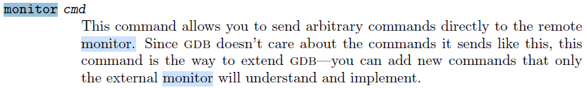
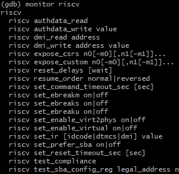
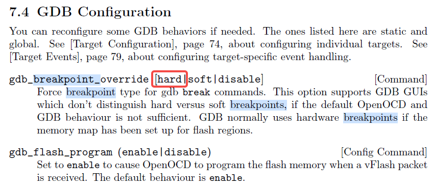
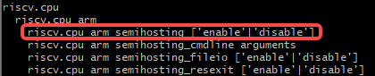

2023年8月17日星期四


# Set up GDB on SPIKE


### On spike:

```bash
./riscv-isa-sim/build/spike --initrd=initrd1.img -H --rbb-port=9824 --isa=RV32imafdc -m0x80000000:0x40000000 ./opensbi/build/platform/generic/firmware/fw_payload.elf
```

### On OpenOCD:

```bash
openocd -f openocd_spike.cfg
```

### On GDB client:

```bash
/opt/riscv/bin/riscv32-unknown-linux-gnu-gdb ./opensbi/build/platform/generic/firmware/fw_payload.elf
```

## monitor命令

通过指令`monitor riscv set_ebreakm off`来关闭断点触发，可禁用semihosting并执行过相应的ebreak指令。



执行`monitor riscv`可以使GDB列出所有能通过monitor发送给OpenOCD的命令。也可能通过查找OpenOCD的手册获取所有可以发送的指令。



### 设置软硬断点




`hbreak *0x` 设置硬断点

### 使能semihosting

在GDB client中，通过`monitor`指令将如下命令发送给OpenOCD即可使能它的semihosting功能。其它指令可以参考OpenOCD文档（16 Architecture and Core Commands章节）




# tools


## strace

调试系统调用

```
Usage: strace [-ACdffhikqqrtttTvVwxxyyzZ] [-I N] [-b execve] [-e EXPR]...
              [-a COLUMN] [-o FILE] [-s STRSIZE] [-X FORMAT] [-O OVERHEAD]
              [-S SORTBY] [-P PATH]... [-p PID]... [-U COLUMNS] [--seccomp-bpf]
              { -p PID | [-DDD] [-E VAR=VAL]... [-u USERNAME] PROG [ARGS] }
   or: strace -c[dfwzZ] [-I N] [-b execve] [-e EXPR]... [-O OVERHEAD]
              [-S SORTBY] [-P PATH]... [-p PID]... [-U COLUMNS] [--seccomp-bpf]
              { -p PID | [-DDD] [-E VAR=VAL]... [-u USERNAME] PROG [ARGS] }

General:
  -e EXPR        a qualifying expression: OPTION=[!]all or OPTION=[!]VAL1[,VAL2]...
     options:    trace, abbrev, verbose, raw, signal, read, write, fault,
                 inject, status, quiet, kvm, decode-fds

Startup:
  -E VAR=VAL, --env=VAR=VAL
                 put VAR=VAL in the environment for command
  -E VAR, --env=VAR
                 remove VAR from the environment for command
  -p PID, --attach=PID
                 trace process with process id PID, may be repeated
  -u USERNAME, --user=USERNAME
                 run command as USERNAME handling setuid and/or setgid

Tracing:
  -b execve, --detach-on=execve
                 detach on execve syscall
  -D, --daemonize[=grandchild]
                 run tracer process as a grandchild, not as a parent
  -DD, --daemonize=pgroup
                 run tracer process in a separate process group
  -DDD, --daemonize=session
                 run tracer process in a separate session
  -f, --follow-forks
                 follow forks
  -ff, --follow-forks --output-separately
                 follow forks with output into separate files
  -I INTERRUPTIBLE, --interruptible=INTERRUPTIBLE
     1, anywhere:   no signals are blocked
     2, waiting:    fatal signals are blocked while decoding syscall (default)
     3, never:      fatal signals are always blocked (default if '-o FILE PROG')
     4, never_tstp: fatal signals and SIGTSTP (^Z) are always blocked
                    (useful to make 'strace -o FILE PROG' not stop on ^Z)

Filtering:
  -e trace=[!]{[?]SYSCALL[@64|@32|@x32]|[?]/REGEX|GROUP|all|none},
  --trace=[!]{[?]SYSCALL[@64|@32|@x32]|[?]/REGEX|GROUP|all|none}
                 trace only specified syscalls.
     groups:     %clock, %creds, %desc, %file, %fstat, %fstatfs %ipc, %lstat,
                 %memory, %net, %process, %pure, %signal, %stat, %%stat,
                 %statfs, %%statfs
  -e signal=SET, --signal=SET
                 trace only the specified set of signals
                 print only the signals from SET
  -e status=SET, --status=SET
                 print only system calls with the return statuses in SET
     statuses:   successful, failed, unfinished, unavailable, detached
  -P PATH, --trace-path=PATH
                 trace accesses to PATH
  -z, --successful-only
                 print only syscalls that returned without an error code
  -Z, --failed-only
                 print only syscalls that returned with an error code

Output format:
  -a COLUMN, --columns=COLUMN
                 alignment COLUMN for printing syscall results (default 40)
  -e abbrev=SET, --abbrev=SET
                 abbreviate output for the syscalls in SET
  -e verbose=SET, --verbose=SET
                 dereference structures for the syscall in SET
  -e raw=SET, --raw=SET
                 print undecoded arguments for the syscalls in SET
  -e read=SET, --read=SET
                 dump the data read from the file descriptors in SET
  -e write=SET, --write=SET
                 dump the data written to the file descriptors in SET
  -e quiet=SET, --quiet=SET
                 suppress various informational messages
     messages:   attach, exit, path-resolution, personality, thread-execve
  -e kvm=vcpu, --kvm=vcpu
                 print exit reason of kvm vcpu
  -e decode-fds=SET, --decode-fds=SET
                 what kinds of file descriptor information details to decode
     details:    dev (device major/minor for block/char device files)
                 path (file path),
                 pidfd (associated PID for pidfds),
                 socket (protocol-specific information for socket descriptors)
  -i, --instruction-pointer
                 print instruction pointer at time of syscall
  -k, --stack-traces
                 obtain stack trace between each syscall
  -n, --syscall-number
                 print syscall number
  -o FILE, --output=FILE
                 send trace output to FILE instead of stderr
  -A, --output-append-mode
                 open the file provided in the -o option in append mode
  --output-separately
                 output into separate files (by appending pid to file names)
  -q, --quiet=attach,personality
                 suppress messages about attaching, detaching, etc.
  -qq, --quiet=attach,personality,exit
                 suppress messages about process exit status as well.
  -qqq, --quiet=all
                 suppress all suppressible messages.
  -r, --relative-timestamps[=PRECISION]
                 print relative timestamp
     precision:  one of s, ms, us, ns; default is microseconds
  -s STRSIZE, --string-limit=STRSIZE
                 limit length of print strings to STRSIZE chars (default 32)
  --absolute-timestamps=[[format:]FORMAT[,[precision:]PRECISION]]
                 set the format of absolute timestamps
     format:     none, time, or unix; default is time
     precision:  one of s, ms, us, ns; default is seconds
  -t, --absolute-timestamps[=time]
                 print absolute timestamp
  -tt, --absolute-timestamps=[time,]us
                 print absolute timestamp with usecs
  -ttt, --absolute-timestamps=unix,us
                 print absolute UNIX time with usecs
  -T, --syscall-times[=PRECISION]
                 print time spent in each syscall
     precision:  one of s, ms, us, ns; default is microseconds
  -v, --no-abbrev
                 verbose mode: print entities unabbreviated
  --strings-in-hex=non-ascii-chars
                 use hex instead of octal in escape sequences
  -x, --strings-in-hex=non-ascii
                 print non-ASCII strings in hex
  -xx, --strings-in-hex[=all]
                 print all strings in hex
  -X FORMAT, --const-print-style=FORMAT
                 set the FORMAT for printing of named constants and flags
     formats:    raw, abbrev, verbose
  -y, --decode-fds[=path]
                 print paths associated with file descriptor arguments
  -yy, --decode-fds=all
                 print all available information associated with file
                 descriptors in addition to paths
  --decode-pids=pidns
                 print PIDs in strace's namespace, too
  -Y, --decode-pids=comm
                 print command names associated with PIDs

Statistics:
  -c, --summary-only
                 count time, calls, and errors for each syscall and report
                 summary
  -C, --summary  like -c, but also print the regular output
  -O OVERHEAD[UNIT], --summary-syscall-overhead=OVERHEAD[UNIT]
                 set overhead for tracing syscalls to OVERHEAD UNITs
     units:      one of s, ms, us, ns; default is microseconds
  -S SORTBY, --summary-sort-by=SORTBY
                 sort syscall counts by: time, min-time, max-time, avg-time,
                 calls, errors, name, nothing (default time)
  -U COLUMNS, --summary-columns=COLUMNS
                 show specific columns in the summary report: comma-separated
                 list of time-percent, total-time, min-time, max-time, 
                 avg-time, calls, errors, name
                 (default time-percent,total-time,avg-time,calls,errors,name)
  -w, --summary-wall-clock
                 summarise syscall latency (default is system time)

Tampering:
  -e inject=SET[:error=ERRNO|:retval=VALUE][:signal=SIG][:syscall=SYSCALL]
            [:delay_enter=DELAY][:delay_exit=DELAY]
            [:poke_enter=@argN=DATAN,@argM=DATAM...]
            [:poke_exit=@argN=DATAN,@argM=DATAM...]
            [:when=WHEN],
  --inject=SET[:error=ERRNO|:retval=VALUE][:signal=SIG][:syscall=SYSCALL]
           [:delay_enter=DELAY][:delay_exit=DELAY]
           [:poke_enter=@argN=DATAN,@argM=DATAM...]
           [:poke_exit=@argN=DATAN,@argM=DATAM...]
           [:when=WHEN],
                 perform syscall tampering for the syscalls in SET
     delay:      microseconds or NUMBER{s|ms|us|ns}
     when:       FIRST[..LAST][+[STEP]]
  -e fault=SET[:error=ERRNO][:when=WHEN], --fault=SET[:error=ERRNO][:when=WHEN]
                 synonym for -e inject with default ERRNO set to ENOSYS.

Miscellaneous:
  -d, --debug    enable debug output to stderr
  -h, --help     print help message
  --seccomp-bpf  enable seccomp-bpf filtering
  -V, --version  print version

```


## mtr

更好的网络调试跟踪工具


## Basic GDB commands

ref: https://www.sourceware.org/gdb/documentation/

1. Start & Running
   - `gdb <executable>` - Start GDB with executable
   - `run` - Start program execution
   - `start` - Run until `main()` function
   - `starti` - Start program execution and stop at the very first executable instruction
  
2. Break points
   - `break <function>` - Set a breakpoint at a function (e.g., `b main`)
   - `break <file>:<line>` - Set a breakpoint at a specific line in a file
   - `info breakpoints` - List all breakpoints
   - `delete <num>` - Delete a breakpoint by its number
   - `break _start` - Set a breakpoint at the entry point `_start`
  
3. Step through code
   - `step` - Step into a function
   - `next` - Step over a function
   - `continue` - Resume exeution until the next breakpoint
   - `finish` - Run until the current function returns
   - `stepi` - Step one assembly instruction `si`
   - `nexti` - Step over one instruction `ni`
  
4. Inspecting variables & memory
   - `print <var>` - Display a variable's value
   - `display <var>` - Continuously show a variable's value
   - `info locals` - List all local variables
   - `x/<format> <address>` - Examine memory (e.g., `x/4x $sp`)
  
5. Call Stack & Threads
   - `backtrace`/`bt` - Show the call stack
   - `frame <num>` - Switch to different stack frame
   - `info threads` - List all threads in a multi-threaded program
  
6. Advanced Commands
   - `watch <var>` - Pause execution when a variable changes
   - `set var <var>=<value>` - Modify a variable's value when dubugging
   - `disassemble` - Show assembly code for current function
   - `disas /r <addr1>, <addr2>` - Disassemble code in an address range
   - `disassemble $pc,+20` - manually Display instructions around current point
   - `layout asm` - Display disassembly automatically after each step
   - `tui enable` - use TUI mode
   - `tui layout asm` - To Display assembly
