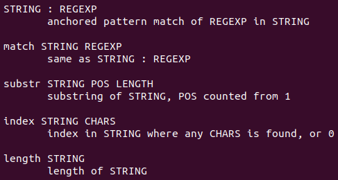
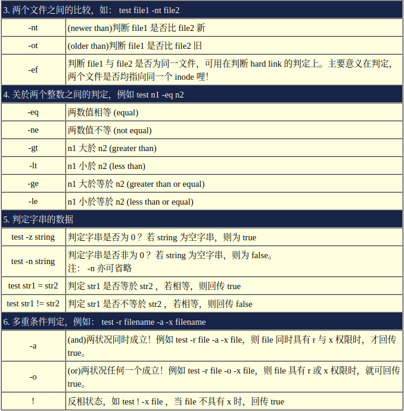

`#!/bin/bash`

ref: [the-art-of-command-line](https://github.com/jlevy/the-art-of-command-line/blob/master/README-zh.md)

# (...)

**sub-shell** command in bash script:

```bash
  # do something in current dir
  (cd /some/other/dir && other-command)
  # continue in original dir
```


# Shell Arithmetic

## ((...))

**Double parentheses** function is preferred to do **arithmetic** in Bash scripts. This looks like a comination
of `$()` and `()`. The former is to get the value of a variable, while the latter is a **sub-shell** commnad,
which will generate a temporary middle variable.


## let

Allows arithmetic to be performed on shell variables


## expr

All-purpose **expression evaluator**: Concatenates and evaluates the arguments according to the **operation** given (arguments must be separated by spaces). 

Operations may be `arithmetic`, `comparison`, `string`, or `logical`.



**example**:


### expr substr
extract substring, starting position & length specified

Extract substring of $length characters, starting at $position:

z=`expr substr $string $position $length`


# test / [] 

中括号与test几乎一模一样，只是中括号比较常用在条件判断式`if ... then ... fi`的情况中。





Note that, `=` will do string comparison while `-eq` does numerical.


# special variables

- **$0** - The name of the Bash script.
- **$1 - $9** - The first 9 arguments to the Bash script. (As mentioned above.)
- **$#** - How many arguments were passed to the Bash script.
- **$@** - All the arguments supplied to the Bash script.
- **$?** - The exit status of the most recently run process.
- **$$** - The process ID of the current script.
- **$USER** - The username of the user running the script.
- **$HOSTNAME** - The hostname of the machine the script is running on.
- **$SECONDS** - The number of seconds since the script was started.
- **$RANDOM** - Returns a different random number each time is it referred to.
- **$LINENO** - Returns the current line number in the Bash script.


# {...}

`mv foo.{txt,pdf} some-dir` -> will move file foo.txt and foo.pdf to some-dir

`mv foo.{1..3}.log some-dir` -> will move file foo.1.log foo.2.log foo.3.log to some-dir

`cp somefile{,.back}` -> will copy somefile to somefile.back

`mkdir -p test-{a,b,c}/subtest-{1,2,3}` -> will create a directory tree


Putting script in braces can prevent executing partial scripts.

```bash
{
	# Scripting here
}
```


# wildcards

- ***** - represents zero or more characters
- **?** - represents a single character
- **[]** - represents a range of characters, the caret (^) inside the brackets means characters not in the range

It is actually **bash** that does the wildcards translation for us.

Putting wildcards inside **quotes** makes them not recognized by the shell. (Similar to wrap file names with spaces in quotes or escape the spaces with `\`)


# basename

Print NAME with any leading directory components removed.

Usage: `basename` NAME [SUFFIX]

  or:  `basename` OPTION... NAME...
  
Print NAME with any leading directory components **removed**.

If specified, also remove a trailing SUFFIX.

Mandatory arguments to long options are mandatory for short options too.

  -a, --multiple       support multiple arguments and treat each as a NAME
  
  -s, --suffix=SUFFIX  remove a trailing SUFFIX; implies -a
  
  -z, --zero           end each output line with NUL, not newline


# parameter expansion

**string manipulation**

``` bash
${parameter#pattern}      # Remove shortest match from beginning
${parameter##pattern}     # Remove longest match from beginning  
${parameter%pattern}      # Remove shortest match from end
${parameter%%pattern}     # Remove longest match from end
${parameter:start:length} # Substring extraction
```

Remove specific prefix:
``` bash
for file in prefix_*; do
    mv "$file" "${file#prefix_}"
done
```

Default value:
``` bash
${variable:-default}        # Use default if variable is unset or empty
${variable:=default}        # Set variable to default if unset or empty
```

Pattern replacement:
``` bash
${variable/pattern/replacement}  # Replace first occurrence
${variable//pattern/replacement} # Replace all occurrences

filename="hello_world.txt"
echo "${filename/_/-}"           # "hello-world.txt"
echo "${filename//l/L}"          # "heLLo_worLd.txt"
```

# redirection

Some Unix **conventions** suggest that if no input is specified, commands should read from `stdin`, and if no output is specified, they should write to `stdout`.

## `-`

Redirected dependently to `stdin`, `stdout` or `stderr`.

The `-` can be used as a special file name to represent `stdin` or `stdout` in such cases. The interpretation of whether - means `stdin` or `stdout` depends on the specific command and context. There is **no universal** rule that dictates whether it represents `stdin` or `stdout` across all programs.

The decision to use `-` for `stdin`, `stdout`, or both is up to the program's design and user interface conventions. There are no widely adopted standards that dictate a single approach. Programs can detect if their `stdin/stdout` is connected to a terminal or being **piped/redirected**, and **may change behavior accordingly**, such as switching to single-column output when piped.


With bash *redirection*, `-` is not recognized as a special filename, so bash will use that as the literal filename.

When cat sees the string `-` as a filename, it treats it as a synonym for `stdin`. To get around this, you need to alter the string that cat sees in such a way that it still refers to a file called `-`. The usual way of doing this is to prefix the filename with a path - `./-`, or `/home/Tim/-`. This technique is also used to get around similar issues where command line **options** clash with filenames, so a file referred to as `./-e` does not appear as the `-e` command line option to a program. 

## `--`

`man bash`:


## >

Saving to a file

## >>

Appending to a file

##  <

Redirecting from a file

`<(some commands)` treats the output of `some commands` as a file.


## 2>

Redirecting STDERR (to STDOUT `2>&1`)


# curl vs wget

`curl` supports more protocol than `wget`. `curl` output to `stdout` in **default**, while `wget` download a file to current directory. So the command before equals to `curl <url> | bash`.
ref: (https://linuxhint.com/what-is-the-difference-between-wget-vs-curl/)

## curl-bash pipe

`curl <url>  -o -| bash -`

This equals to `curl <url> | bash`, as `curl` outputs to `stdout` in default, while `bash` takes from `stdin` if there is no input specified.

curl https://www.opscode.com/chef/install.sh | sudo bash
This curl-bash pipe is from https://gist.github.com/btm/6700524


# Cron - Task Scheduling

Cron stands for **C**ommand **R**un **ON**. It is a mechanism that allows you to tell the system to run certain commands at a certain times.


### crontab

```crontab
***** command to execute
```

Where the `*`'s represent (in order from left to right:

- Minutes (0 - 59)
- Hours (0 - 23)
- Day of Month (1 - 31)
- Months (1 - 12)
- Day of week (0 - 7) (0 and 7 are Sunday) 			

`crontab -l` To view a list of what tasks you currently have scheduled

`crontab -e` To edit your scheduled tasks in a text editor you like


# xargs

Xargs is a great command that **reads streams of data from standard input**, then generates and executes command lines; meaning it can take output of a command and passes it as argument of another command. If no command is specified, **xargs executes echo by default**. You many also instruct it to read data from a file instead of `stdin`.

```shell
find . -name "*.txt" | xargs -I '{}' mv '{}' /foo/'{}'.bar

  -I R                         same as --replace=R (R must be specified)
  -i,--replace=[R]             Replace R in initial arguments with names
                               read from standard input. If R is
                               unspecified, assume {}
```


One side effect of `xargs` is to concatenate multiple lines into **one line**. For example, there are multi lines in `test.txt` file, the following commands will output them in one line:

`cat test.txt | xargs`

Further more:

`-n` option can specify column of a line in output.

`-d` option defines the delimiter of its input data.


```shell
find sdma_list/ -type f | xargs -I {} sh -c 'echo {}; grep "Skipped$" {} '
```

Multi-commands execution with `xargs`


# find

Find is a great tool for fine grained control over searching for files.  Like with **xargs**, the man page is the best place to discover them all.  


# tar

Tar stands for **T**ape **AR**chive and is a popular means for combining and  compressing several files into a single file.  It was originally created for making backups on **tape** but is still commonly used today.


# Secure Copy (scp)

Scp is a quick, easy and secure way to copy files between different  machines.  It is part of the SSH (Secure SHell) suite of tools.  With it you may copy files to and from your local machine and a remote machine.


# sort -u

unique items

# return vs exit

We can call exit anywhere in the script, either inside a function or outside a function. This stops the execution of the script immediately.

We can call return in a function. This stops the execution of the function immediately. Using return for exiting from a script gives error. However, sourcing the script doesn’t give an error.

The shell executes the action in the trap command on EXIT for exit, but it doesn’t run it for return.


# diff & patch

Source code comparison and merge. `diffstat` can be used to show change statistics.


# cut, past, join

cut: separate content into fields (columns), then get certain fields.

```cut -f 1,2 -d ' ' mysampledata.txt```


# tac

The reverse of `cat`

example to change endian-ness manually:

```
xxd -g 16 test.bin | cut -d" " -f2 | xargs -I% sh -c 'echo  % | tac -rs ..' | head
```

A side effect is that the new line symbol is at the beginning of a line, instead of the end of the line.


## rev

reverse the order of characters in every line.


# stat

file info


# time

Execution time period


# strings

Extract strings from **binary** file


# tr

Characters transformation

```Usage: tr [OPTION]... SET1 [SET2]
Translate, squeeze, and/or delete characters from standard input,
writing to standard output.

  -c, -C, --complement    use the complement of SET1
  -d, --delete            delete characters in SET1, do not translate
  -s, --squeeze-repeats   replace each sequence of a repeated character
                            that is listed in the last specified SET,
                            with a single occurrence of that character
  -t, --truncate-set1     first truncate SET1 to length of SET2
      --help     display this help and exit
      --version  output version information and exit

SETs are specified as strings of characters.  Most represent themselves.
Interpreted sequences are:

  \NNN            character with octal value NNN (1 to 3 octal digits)
  \\              backslash
  \a              audible BEL
  \b              backspace
  \f              form feed
  \n              new line
  \r              return
  \t              horizontal tab
  \v              vertical tab
  CHAR1-CHAR2     all characters from CHAR1 to CHAR2 in ascending order
  [CHAR*]         in SET2, copies of CHAR until length of SET1
  [CHAR*REPEAT]   REPEAT copies of CHAR, REPEAT octal if starting with 0
  [:alnum:]       all letters and digits
  [:alpha:]       all letters
  [:blank:]       all horizontal whitespace
  [:cntrl:]       all control characters
  [:digit:]       all digits
  [:graph:]       all printable characters, not including space
  [:lower:]       all lower case letters
  [:print:]       all printable characters, including space
  [:punct:]       all punctuation characters
  [:space:]       all horizontal or vertical whitespace
  [:upper:]       all upper case letters
  [:xdigit:]      all hexadecimal digits
  [=CHAR=]        all characters which are equivalent to CHAR
```


# ls*

`lsblk`, 	`lshw`, 	`lscpu`, 	`lspci`, 	`lsusb`, 	`lsmod`

块，		 硬件，	CPU， 	PCI， 		USB， 	内核模块


# statements


## if ... then

```
if [ <some test> ]; then
	<commands>
elif [ <some test> ]; then
	<other commands>
else
	<other commands>
fi
```


## case ... esac

```
case $variable in
<pattern 1>)
	<commands>
	;;
<pattern 2>)
	<other commands>
	;;
*)
	<error handling commands>
	exit 1
	;;
esac
```


# loop

## while/until ... do .. done

```
while/until [ condition ] # loop `while` expression is true, or `until` expression is true
do
	<commands>
done
```


## for ... do ... done

For each of the items in a given `list`, do some commands.

```
for var in <list>
do
	<commands>
done
```


Perform commands for range [m-n] by step `s`.

```
for value in {m..n..s}
do
	<commands>
done
```


C-like `for` loop

```
for ((expr1; expr2; expr3))
do
	<commands>
done
# or
for ((expr1; expr2; expr3)); do <commands>; done
```


# man

Manual pages

`man <command to look up>`

`man -k <search term>` search manual pages.

Manual pages is like `less` command, so you can use `/` to trigger a search inside a manual page.


# Permissions for Directories

- **r** - you have the ability to read the contents of the directory (ie do an `ls`)
- **w** - you have the ability to write into the directory (ie create files and directories)
- **x** - you have the ability to enter that directory (ie `cd`)


# debug script

`sh [-nvx] script.sh`

```
选项与参数：
-n  ：不要运行 script，仅查询语法的问题；
-v  ：再运行 sccript 前，先将 scripts 的内容输出到萤幕上；
-x  ：将使用到的 script 内容显示到萤幕上，这是很有用的参数！
```


# hash value

`md5sum`

`sha256sum`


# Bash example

Record the representative commands in practical useage.


## remote desktop for windows

```rdesktop -g 1920x1080 -a 16 -u tsinghuaic -p tsinghuaic -0 10.21.0.167:3389```

## change file names in batch

Remove `prefix_` of file names:

`for file in prefix_*; do mv "$file" "${file#prefix_}"; done`


## find

`find -type d ! -name . -exec basename "{}" \; | xargs -I {} mv "{}" ."{}"`

Change *all folder names* from "folder_name" to ".folder_name", to hide them in normal view.


## xargs

`ls | xargs basename -s .md -a | xargs -I % sed -i "s/\(%\)/.\1/" %.md`

Replace folder names in all files in a folder with different names.


## truncate

`truncate -s 10M file`

Can not only reduce file size, but also extend a file to a specific size by padding with zeros


## zip

`zip -q -r RV64IM-CoreMark.zip RV64IM-CoreMark/*`

Compress all file in directory `RV64IM-CoreMark/` to zip file `RV64IM-CoreMark.zip`.

`zip -q -r RV64IM-CoreMark.zip RV64IM-CoreMark --exclude *.git*`

Compress folder `RV64IM-CoreMark` while exclude `.git` file

`unzip -l RV64IM-CoreMark.zip`

Display content of the zip file.


## sed

Extract PC values from PC stream log

`cat log-opensbi-gmac_1028-1.txt | sed 's/^.*core0_pad_retire[0-9]: *\([0-f]\{16\}\).*$/\1/g' > pc_stream`


## split

Split a big file by lines into files consist of 10000 lines each, and extend their file names with 4 digits.

`split -l 10000 pc_stream -d -a 4 split_stream/pc_stream`


# Filter

A filter, in the context of the Linux command line, is a program that accepts textual data and then transform it in a particular way.

Filters are a way to take raw data, either produced by another program, or stored in a file, and manipulate it to be a displayed in a way more suited to what we are after.

These filters often have various command line options that will modify their behavior  so it is always good to check out the man page for a filter to see what is available.


Some of them:

head, tail, sort, nl, wc, cut, sed, uniq, tac, awk, diff


## nl

number lines

```nl -s '. ' -w 10 mysampledata.txt``` 

`-s` specifies what should be printed after number

`-w` specifies how much padding to put before numbers


# network

ref: https://www.cellstream.com/2010/09/10/what-is-the-arp-command/

## arp-scan

`arp-scan 192.168.1.0/24`

who is on my network

ref: https://www.cellstream.com/2023/02/24/who-is-on-my-network/

## ARP table

Ping the broadcast address of network to populate the ARP table.

```ping -b 10.21.3.255```

The broadcast address can get from `ip ad` command.


check the **ARP cache**

`arp -a`


**ARP probe**


## ifup

The `ifup` program from BusyBox will read the `/etc/network/interfaces` file to configure network interfaces.

interfaces:

```interfaces
auto lo
iface lo inet loopback
auto eth0
iface eth0 inet static
	address 192.168.0.2
	netmask 255.255.255.0
```

Restart networking will be needed to effect the interfaces file changes:

`/etc/init.d/Sxxnetwork restart` 

`Sxxnetwork` is a customized script having the `restart` as parameter. It contains calling to the `ifup` command, which will then uses the `/etc/network/interfaces` as its configuration file.


Beside the `interfaces` file, there are some directories are also needed in `/etc/network/`: **if-down.d**  **if-post-down.d**  **if-pre-up.d**  **if-up.d**.


## nmcli

NetworkManager can be used to configure an IP address for a interface:

```shell
nmcli con add type ethernet ifname enxf8dc7a000001 ip4 192.168.0.1/24
```


## ifconfig

You can manually set the IP address using the `ifconfig` command. Here’s how:

1. **Bring up the network interface** (e.g., `eth0`):

   ```bash
   ifconfig eth0 up
   ```

2. **Assign a static IP address**:

   ```
   bash
   ifconfig eth0 192.168.1.100 netmask 255.255.255.0
   ```

3. **Set the default gateway**:

   ```
   bash
   route add default gw 192.168.1.1
   ```

This method will work until the system is rebooted, as these settings are not persistent.


To list all the network interface:

```bash
ifconfig -a
```


## ip

`ip [OPTIONS] OBJECT {COMMAND | help}`

- **OPTIONS**: Optional flags to modify command behavior
- **OBJECT**: Specifies the type of the network object (e.g., `link`, `addr`, `route`)
- **COMMAND**: The action to perform on the object (e.g., `add`, `delete`, `show`)


Show **all interfaces**:

`ip link show`

Bring an interface up/down:

`sudo ip link set dev eth0 up/down`


Show **IP addresses**:

`ip addr show`

Add/Delete an IP address:

`sudo ip addr add/del 192.168.1.100/24 dev eth0`


Show **routing table**:

`ip route show`

Add a route:

`sudo ip route add 192.168.2.0/24 via 192.168.1.1 dev eth0`

Delete a route:

`sudo ip route del 192.168.2.0/24`

Add a new default gateway:

`sudo ip route add default via 192.168.1`

Add a route to a specific host:

`sudo ip route add 192.168.2.1 via 10.0.0.1 dev eth0`


Show **ARP cache**:

`ip neigh show`

Flush ARP cache:

`sudo ip neigh flush dev eth0`


## traceroute

To trace the route packets take from your device to a destination

`traceroute <destination>`


## Route Between Subnets

1. Configure Network Interfaces

```
sudo ip addr add 192.168.16.1/24 dev eth0
sudo ip addr add 192.168.2.1/24 dev eth1
sudo ip link set eth0 up
sudo ip link set eth1 up
```

2. Enable IP Forwarding

```
echo 1 | sudo tee /proc/sys/net/ipv4/ip_forward
```

Or to make this change permanent by edit `/etc/sysctl.conf` and uncomment or add the line:

`net.ipv4.ip_forward=1`

Then, apply the changes with:

`sudo sysctl -p`

3. Configure Routing Tables

```
sudo ip route add 192.168.2.0/24 via 192.168.16.1 dev eth0
sudo ip route add 192.168.16.0/24 via 192.168.2.1 dev eth1
```

4. Verify Configuration

After configuring everything, ensure that devices in each subnet can ping interfaces of the PC and each other:

- From a device in the `192.168.16.x` subnet, ping `192.168.2.1`.
- From a device in the `192.168.2.x` subnet, ping `192.168.16.1`.


## Bridge Between LANs

After bridging two LANs, devices on both networks can communicate with each other as if they are part of the same local network. 

- Bridging creates a **Layer 2 connection** between the two LANs, meaning that all devices on both sides can send Ethernet frames directly to each other without needing to route through a Layer 3 device (like a router). 

- This setup is **similar to connecting multiple switches** together, allowing devices to treat the entire bridged network as a single broadcast domain.
- Since both LANs are on the **same subnet** (e.g., 192.168.1.0/24), devices can communicate using their MAC addresses. When a device sends a data packet, it will be broadcasted across the bridge, allowing any device on either side to receive it.
- Bridging **increases broadcast traffic** since all broadcast packets from one LAN are sent to the other LAN. This can lead to increased network congestion if many devices are present.


By **configuration** files: (may need `bridge-utils` tool)

```

# Create a bridge
auto br0
iface br0 inet static
    address 192.168.1.10   # Assign a unique IP in the subnet
    netmask 255.255.255.0
    bridge_ports eth0 eth1
```


By **`ip` tools**:

1. Create and Bring up the Bridge

`ip link add name br0 type bridge`

`ip link set br0 up`


2. Add NICs to the Bridge

`ip link set eth0 master br0`

`ip link set eth1 master br0`

`ip link set eth0 up`

`ip link set eth1 up`


3. Assign an IP address to the Bridge

`ip addr add 192.168.1.10/24 dev br0`


4. Check the Bridge

`ip addr show br0`

`bridge link`


By **`bridge-utils`**:

1. Get down interfaces needed to add to bridge

```
ifconfig eth0 down
ifconfig eth1 down
```

2. Create a Bridge

```
brctl addbr br0
```

3. Add interfaces to the Bridge

```
brctl addif br0 eth0
brctl addif br0 eth1
```

4. Bring them up all

```
ifconfig br0 up
ifconfig eth0 up
ifconfig eth1 up
```

5. Assign an IP address to the Bridge

```
ifconfig br0 192.168.1.1 netmask 255.255.255.0
```

6. Verify the Configuration

```
brctl show
```


# udisksctl

ref: https://storaged.org/doc/udisks2-api/latest/udisksctl.1.html

ref: https://wiki.debian.org/ManipulatingISOs

The udisks command line tool

The package is `udisks2`.


Mount ISO fie:

`udisksctl loop-setup -r --file file.iso`


Unmount a block device:

`udisksctl unmount -b /dev/loop18`


# DVD

1. **Insert a Blank DVD**: Place a blank DVD into your drive.

2. **Identify the DVD Drive**: Check your DVD drive identifier (usually `/dev/sr0` or `/dev/dvdrw`):

   ```
   bash
   ls /dev/dvd*
   ```

3. **Use `growisofs` to Burn the ISO**:

   - First, ensure `growisofs` is installed:

     ```
     bash
     sudo apt install dvd+rw-tools
     ```

   - Then, burn the ISO image to the DVD:

     ```
     bash
     growisofs -Z /dev/dvd=dvd_image.iso
     ```

   Replace `dvd_image.iso` with the path to your ISO file.

4. **Verify the Burn** (optional): You can check if the data was written correctly by mounting the DVD and examining its contents:

   ```bash
   sudo mount /dev/sr0 /mnt
   ls /mnt
   sudo umount /mnt
   ```


