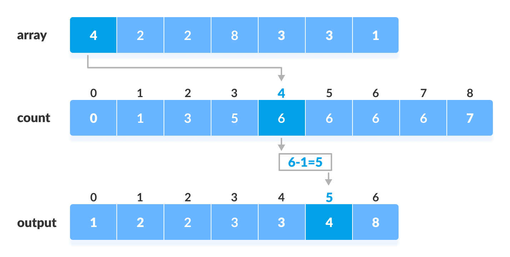

# 1. forward declaration
Forward declaration refers to the beforehand declaration for the syntax of signature of an identifier, variable, function, class, etc. prior to its usage (done later in the program).
```
void sum(); // forward declaration
void sum();
{
    //Body
}
```
`forward declaration` is that you declare a identifier before use. It's possible for not only functions, but also `struct`, `union` and `enum`.

Forward declaration is a promise to define something that you make to a compiler at the point where the definition cannot be made. The compiler can use your word to interpret other declarations that it would not be able to interpret otherwise.

A common example is a `struct` designed to be a node in a linked list: you need to put a pointer to a node into the `struct`, but the compiler would not let you do it without either a `forward declaration` or a `tag`:
```
// Forward declaration
struct element;  // ??? Not sure how this works or whether it works
typedef struct element {    // Added a tag name here to enable struct forward declaration
    int value;
    // Use of the forward declaration
    struct element *next;
} element; // Complete definition
```
I think that author's point was that giving your `struct` a `tag` would be equivalent to a `forward declaration`:
```
typedef struct element {
    int value;
    // No need for a forward declaration here
    struct element *next;
} element;
```
`Forward declaration` is a declaration proceeding an actual definition, usually for the purpose of being able to refer the declared type when the definition is not available. Of course, not everything may be done with the `declared-not-defined` structure, but in certain context it is possible to use it. Such type is called `incomplete`, and there are a number of restrictions on its usage. For example:
```
struct X; // forward declaration

void f(struct X*) { }  // usage of the declared, undefined structure

// void f(struct X) { }         // ILLEGAL
// struct X x;                  // ILLEGAL
// int n =sizeof(struct X);     // ILLEGAL

// later, or somewhere else altogether
struct X { /* ... */ };
```
This can be useful e.g. to break circular dependencies, or cut down the compilation time, as the definitions are usually significantly larger, and so more resources are required to parse it.
## Hide the struct inside by `forward declaration`
Hide the whole struct and expose accessor functions that act on a pointer:
```
/* header */
struct S_course; //forward declaration
enum TP_starter {SALAD, GRILLEDVEGETABLES, PASTA};
enum TP_maincourse {BEEF, LAMB, FISH};
enum TP_dessert {APPLEPIE, ICECREAM, MOUSSE};
void S_course__set_starter(struct S_course *this,  enum TP_starter starter);

//accessor functions
void S_course__set_maincourse(struct S_course *this,  enum TP_maincourse maincourse);
void S_course__set_dessert(struct S_course *this,  enum TP_dessert dessert);


/* c file */
enum TP_course {STARTER, MAINCOURSE, DESSERT};
union U_subtype {
   enum TP_starter s;
   enum TP_maincourse m;
   enum TP_dessert d;
};
struct S_course {
   enum TP_course type;
   union U_subtype stype;
   float price_in_USD;
   int availability;
   /*...*/
};
void S_course__set_starter(struct S_course *this,  enum TP_starter starter)
{
    this->type = STARTER;
    this->stype.s = starter;
}
```
An alternative for using of `forward declaration` would be to transform the pointer to `void *` in `accessor` and then force the type it points to the designed type in the `methods`. The only advantage seems to be that compilers could help check you didn't pass wrong pointers inside.

# 2. tag (of struct, union or enum )
In the definition below `element_tag` is a tag.
```
typedef struct element_tag {
    int value;
    // No need for a forward declaration here
    struct element_tag *next;
} element;
```
All declarations of `structure`, `union`, or `enumerated` types that have the same scope and
use the same `tag` declare the same `type`. Irrespective of whether there is a `tag` or what
other `declarations` of the type are in the same translation unit, the type is incomplete 129)
until immediately after the closing brace of the list defining the content, and complete
thereafter.

A type `specifier` of the form
```
struct-or-union identifier opt { struct-declaration-list }
or
enum identifier opt { enumerator-list }
or
enum identifier opt { enumerator-list , }
```
declares a structure, union, or enumerated type. The list defines the structure content,
union content, or enumeration content. If an identifier is provided, the type `specifier`
also declares the `identifier` to be the `tag` of that type.

# 3. typedef
A typedef declaration does not introduce a new type, only a
synonym for the type so specified. That is, in the following declarations:
```
typedef T type_ident;
type_ident D;
```
`type_ident` is defined as a `typedef` name with the type specified by the declaration
specifiers in `T`, and the identifier in D has the type "`derived-declarator-type-list` `T` " where the `derived-declarator-type-list` is specified by the declarators of D. 
A `typedef` name shares the same name space as other identifiers declared in ordinary
declarators
## typedef with forward declaration

`struct element_tag` is forward declaration here:
```
typedef struct element_tag element;
```
You must use the `struct` keyword with the tag, and you can't use the `struct` keyword with the `typedef` name.

## opaque pointer - `typedef` with `forward declaration`
The opaque pointer type defined below is using `typedef` and `forward declaration` of `struct`.
```
// Opaque pointer type to represent a ringbuffer instance
typedef struct ringbuffer_instance_t* ringbuffer_t;
```
The opaque pointer `typedef` is such that it hides the fact that it's a pointer, then representing instances, often referred to as a `handle`.


# 4. preprocessor


`#` operator in macros converts a macro parameter to a string literal.

`##` operator in macros concatenates two tokens.


# 5. precedence


## Decrement Operators in C

Decrement operators in C language are used to reduce the value of a variable by one. Represented by the symbol --, they have two forms: prefix (--a) and postfix (a--). 

In the prefix form, the value is decremented before it’s **used in an expression**, while in postfix, the current value is used first and then decreased. Decrement operators are particularly helpful in loops and counting operations, allowing you to manage iterations in reverse or reduce a variable in one concise operation. 

This operator streamlines code by making it easier to adjust values within loops, conditions, and calculations where frequent reductions are needed.


# 6. Data Structure

**Data Structure is a way of collecting and organizing data ,such that we can optimize our code**

## array

An array is a linear data structure that stores a collection of items at contiguous memory locations. The elements in an array are accessed using an index, which starts from zero.

**Fixed Size**, Homogeneous Elements, Operation: searching, sorting, inserting, traversing, and deleting elements.


## list

A list is a more flexible data structure that can hold an ordered collection of items. Unlike arrays, list can  **dynamically grow or shrink** in size.

Singly Linked List: Each node contains a value and a reference to the next node in the sequence

Doubly Linked List: Each node has references to both the next and the previous nodes, allowing traversal in both directions


## hash map

A hash map (or hash table) is a data structure that implements an **associative array**, mapping **keys to values**. It uses a hash function to compute an index (hash code) into an array of buckets or slots, where the corresponding value can be found.

Fast Access: Average time complexity for search operation is O(1), making it very efficient

Key-Value Pairs: Data is stored as pairs, allowing for quick lookups based on unique keys

Collision Handling: When multiple keys hash to the same index, various strategies (like chaining or open addressing chosen base on load factor) are used to resolve collisions

**Load factor**: n/m (n is the number of entries occupied in the hash table, m is the number of buckets)


## tree

A tree is a hierarchical data structure consisting of nodes connected by edges. Each tree has a root node and can have child nodes, forming a parent-child relationship.

Binary Tree: Each node has at most two children referenced as the left and right child

Binary Search Tree (BST): A binary tree where the left child contains only nodes with values less than the parent node, and the right child contains only nodes with values greater than the  parent node

Efficient searching, insertion, and deletion operations with average time complexity of O(logn)

rb tree is a balanced BST.

A **radix tree**, also known as a **compressed trie** or **Patricia tree**, is a specialized data structure that optimizes the storage of strings or prefixes by merging nodes that have only one child. This compression reduces the number of nodes and edges, making radix trees more space-efficient compared to traditional tries.

In a radix tree, any node that has only one child is merged with its parent. Tree can represent longer strings with fewer nodes, leading to better memory efficiency

Radix trees can label edges with sequences of characters

The term "radix" refers to the base of a number system. In the context of radix trees, it indicates the number of unique symbols used to represent keys. For example, in binary systems (radix-2), only two symbols (0 and 1) are used, while in decimal systems (radix-10), then symbols (0-9) are utilized.


## queue

A queue is a linear data structure that follows the First-In-First-Out (FIFO) principle. This means that elements are added at one end (the rear) and removed from the other end (the front).

Enqueue Operation: Adding an element to the rear of the queue.

Dequeue Operation: Removing an element from the front of the queue.

Applications: Queues are commonly used in scenarios like scheduling tasks or managing requests in order.


## graph

A **graph** is a non-linear data structure consisting of nodes and edges. The nodes are sometimes also referred to as vertices and the edges are lines or arcs that connect any two nodes in the graph.

A graph data structure (V, E) consists of:

1. A collection of vertices (V) or nodes
2. A collection of edges (E) or paths.

Applications of Graphs:

1. Representing networks and routes in communication, transportation and travel applications
2. Routes in GPS
3. Interconnections in social networks and other network based applications
4. Resource utilization and availability in an organization
5. Robotic motion and neural networks

Ways to traverse a Graphs:

1. Depth First Search (DFS)
2. Breadth First Search (BFS)


# 7. Algorithm

## sorting


computational complexity and memory usage matter when choosing a sorting algorithm


**Bubble Sort**: Repeatedly steps through the list, compares adjacent elements and swaps them if they are in the wrong order. Complexity: O(n2) ~ O(n)

**Selection Sort**: Sorts an array by repeatedly finding the minimum element from the unsorted part and putting it at the beginning. Complexity: O(n2)

**Insertion Sort**: Iterates through the array and inserts each element into its correct position within the already sorted portion of the array. Complexity: O(n2) ~ O(n)

Merge Sort: **divide-and-conquer** algorithm, Divides the array into smaller sub-arrays, sorts them, and then merges them back together. Complexity: O(n*log n), Space Complexity: O(n)


**Quick Sort**: **divide-and-conquer** algorithm, Picks a pivot element and rearranges the array into two sub-arrays: elements less than the pivot and elements greater than or equal to the pivot. Complexity: O(n*log n) ~ O(n2)

**Heap Sort**: comparison-based algorithm, Uses a binary heap data structure to sort elements. Complexity: O(n*log n), Space complexity: O(1)


**Counting Sort**: suitable for sorting integers within a **known range**. Complexity: O(n+max), Space complexity: O(max)



After placing each element at its correct position, decrease its count by one.

**Radix Sort**: Sorts numbers by processing individual digits. Complexity: O(n+k), Space complexity: O(max)


**Bucket Sort**: scatter-and-gather algorithm, Scattered into buckets then gathered. Complexity: O(n2) ~ O(n), Space complexity: O(n+k)


**Shell Sort**: Optimization for insertion sort. Complexity: O(n*log n) ~ O(n2)


## BFS/DFS

Traversal refers to the process of visiting each node in a data structure, such as **trees or graphs**, exactly once.

BFS and DFS are two fundamental algorithms used for traversing or searching through **graphs** and trees, each with distinct characteristics:

BFS: Suitable for finding shortest paths, broadcasting in networks, ans scenarios where solutions are closer to the source.

- Cons: Utilizes a **queue** to keep track of nodes to visit next. This requires more memory since it stores all nodes at the current level
- Pros: Guarantees finding the shortest path in unweighted graphs


DFS: Useful for topological sorting, cycle detection in graphs, and scenarios where solutions are far from the source.

- Cons: Does not guarantee finding the shortest path
- Pros: May find a solution faster if it lies deep within a branch; Utilizes a **stack (or recursion)** to manage nodes to visit next. This generally requires less memory compared to BFS since it only needs to store nodes along a single path


## divide and conquer

**Divide and Conquer** is an algorithm design paradigm that involves three main steps:

Divide: Break the problem into smaller subproblems that are similar to the original problem

Conquer: Solve the subproblems recursively. If they are small enough, solve them directly

Combine: Merge the solutions of the subproblems into a solution for the original problem.


# 8. recursive

ref: http://cslibrary.stanford.edu/110/BinaryTrees.html

A binary tree is made of nodes, where each node contains a "left" pointer, a "right" pointer, and a data element. The "root" pointer points to the topmost node in the tree. The left and right pointers recursively point to smaller "subtrees" on either side. A null pointer represents a binary tree with no elements -- the empty tree. 

The formal *recursive* definition is: a **binary tree** is either empty (represented by a null pointer), or is made of a single node, where the left and right pointers (recursive definition ahead) each point to a **binary tree**.


