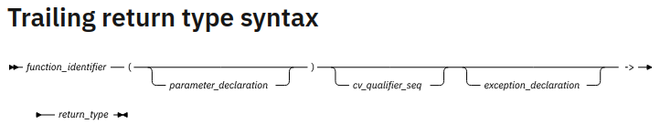
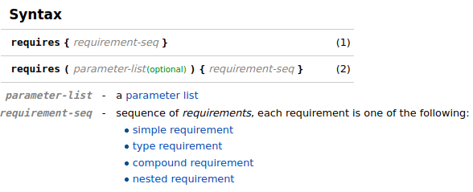
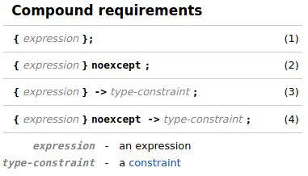

Jun 20, 2024


class, object, encapsulation, inheritance, polymorphism

containers: vector, list, map...

function overloading, **operator overloading**, references, default parameters

namespaces to organize code


OOP: Object-Oriented Programming

STL: C++ Standard Template Library, its containers, algorithms, iterators

memory management model: new/delete, smart pointers, and RAII


# STL container

Containers are implemented as **class templates**, allowing them to work with different data **types**.

Containers **handle memory allocation and deallocation automatically**, simplifying resource management.

## std

`std::remove_pointer_t<FacadePtr>`: obtain the type that `FacadePtr` points to.

## dynamic_cast

In C++, dynamic_cast is an operator used to safely convert pointers or references to classes up, down, or across an inheritance hierarchy, particularly when working with polymorphic types (classes with at least one virtual function). It performs a runtime check to ensure that the cast is valid.

If the cast if valid, it returns a valid pointer, If not, it returns `nullptr`.

## map

`std::map`: **Key-Value** Storage, each element in a map consists of a unique key and its associated value.

The elements in a `map` are automatically sorted based on their keys, using the less-then operator (<) comparison.

Each `key` in a `map` must be unique, inserting a duplicate key will fail.


The `map` class is a template, allowing you to specify the types for both the `key` and the `value`:

```c++
map<string, int> myMap;
```


## set

`std::set` is an associative container that contains a sorted set of unique objects of type Key. Sorting is done using the key comparison function *Compare*. Search, removal, and insertion operations have logarithmic complexity. Sets are usually implemented as **Red-black tress**.

Everywhere the standard library uses the *Compare* requirements, uniqueness is determined by using the equivalence relation. In imprecise terms, two objects `a` and `b` are considered equivalent if neither compares ess than the other: `!comp(a, b) && !comp(b, a)`.


## vector

`std::vector`: A sequence container that stores elements in a dynamically allocated array.

Store elements in **contiguous** memory locations, allowing fast random access using indexes like regular arrays.

Preferred when random access to elements is required

## std::span

The use of `std::span` is significant: it creates a lightweight, non-owning view over the contents of m_srcBuffer, which is typically a container like `std::vector`, `std::array`, or a raw array. By passing a `std::span` instead of the container itself, the code allows setData to access the buffer's data and size **without** copying the underlying elements. This approach improves efficiency and flexibility, as `std::span` can adapt to various container types and array sources.

A potential 'gotcha' is that `std::span` does not manage the lifetime of the data it points to. The underlying buffer (m_srcBuffer) must remain valid for as long as the `std::span` is used inside setData. If setData stores the span or its data pointer for later use, you must ensure that m_srcBuffer is not destroyed or modified in a way that invalidates the data.

## next

`std::next` is a standard library **function** that returns an iterator pointing to an element a specified numbers of 
positions ahead of a given iterator. It does not modify the orriginal iterator; instead, it creates a new one. 
The function is useful for advancing through containers like `array`s, `vector`s, or `list`s without manually incrementing 
the iterator in a loop.

For example, `std::next(temp.begin(), n)` returns an `iterator` to the nth element after `temp.begin()`. If the 
container has fewer than `n` elements, the returned iterator will be equal to the container's end iterator. This function 
helps write clear and concise code when working with `range`s and iterators.


## list

`std:list`: Doubly-linked list, providing sequential access to its elements.

Store elements in a **non-contiguous** way

Preferred when random access to elements is not needed


## union-like template

`std::optional` vs `std::variant`

`std::optional` template is a standard C++ feature that allows a variable to either contain a value of the specified type, 
or to be empty, representing the absence of a value. The presence or absence of a value can be checked using the 
`has_value()` method or by comparing to `std::nullopt`.

### std::variant

`std::getif` is a utility function by the C++ standard library for working with `std:variant`. It allows you to safely access
the value stored in a `std::variatnt` if it currently holds a specific type. The function takes a pointer to a `std::variant`
and returns a pointer to the value of the requested type if the variant holds that type; otherwise it returns `nullptr`.

## utility

### pair

ref: https://cplusplus.com/reference/utility/pair/

class template: `template <class T1, class T2> struct pair;`

Pairs are a particular case of `tuple` (元组)


## algorithm

### sort

The `std::sort` function is part of the `<algorithm>` header in C++ and is used to sort elements in a specified range. It is efficient and works on containers that provide **random access iterators**, such as arrays and vectors. The function uses the **IntroSort algorithm**, which is a hybrid of QuickSort, HeapSort, and InsertionSort, ensuring an average time complexity of **O(n log n)**.

```c++
std::sort(RandomIt first, RandomIt last);
std::sort(RandomIt first, RnadomIt last, Compare comp);
```

**Parameters**: A comparison function or lambda expression that defines the sorting order. By default, it uses the `<` operator for ascending order.

**Return Value**: The function does not return any value. It directly modifies the range in place.

```c++
#include <algorithm>
#include <iostream>

int main() {
int arr[] = {5, 3, 2, 1, 4};
int n = sizeof(arr) / sizeof(arr[0]);

std::sort(arr, arr + n); // Sort in ascending order

for (int i : arr)
std::cout << i << " "; // Output: 1 2 3 4 5
return 0;
}
```

# class

## constructor

Default Constructor:

- If no constructors are declared, the compiler generates a public default constructor.
- This implicitly-declared default constructor performs no initialization.
- It calls the default constructors of base classes and member objects.

```c++
class MyClass {
    // No constructor specified
};

// Equivalent to:
class MyClass {
public:
    MyClass() = default;
};
```

`= default` **explicitly** request compiler-generated versions of these functions (These are actually **implicit constructors**, kind of confusing).

Constructors in Inheritance:

- Base class constructors are called before derived class constructors
- Derived classes can specify which base class constructor to call

### Default constructors

A default constructor is a constructor that either:

1. Has no parameters, OR
2. Has parameters but all parameters have default values

Implicitly declared default constructor:
```c++
class MyClass {
    // No constructor declared
    // Compiler provides implicit default constructor
};

MyClass obj;  // Uses implicit default constructor
```

Explicitly defined default constructor:
```c++
class MyClass {
public:
    MyClass() {  // No parameters
        // initialization code
    }
};

MyClass obj;  // Uses explicit default constructor
```

Default constructor with default parameters:
```c++
class MyClass {
public:
    MyClass(int x = 0, int y = 0) {  // All parameters have defaults
        // initialization code
    }
};

MyClass obj1;      // MyClass(0, 0)
MyClass obj2(5);   // MyClass(5, 0)
MyClass obj3(1,2); // MyClass(1, 2)
```

The compiler does NOT generate a default constructor if:

1. You define any constructor (default or parameterized)
2. You have **const** or **reference** members without in-class initialization
3. You delete the default constructor explicitly

Explicitly delete default constructor:
```c++
class NonCopyable {
public:
    NonCopyable() = delete;  // Explicitly delete default constructor
};

// NonCopyable obj;  // Error: use of deleted function
```

**Best Practices**:
- Always initialize all members in default constructors
- Use **member initializer lists** for efficiency
- Consider making classes default-constructible when possible
- Use `= default` when you want the compiler-generated version
- Use `= delete` when you want to prevent default construction


### Implicit constructors

The compiler generates implicit constructors only when:

- No user-declared constructors are present
- All members are **copyable/movable**
- No special circumstances prevent generation

Implicit default constructor does not initialize primitive types (they contain garbage values)

**Implicit Constructor Generation**:

```c++
#include <iostream>
#include <string>

struct Employee {
    int id;
    std::string name;
    double salary;
    
    // No constructors declared
    // Compiler provides:
    // - Employee() (default constructor)
    // - Employee(const Employee&) (copy constructor)
    // - Employee(Employee&&) (move constructor, C++11+)
};

int main() {
    // Default construction
    Employee e1;  // id, salary: garbage values, name: empty
    
    // Value initialization (zero-initializes primitives)
    Employee e2{};  // id: 0, salary: 0.0, name: empty
    
    // Aggregate initialization
    Employee e3{101, "Alice", 50000.0};
    
    // Copy construction
    Employee e4 = e3;  // Copies all members
    
    // Move construction
    Employee e5 = std::move(e3);  // Moves name, copies primitives
    
    std::cout << "e4: " << e4.id << ", " << e4.name << ", " << e4.salary << std::endl;
    std::cout << "e5: " << e5.id << ", " << e5.name << ", " << e5.salary << std::endl;
    
    return 0;
}
```

**Non-copyable members prevent copy constructor**:

```c++
#include <memory>

struct ResourceHolder {
    int id;
    std::unique_ptr<int> resource;  // Not copyable
    
    // No implicit copy constructor generated!
};

int main() {
    ResourceHolder rh1{1, std::make_unique<int>(42)};
    // ResourceHolder rh2 = rh1;  // Error: deleted copy constructor
    
    ResourceHolder rh3 = std::move(rh1);  // OK: move constructor still generated
    
    return 0;
}
```

**Reference members without initialization**:

```c++
struct ReferenceHolder {
    int& ref;  // Reference must be initialized
    
    // No implicit default constructor generated!
};

int main() {
    int value = 42;
    ReferenceHolder rh{value};  // Must use aggregate initialization
    // ReferenceHolder rh2;     // Error: no default constructor
    
    return 0;
}
```

#### Control implicit constructor generation

**Using `= default`**:

```c++
struct ExplicitDefault {
    int value;
    std::string name;
    
    // Explicitly request default implementation
    ExplicitDefault() = default;
    ExplicitDefault(const ExplicitDefault&) = default;
    ExplicitDefault(ExplicitDefault&&) = default;
};

int main() {
    ExplicitDefault ed1;        // Uses default constructor
    ExplicitDefault ed2 = ed1;  // Uses copy constructor
    ExplicitDefault ed3 = std::move(ed1);  // Uses move constructor
    
    return 0;
}
```

**Using `= delete`**:

```c++
struct NonCopyable {
    int value;
    
    // Allow default construction
    NonCopyable() = default;
    
    // Delete copy operations
    NonCopyable(const NonCopyable&) = delete;
    NonCopyable& operator=(const NonCopyable&) = delete;
};

int main() {
    NonCopyable nc1;
    // NonCopyable nc2 = nc1;  // Error: deleted copy constructor
    // nc1 = NonCopyable();    // Error: deleted copy assignment
    
    return 0;
}
```

**POD (Plain Old Data) struct**:

```c++
#include <iostream>

// Traditional C-style struct (POD)
struct Vector3D {
    float x;
    float y;
    float z;
    
    // No constructors declared → implicit ones generated
};

void printVector(const Vector3D& vec) {
    std::cout << "(" << vec.x << ", " << vec.y << ", " << vec.z << ")" << std::endl;
}

int main() {
    // All these work thanks to implicit constructors:
    
    Vector3D v1;           // Default construction (garbage values)
    Vector3D v2{};         // Value initialization (0, 0, 0)
    Vector3D v3{1.0f, 2.0f, 3.0f};  // Aggregate initialization
    
    Vector3D v4 = v3;      // Copy construction
    Vector3D v5 = std::move(v3);  // Move construction (C++11+)
    
    printVector(v2);  // (0, 0, 0)
    printVector(v4);  // (1, 2, 3)
    
    return 0;
}
```


### Initialization list

The initialization list appears after the constructor's parameter list, separated by a colon. It consists of a comma-separated list of member initialization.

Usage: It's used to initialize **member variables** before the constructor body executes.

```c++
ClassName::ClassName(parameters) : member1(value1), member2(value2), ... 
{
  // Constructor body
}
```

Advantages:

- More efficient than assigning values in the constructor body, especially for class-type members.
- Required for initializing `const` members and `reference` members.
- Necessary for calling base class constructors with arguments.

### initialization style
**Value Initialization** and **Aggregate Initialization** are two important concepts in C++ that
descripbes how objects are initialized using braces `{}` or other syntax.

```c++
// Different initialization styles
Car car1("Ford", 2020, 22000.0);      // Traditional
Car car2 = Car("Chevy", 2022, 26000.0); // Copy initialization
Car car3{"Nissan", 2021, 24000.0};    // Uniform initialization
```

#### Value Initialization:

The use of empty braces (`{}`) ensures **all members are value-initialised**, which is a safe and modern C++ practice.
This approach helps prevent uninitialised data, espacially for complex types or structs.

For **primitive types**, this means *zero-initialization*; for **class types**, it means calling the **default** constructor.

```c+++
struct Point {
    int x;
    int y;
    // No constructor declared
    // Compiler provides implicit default constructor
};

int main() {
    Point p1;          // Uses implicit default constructor
    Point p2{};        // Value initialization
    MyClass obj{};     // obj is value-initialized (default constructor called)
    Point p3 = Point();// Explicit default construction
    
    // p1.x and p1.y are uninitialized (contain garbage values)
    // p2.x and p2.y are zero-initialized (0, 0)
    // p3.x and p3.y are zero-initialized (0, 0)
    
    return 0;
}
```

#### Aggregate Initialization:
Aggregate Initialization is used for initializing **aggregates**, which are arrays or
classes/structs **with only public members and no user-provided constructors, base classes,
or virtual functions**. When you use braces `{}` with a list of values, each member is
initialized **in order**.

```c++
struct OldSchoolPoint {
    int x;
    int y;
    // No constructor defined
};

int main() {
    // Aggregate initialization (works when no constructors are defined)
    OldSchoolPoint p1 = {10, 20};
    OldSchoolPoint p2{30, 40};
    
    std::cout << "p1: (" << p1.x << ", " << p1.y << ")" << std::endl;
    std::cout << "p2: (" << p2.x << ", " << p2.y << ")" << std::endl;
    
    return 0;
}
```

If fewer values are provided than members, the remaining members are value-initialized (typically zeroed).

If a class has a user-provided constructor that matches the argument types, then that constructor will be called instead.

## overloading

Compile-Time polymorphism, including `function overloading` and `operator overloading`. Doing different operation depending parameter numbers or objects' class type.

### operator overloading

```c++
`object_type` operator`op`(argument-list)
// overload `op` 
```

## overriding

Run-Time polymorphism, with keywords `virtual` and `override`. Doing different operation through overriding the virtual functions. (Changes the virtual function tables in objests)

## struct

Compatible with `class` and C type `struct`.

The members and classes of a `struct` are `public` by default, while in `class`, they default to `private`.

`struct` and `class` are otherwise functionally equivalent.


## Anonymous object

`Classname({parameters});`

`class Classname {};`

`Classname();`, Rvalue, possible to be interpreted as a function declaration, use brace initialization instead

`Classname{};`


Lamdas themselves are **unnamed functor objects**, and you can use them anonymously:

```c++
#include <iostream>

int main() {
    [](int a, int b) {
        std::cout << a + b << std::endl;
    }(3, 4); // immediately invoked lambda
}

```


# try-catch

`try-catch` block is used to handle exceptions:

```c++
void foo() {
    throw std::runtime_error("error");
    // Code here will NOT run
}

int main() {
    try {
        foo();
    } catch (const std::runtime_error& e) {
        std::cout << "Caught: " << e.what() << std::endl;
    }
    // Program continues here after handling
}

```

Things behind the `try-catch` block:

1. Stops executing at the `throw` statement (where a exception is thrown out);
2. Unwinds stack up until a matching `catch` block, all local objects are properly destroyed while unwinding the call stack (Destructors for these local objects are called as part of this cleanup;
3. Handles the exception by executing code inside the `catch` block
4. If no matching `catch` block is found, the program terminates abnormally. (by the time the stack is fully unwound, calls `std::terminate` and exits abnormally)


# lambda function

Lambda functions in C++ provide a powerful and flexible way to create **anonymous functions**. They are particularly useful for short, one-off tasks and can make code more readable and maintainable by **keeping related logic together**.

```c++
 auto const device_parser = [&plugin_device_factories](const char *s) {
    const std::string device_args(s);
    std::vector<std::string> parsed_args;
    std::stringstream sstr(device_args);
    while (sstr.good()) {
      std::string substr;
      getline(sstr, substr, ',');
      parsed_args.push_back(substr);
    }
    if (parsed_args.empty()) throw std::runtime_error("Plugin argument is empty.");

    const std::string name = parsed_args[0];
    if (name.empty()) throw std::runtime_error("Plugin name is empty.");

    auto it = mmio_device_map().find(name);
    if (it == mmio_device_map().end()) throw std::runtime_error("Plugin \"" + name + "\" not found in loaded extlibs.");

    parsed_args.erase(parsed_args.begin());
    plugin_device_factories.push_back(std::make_pair(it->second, parsed_args));
  };

```

The syntax is:

```c++
[Capture clause] (parameters) mutable exception ->return_type
 {
           // Method definition;
 }

[]{}	// lambda with no parameters that does nothing
// `[]` is the capture list and `{}` the function body
```


## Capture Clause

- **By Value**: `[=]` captures all variables by value. (`[x]`: a value)
- **By Reference**: `[&]` captures all variables by reference. (`[&x]`: a reference)
- **Mixed**: `[=, &x]` captures all variables by value except `x`, which is captured by reference. (`[x, &]` captures all variables by reference except `x`)

The default state is capture by value.

## parameters

zero, one or more than one argument to be passed to the lambda at execution time.


## mutable

Mutable is an optional keyword. It lets us modify the value of the variables that are captured by the call-by-value when written in the lambda expression.


## return type

It is optional as the compiler evaluates it. Though, in some complex cases compiler can't make out the return type and thus we need to specify it.


## Throw specification

Throw Specifications (also called Exceptions) are optional to mention in the lambda function in C++. We can specify which exceptions our lambda expression throws. As we are passing this to another function as an argument, this function expects only a certain set of exceptions to be thrown by lambda. It is written after a mutable keyword and after parameters in the absence of a mutable keyword.


# Structured Binding

**Structured binding** is a feature introduced in C++17 that allows you to decompose objects like `tuples`, `pairs`, `arrays`, or `structs` with public members into individual variables in a single, concise statement. This improves code readability and reduces the need for verbose member or index access.

```c++
auto [var1, var2, ..., varN] = expression;
```

Structured bindings use reference binding by default unless you explicitly copy:
```c++
auto [a, b] = pair;       // copies
auto& [x, y] = pair;      // binds by reference
const auto& [m, n] = pair; // binds by const reference
```

# keywords

## using

Namespace resolution:

```c++
using namespace std;	// Brings entire std namespace into current scope
using std::cout;		// Brings only cout from std namespace
```

Type aliases:

```c++
using IntVector = std::vector<int>;	// Alias for std::vector<int>
```

Inheriting Constructors:

```c++
class Derived : public Base {
	using Base::Base;	// Inherits constructors from Base
};
```

Resolving Name conflicts:

```c++
class Derived : public Base1, public Base2 {
	using Base1::someFunction;	// use someFunction from Base1
};
```

Template Alias:

```c++
template<typename T>
using MyAllocList = std::list<T, MyAlloc<T>>;
```


## virtual

To declare a virtual function, which is a key mechanism for implementing runtime polymorphism.

`Virtual function` allow derived classes to **override** the implementation of a function in the base class.

```c++
class Base {
public:
    virtual void someFunction() {
        // Base implementation
    }
};

class Derived : public Base {
public:
    void someFunction() override {
        // Derived implementation
    }
};
```

The `override` keyword is optional but recommended for clarity.

Usage: Virtual functions are typically used when you want to define a *common interface* in a base class and allow derived classes to provide specific implementations.


## explicit

A `specifier` to stop implicit `conversions` and `copy-initialization`.

```c++
struct A
{
    A(int) {}      // converting constructor
    A(int, int) {} // converting constructor (C++11)
    operator bool() const { return true; }
};
 
struct B
{
    explicit B(int) {}
    explicit B(int, int) {}
    explicit operator bool() const { return true; }
};
 
int main()
{
    A a1 = 1;      // OK: copy-initialization selects A::A(int)
    A a2(2);       // OK: direct-initialization selects A::A(int)
    A a3 {4, 5};   // OK: direct-list-initialization selects A::A(int, int)
    A a4 = {4, 5}; // OK: copy-list-initialization selects A::A(int, int)
    A a5 = (A)1;   // OK: explicit cast performs static_cast
    if (a1) { }    // OK: A::operator bool()
    bool na1 = a1; // OK: copy-initialization selects A::operator bool()
    bool na2 = static_cast<bool>(a1); // OK: static_cast performs direct-initialization
 
//  B b1 = 1;      // error: copy-initialization does not consider B::B(int)
    B b2(2);       // OK: direct-initialization selects B::B(int)
    B b3 {4, 5};   // OK: direct-list-initialization selects B::B(int, int)
//  B b4 = {4, 5}; // error: copy-list-initialization does not consider B::B(int, int)
    B b5 = (B)1;   // OK: explicit cast performs static_cast
    if (b2) { }    // OK: B::operator bool()
//  bool nb1 = b2; // error: copy-initialization does not consider B::operator bool()
    bool nb2 = static_cast<bool>(b2); // OK: static_cast performs direct-initialization
 
    [](...){}(a4, a5, na1, na2, b5, nb2); // suppresses “unused variable” warnings
}
```

ref: https://en.cppreference.com/w/cpp/language/explicit


## delete

Explicitly deleting the copy constructor for the class

`Generator(const Generator &) = delete;`


## for

The same with `for` in C

```c++
for (initialization; condition; update) {
    // code to be executed
}
```

or Range-Based loop

```c++
for (declaration : range) {
    // code to be executed for each element
}
```


## for_each

syntax:

```c++
for_each ( InputIterator start_iter, InputIterator last_iter, Function fnc);

for_each(v.begin(), v.end(), printValues); 
```


## protected

A level of access control between `public` and `private`.  The `private` level encapsulates the access level inside the class, while the `public` level allow accesses from outside, or anywhere. 

The partial encapsulation of `protected` members of a class allows them to be accessed within the class and its derived classes.

- **public**: Accessible from anywhere.
- **protected**: Accessible within the class and its derived classes.
- **private**: Accessible only within the class itself.


## const

- `const` **variables** cannot be changed after initialization
- `const` **pointers**
  - pointer to constant: pointed variables cannot be changed
  - constant pointer: cannot point to another address
  - constant pointer to constant: Neither cannot be modified
- `const` **function arguments**: prevents modification inside the function
- `const` **member functions**: prevents it from modifying any `member variables` of the class
- `const` **objects**: only its `const` member functions can be called, its data members cannot be modified


## constexpr

The `constexpr` specifier declares that it is possible to evaluate the value of the entities at compile time.

A `constexpr` specifier used in the first declaration of a function or static data member implies `inline`


## static

- `static` functions in class are owned by all objects, not related to `this` pointer


## friend

```c++
class Box
{
   double width;
public:
   double length;
   friend void printWidth( Box box );
   void setWidth( double wid );
};

// 请注意：printWidth() 不是任何类的成员函数
void printWidth( Box box )
{
   /* 因为 printWidth() 是 Box 的友元，它可以直接访问该类的任何成员 */
   cout << "Width of box : " << box.width <<endl;
}
```


## cast

`static_cast`, `const_cast`, `dynamic_cast`, `reinterpret_cast`

`static_cast`: 非多态类型转换，不执行类型检查，通常用于转换数值数据类型

`dynamic_cast`: 多态类型转换，执行类型检查，只适用于指针或引用

`const_cast`: 用于删除`const`， `volatile`和`__unaligned`特性


## auto

Tells the compiler to **deduce** the type of the object so that you don't have to type it explicitly.


### auto -> trailing return type

The trailing return type feature removes a C++ limitation where the return type of a function template cannot be generalized if the return type depends on the types of the function arguments.

When a trailing return type is used, the **placeholder** return type must be `auto`.



```c++
// Trailing return type is used to represent 
// a fully generic return type for a+b.
template <typename FirstType, typename SecondType> 
auto add(FirstType a, SecondType b) -> decltype(a + b){
   return a + b;
}

int main(){
   // The first template argument is of the integer type, and
   // the second template argument is of the character type.
   add(1, 'A'); 

   // Both the template arguments are of the integer type.
   add(3, 5); 
}
```


ref: https://www.ibm.com/docs/en/zos/2.4.0?topic=declarators-trailing-return-type-c11

```c++
template <class A, class B> class K{
   public: 
      int i;
};

K<int, double> (*(*bar())())() {
   return 0;
}

```

use the trailing return type feature to make the code compact:

```c++
template <class A, class B> class K{
   public: 
      int i;
};

auto bar()->auto(*)()->K<int, double>(*)(){
   return 0;
}
```


not need to qualify member function return types:

```c++
struct A{
   typedef int ret_type;
   auto bar() -> ret_type;
};

// ret_type is not qualified
auto A::bar() -> ret_type{  
   return 0;
}
```


perfect forwarding functions:

```c++
double number (int a){
   return double(a);
}

int number(double b){
   return int(b);
}

template <class A> 
auto wrapper(A a) -> decltype(number(a)){
   return number(a);
}

int main(){
   // The return value is 1.000000.
   wrapper(1); 

   // The return value is 1.
   wrapper(1.5); 
}

```


## decltype

Inspects the **declared type** of an *entity* or the type and value category of an *expression*. It yields a type from the expression.

ref: https://www.cnblogs.com/QG-whz/p/4952980.html


泛型编程中结合auto，用于追踪函数的返回值类型

```c++
template <typename _Tx, typename _Ty>
auto multiply(_Tx x, _Ty y)->decltype(_Tx*_Ty)
{
    return x*y;
}

```


# Templates

Allows to write **generic** code that can work with **different data types**

## Function Templates:

```c++
template <typename T>
// Write single function
T maximum(T a, T b) {
	return (a > b) ? a : b;
}

// Work with multiple data types
int maxInt = maximum(5, 10);
double maxDouble = maximum(3.14, 2.71);
```

## Class Templates:

```c++
template <class T>
// or: template <typename T>
class Stack {
private:
    T* elements;
    int top;
    int capacity;
public:
    Stack(int size);
    ~Stack();
    void push(T element);
    T pop();
};

// Create stacks of different types
Stack<int> intStack(100);
Stack<string> stringStack(50);

/* RAII principles */
/* No return type is used for constructors ad destructors */
Stack::Stack(int size) {
    elements = new T[size];
}
Stack::~Stack() {
    delete[] elements;
    elements = nullptr;
}
```

## Object templates

Templated member function, when the object it itself is a template

```c++
const auto comandToTest = m_parameters.template get<CommandToTest>();
```


template specialization: `template<>`

```c++
#include <iostream>
#include <string>

// Minimum C++ standard: C++98/C++11

// Function template
template<typename T>
T maximum(T a, T b) {
    return (a > b) ? a : b;
}

// Class template
template<typename T>
class Box {
private:
    T content;

public:
    Box(const T& item) : content(item) {}

    T getContent() const {
        return content;
    }

    void setContent(const T& item) {
        content = item;
    }

    void describe() const {
        std::cout << "Box contains: " << content << std::endl;
    }
};

// Template with multiple type parameters
template<typename K, typename V>
class Pair {
private:
    K key;
    V value;

public:
    Pair(const K& k, const V& v) : key(k), value(v) {}

    K getKey() const { return key; }
    V getValue() const { return value; }

    void display() const {
        std::cout << key << " -> " << value << std::endl;
    }
};

// Template specialization (C++98)
template<>
class Box<bool> {
private:
    bool content;

public:
    Box(bool item) : content(item) {}

    bool getContent() const {
        return content;
    }

    void describe() const {
        std::cout << "Boolean box contains: " << (content ? "true" : "false") << std::endl;
    }
};

int main() {
    // Using function template
    std::cout << "Max of 5 and 10: " << maximum(5, 10) << std::endl;
    std::cout << "Max of 3.14 and 2.71: " << maximum(3.14, 2.71) << std::endl;
    std::cout << "Max of 'a' and 'z': " << maximum('a', 'z') << std::endl;
    std::cout << "Max of \"apple\" and \"banana\": " << maximum(std::string("apple"), std::string("banana")) << std::endl;

    // Using class template
    Box<int> intBox(123);
    intBox.describe();

    Box<std::string> stringBox("Hello Templates");
    stringBox.describe();

    // Using template specialization
    Box<bool> boolBox(true);
    boolBox.describe();

    // Using multiple type parameters
    Pair<int, std::string> student(42, "John");
    student.display();

    return 0;
}

```

## keyword typename

**Specifying template type parameters**

Used to declare type parameters in template definitions:
```c++
template <typename T>  // T is a type parameter
class Container {
private:
    T value;
public:
    Container(T val) : value(val) {}
    T getValue() { return value; }
};

// Usage
Container<int> intContainer(42);
Container<std::string> stringContainer("Hello");
```

This is equivalent to using `class` keyword, but `typename` is preferred for clarity.


**Disambiguating Dependent Types (Most Important Usage)**

Used to tell the compiler that a dependent name refers to a type (**to refer to dependent types**), not a value:

```c++
template <typename T>
class MyClass {
public:
    // Without typename - ERROR: compiler doesn't know if ::type is a type or value
    // typename T::type member1; 
    
    // With typename - CORRECT: explicitly tells compiler it's a type
    typename T::type member2;
    
    void method() {
        // Without typename - ERROR
        // T::iterator iter;
        
        // With typename - CORRECT
        typename T::iterator iter;
    }
};
```


# Reference

In C++, you can return an object `by value` or `by reference` from a function. When you return an object by **value**, a copy of the object is created and returned to the caller. This means that a temporary object is constructed and then copied or moved to the calling site.

Alternatively, you can return a **reference** to an existing object from a function.

```c++
mmio_device_map_t& mmio_device_map()
{
  static mmio_device_map_t device_map;
  return device_map;
}
```


A reference is an **alias** (an alternative name) for an object. It's not a pointer, but the referent itself. The **referent** is the object to which the reference refers).

This fact eliminates the actions of **reference** (*address-of: &*) and **dereference** (*value-of: **) in C.

```c++
void swap(int& i, int& j)
{
  int tmp = i;
  i = j;
  j = tmp;
}
int main()
{
  int x, y;
  // ...
  swap(x,y);
  // ...
}
```


## Lvalue vs Rvalue

**Left values** are addressable (occupies a specific, identifiable location in memory), values which are not left values are right values. Normally, temporary objects are **Right values**.

So, it's impossible to assign to a right value, as it has no existence in memory.

- Lvalue reference: &, `int& ref = x;`
  - Lvalue lifetimes are tied to their scope (e.g., local, global, or static)

- Rvalue reference: &&, `int&& ref = 5;
  - Rvalues are temporary values, lifetimes are temporary, managed by the compiler
  - **Rvalue reference** expands the life period of the temporary objects

- `const` Lvalue reference: `const int& cref = 5;`
  - Can refer to Rvalues, also expands their lifetimes to the same as `cref`


## move semantics

`std::move` converts an Lvalue into an Rvalue reference, making it eligible for move operations instead of copy operations. As Rvalue reference is referring to a temporary objects, operator `=` will do move operation to **transfer resources** from Rvalue reference.

Move semantics allow resources (like dynamic memory, file handles, etc.) to be transfered from temporary objects (Rvalues) rather than copied, which is more efficient.


## forward

function template: `std::forward`

perfect forwarding, preserving any potential *move semantics* involved.

- `std::forward<t>(arg)`

- `static_cast<decltype(arg)&&>(arg)`

ref: https://cplusplus.com/reference/utility/forward/


# Concurrency


## thread


## async

### std::async

A function template that runs a function asynchronously (potentially in a new thread) and returns a `std::future` for its result.

Usage:
```c++
std::future fut = std::async(std::launch::async, someFunction, args...);
```

- `std::launch::async`: An option for `std::async` that forces the function to run on a new thread immediatly
- `std::launch::deferred`: Runs only when result is requested

### std::future

An object that represents a value that will be available at some point in the future, typically the result of an **asynchronous** operation.

You can retrive the result using `.get()`, which will block until the result is ready.

If a `std::future` is associated with an asynchronous task launched using std::async and you do not explicitly call `.get()` or `.wait()` on it, the **destructor** of the `std::future` will block until the task completes. This ensures that the asynchronous operation finishes before the future object is destroyed, preventing premature termination of the thread. This behavior only applies to futures returned by `std::async`, not to those from `std::promise` or other sources.

### std::latch

A synchronization **primitive** that allows threads to wait until a counter reaches zero.

Threads call `arrive_and_wait()` to **derement the counter and block** until all participating threads have arrived.

```c++
std:: latch start{static_cast<ptrdiff_t>(m_threads)}; // The constructor for std::latch expects its count parameter to be of type ptrdiff_t
//...
start.arrive_and_wait(); // Wait all threads reaching before proceeding
```


## mutex


# C++20 features


## Concepts

Used to add **constraints** to templates.

Help catch template misuse at compile time, improving code safety

```c++
template <typename T>
concept Addable = requires(T a, T b) {
    { a + b } -> std::same_as<T>;
};

template <Addable T>
T add(T a, T b) {
    return a + b;
}

```

The `std::same_as` is a `concept`, which requires the expression `{ a + b }` is the same type as `T`.


constraints:

```c++
// Basic concept: Type must be a numeric type
template<typename T>
concept Numeric = std::is_arithmetic_v<T>;

// Constrained function template using a concept
template<Numeric T>
T add(T a, T b) {
    return a + b;
}

// Concept with auto parameters (abbreviated function template)
void print_if_numeric(const auto& value) requires Numeric<decltype(value)> {
    std::cout << "Numeric value: " << value << std::endl;
}
// `requires` needs a true expression after
```


std::convertible_to

It's a `concept` in <concepts> file. It requires `{ a = b }` can be converted to `bool` type, implicitly.

```c++
// Concept that requires equality comparison
template<typename T>
concept Equality_comparable = requires(T a, T b) {
    { a == b } -> std::convertible_to<bool>;
    { a != b } -> std::convertible_to<bool>;
};

```


### requires

The requirement expressions needs to be evaluated as `true`, to comply with the `concept` or `constraints` they form.

ref: https://en.cppreference.com/w/cpp/language/requires




compound requirements:




## Ranges

The `ranges library` introduces a new way to work with sequences, enabling more composable and expressive operations on collections.

```c++
std::vector<int> v = {1, 2, 3, 4, 5};
auto result = v | std::views::filter([](int x) { return x % 2 == 0; })
                | std::views::transform([](int x) { return x * x; });

```

This approach simplifies code for filtering, transforming, and combining sequences


### std::ranges


### std::views
In C++20, a view is a lightweight, non-owning range adaptor that provides a way to transform or filter data from an existing range (like a container) without copying it. Views are part of the Ranges library, which aims to make range-based programming more expressive, efficient, and composable.


### `|`

Pipe


## Coroutines

new model to write asynchronous and concurrent code, allowing functions to be **suspended** and **resumed**

If a function contains `co_await`, `co_return` or `co_yield`, it's a `coroutine`.

```c++
std::future<int> async_add(int a, int b) {
    co_return a + b;
}

```

new operators:

- `co_await`: **Suspends execution** ~~until a certain condition is met~~
- `co_return`: **Ends the coroutine** and optionally returns a value
- `co_yield`: **Produces a value** and **suspends** execution, similar to generator

When a coroutine suspends, its state (including local variables and the point of suspension) is saved in a special structure called a **coroutine frame**, typically allocated in the heap.

minimal coroutine example:

```c++
#include <coroutine>

class BasicCoroutine {
public:
    struct Promise {
        BasicCoroutine get_return_object() { return BasicCoroutine {}; }

        void unhandled_exception() noexcept { }

        void return_void() noexcept { }

        std::suspend_never initial_suspend() noexcept { return {}; }
        std::suspend_never final_suspend() noexcept { return {}; }
    };
    using promise_type = Promise;
};

/* The return type of a coroutine must be an object type with a nested type `promise_type` */
BasicCoroutine coro()
{
    co_return;
}

int main()
{
    coro();
}
```

ref: https://theshoemaker.de/posts/yet-another-cpp-coroutine-tutorial

coroutines will rewritten by compilers as:

```c++
ReturnType someCoroutine(Parameters parameter)
{
    /* frame is actually pointing to the coroutine handle */
    auto* frame = new coroutineFrame(std::forward<Parameters>(parameters));
    /* ->promise is the promise_type member of ReturnType */
    auto returnObject = frame->promise.get_return_object();
    co_await frame->promise.initial_suspend();
    try
    {
        <body-statements>
    }
    catch (...)
    {
        frame->promise.unhandled_exception();
    }
    /* get here by `co_return`, or simply fall off the end of the coroutine function */
    co_await frame->promise.final_suspend();
    delete frame; // not same as h.destory()
    return returnObject; // This should happen the first time the coroutine suspends
}
```


Use Cases:

- Asynchronous
- Generators
- Cooperative Multitasking


### coroutine_handle<>

ref: https://www.scs.stanford.edu/~dm/blog/c++-coroutines.html#the-co_return-operator

The `co_await` operator ensures the **current state** of a function is bundled up somewhere on the heap and creates a **callable object** whose invocation continues execution of the current function. 

The **callable object** is of type `std::coroutine_handle<>`. It is used to resume or destroy a coroutine, and to to query the status of a coroutine. (`h.resume()`, `h.destroy()`, `h.done()`)

An example of invoking a **callable object**(`h()`) to continue the execution of a function:

```c++
#include <concepts>
#include <coroutine>
#include <exception>
#include <iostream>

struct ReturnObject {
  struct promise_type {
    ReturnObject get_return_object() { return {}; }
    std::suspend_never initial_suspend() { return {}; }
    std::suspend_never final_suspend() noexcept { return {}; }
    void unhandled_exception() {}
  };
};

struct Awaiter {
  std::coroutine_handle<> *hp_;
  constexpr bool await_ready() const noexcept { return false; }
  void await_suspend(std::coroutine_handle<> h) { *hp_ = h; }
  constexpr void await_resume() const noexcept {}
};

ReturnObject
counter(std::coroutine_handle<> *continuation_out)
{
  Awaiter a{continuation_out};
  for (unsigned i = 0;; ++i) {
    co_await a;
    std::cout << "counter: " << i << std::endl;
  }
}

void
main1()
{
  std::coroutine_handle<> h;
  counter(&h);
  for (int i = 0; i < 3; ++i) {
    std::cout << "In main1 function\n";
    h(); // `operator()` is overloaded!!!, so `h()` means `h.resume()`
  }
  h.destroy();
}

```


#### coroutine state

Allocated in heap by compiler,

2 ways to get the coroutine state handle:

- `std::coroutine_handle<promise_type>::from_promise(*this)` inside the promise type
- `awaiter::await_suspend(std::coroutine_handle<> h)` passed in implicitly when `co_await` evaluating an **awaiter**

A way to get `promise_type` from `coroutine_handle`:

- `promise_type &promise = h.promise();`, the **coroutine state** includes an instance of `promise_type`. The method `promise()` on this coroutine handle will return the `promise_type&`.


#### operator overload

Implicit conversion from `ReturnObject2` to `std::coroutine_handle<>` is overloaded to correctly return the coroutine handle.

```c++
struct ReturnObject2 {
  struct promise_type {
    ReturnObject2 get_return_object() {
      return {
        // Uses C++20 designated initializer syntax
        .h_ = std::coroutine_handle<promise_type>::from_promise(*this)
      };
    }
    std::suspend_never initial_suspend() { return {}; }
    std::suspend_never final_suspend() noexcept { return {}; }
    void unhandled_exception() {}
  };

  std::coroutine_handle<promise_type> h_;
  operator std::coroutine_handle<promise_type>() const { return h_; }
  // A coroutine_handle<promise_type> converts to coroutine_handle<>
  operator std::coroutine_handle<>() const { return h_; }
};

ReturnObject2
counter2()
{
  for (unsigned i = 0;; ++i) {
    co_await std::suspend_always{};
    std::cout << "counter2: " << i << std::endl;
  }
}

void
main2()
{
  std::coroutine_handle<> h = counter2();
  for (int i = 0; i < 3; ++i) {
    std::cout << "In main2 function\n";
    h();
  }
  h.destroy();
}

```


### awaitable

The new `co_await` operator ensures the **current state** of a function is bundled up somewhere on the heap and creates a **callable object** whose invocation continues execution of the current function.  The **callable object**, i.e, coroutine handle, is of type `std::coroutine_handle<>`.

When you evaluate the expression `co_await a`, the compiler creates a coroutine handle and passes it to the method `a.await_suspend(callable object)`. The type of `a` must support **certain methods** (`await_ready`, `await_suspend`, `await_resume`), and is sometimes referred to as an **awaitable** object or an **awaiter**.

Here is an example of an **awaiter**:

```c++
struct Awaiter {
	std::coroutine_handle<> *hp_;
	constexpr bool await_ready() const noexcept { return false; }
	void await_suspend(std::coroutine_handle<> h) { *hp_ = h; } // store the callable
	constexpr void await_resume() const noexcept {}
    // int await_resume() const noexcept { return value; } // return result
};
```

Then the example of using the **awaiter**: (Yes, that is `co_await a;`)

```c++
ReturnObject
counter(std::coroutine_handle<> *continuation_out)
{
  Awaiter a{continuation_out};
  for (unsigned i = 0;; ++i) {
    co_await a;
    // int result = co_await a;
    std::cout << "counter: " << i << std::endl;
  }
}
```


ref: https://github.com/Atliac/Coroutine-Tutorial

How `co_await expr;` works:

- The compiler gets an **awaitable object**, either from the `expr`, or itself is the **awaiter**.
- The coroutine calls `awaiter.await_ready()`, **suspends only when it returns false**.
- Then, calls `awaiter.await_suspend(coroutine handle)` to suspend, and returns to function caller.
  - Before calling `await_suspend`, the compiler must bundle all state into the heap object referenced by the **coroutine handle**.
  - Special case: When return `false` instead of `void`, the coroutine is not suspended after all.
- Resumed by invoking the callable, and then calls `awaiter.await_resume()` to return the result if any.
  - the **return value** of the method `await_resume` would be the return value of the `co_await` expression.
  - If `await_ready()` returns true, `await_resume` is called subsequently.


- A **coroutine_handle** is like a **C pointer**, not like an object. The resources it points to is allocated in heap by compiler. Somebody needs to reclaim the space pointed by calling **h.destory()**, otherwise it creates a memory leak.


Predfined **awaiters**:

- `std::suspend_always`, `::await_ready` always return false, other methods empty and do nothing.
- `std::suspend_never`, `::await_ready` always return true, other methods empty and do nothing.

```c++
struct suspend_always {
    bool await_ready() const noexcept { return false; }
    void await_suspend(coroutine_handle<>) const noexcept {}
    void await_resume() const noexcept {}
};
struct suspend_never {
    bool await_ready() const noexcept { return true; }
    void await_suspend(coroutine_handle<>) const noexcept {}
    void await_resume() const noexcept {}
};

```


### co_yield

`co_yield e` = `co_await p.yield_value(e)`, if `p` is the promise object of the current coroutine.

```c++
struct ReturnObject4 {
  struct promise_type {
    unsigned value_;

    ReturnObject4 get_return_object() {
      return {
        .h_ = std::coroutine_handle<promise_type>::from_promise(*this)
      };
    }
    std::suspend_never initial_suspend() { return {}; }
    std::suspend_never final_suspend() noexcept { return {}; }
    void unhandled_exception() {}
    std::suspend_always yield_value(unsigned value) {
      value_ = value;
      return {};
    }
  };

  std::coroutine_handle<promise_type> h_;
};

ReturnObject4
counter4()
{
  for (unsigned i = 0;; ++i)
    co_yield i;       // co yield i => co_await promise.yield_value(i)
}

void
main4()
{
  auto h = counter4().h_;
  auto &promise = h.promise();
  for (int i = 0; i < 3; ++i) {
    std::cout << "counter4: " << promise.value_ << std::endl;
    h();
  }
  h.destroy();
}

```


### co_return

ref: https://www.scs.stanford.edu/~dm/blog/c++-coroutines.html#the-co_return-operator

3 ways a coroutine to signal its completion: 

- `co_return e;` to return a final value `e`, the compiler inserts a call to `p.return_value(e)` on promise object `p`
- `co_return;` to end the coroutine without a final value, the compiler calls `p.return_void()`
- Just fall off the end of the function.


`h.done()` on its coroutine handle `h` tell whether a coroutine is complete or not

```c++
struct ReturnObject5 {
  struct promise_type {
    unsigned value_;

    ~promise_type() {
      std::cout << "promise_type destroyed" << std::endl;
    }
    ReturnObject5 get_return_object() {
      return {
        .h_ = std::coroutine_handle<promise_type>::from_promise(*this)
      };
    }
    std::suspend_never initial_suspend() { return {}; }
    std::suspend_always final_suspend() noexcept { return {}; }
    void unhandled_exception() {}
    std::suspend_always yield_value(unsigned value) {
      value_ = value;
      return {};
    }
    void return_void() {} // called by `co_return;`
  };

  std::coroutine_handle<promise_type> h_;
};

ReturnObject5
counter5()
{
  for (unsigned i = 0; i < 3; ++i)
    co_yield i;
  // falling off end of function or co_return; => promise.return_void();
  // (co_return value; => promise.return_value(value);)
}

void
main5()
{
  auto h = counter5().h_;
  auto &promise = h.promise();
  while (!h.done()) { // Do NOT use while(h) (which checks h non-NULL)
    std::cout << "counter5: " << promise.value_ << std::endl;
    h();
  }
  h.destroy();
}
```


## Modules

Modules offer a modern alternative to header files, improving build times, reducing code duplication, and increasing modularity

```c++
// math.cppm
export module math;
export int square(int x) { return x * x; }

// main.cpp
import math;
int result = math::square(5);

```

- create a module
- import and use the module
- link modules with GCC

