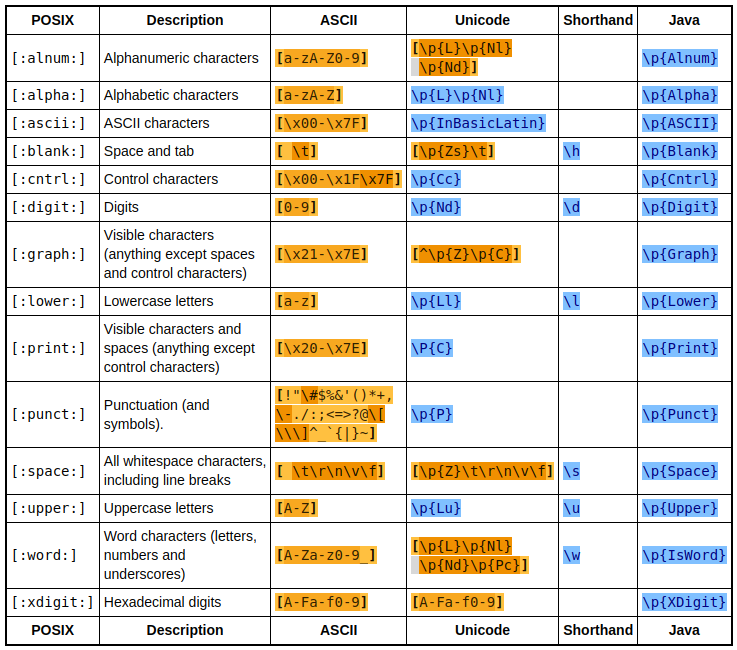
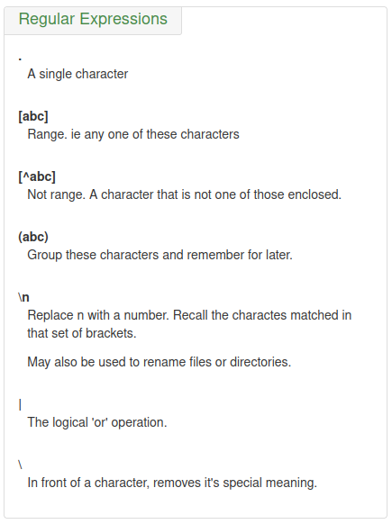
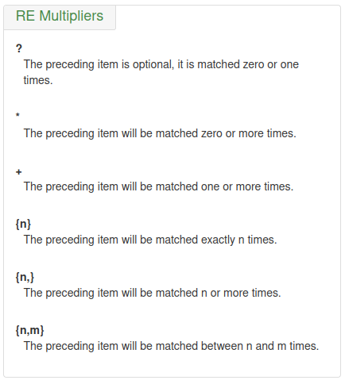
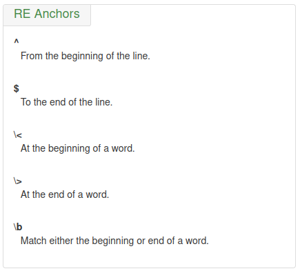
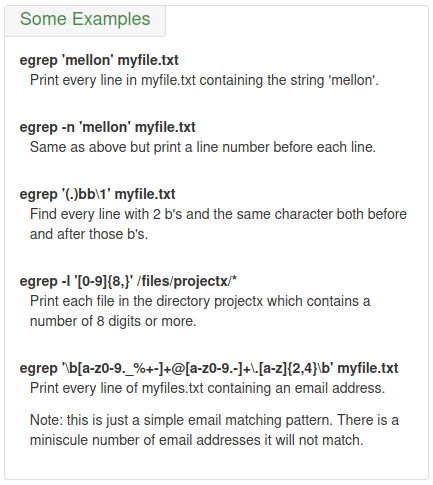

# RegExpr

i.e., Regular Expression

`[0123456789]` matches any **single digit**, where as `[^()]` matches any single character that is not an **opening or closing parenthesis**

range expressions: '[a-d]' = '[abcd]'

## test

**The only way to be certain that a particular RE works is to test it.**

## character classes and bracket expressions

### character classes

[POSIX locale classes](https://pubs.opengroup.org/onlinepubs/9699919799/basedefs/V1_chap07.html#tag_07_03_02_04):

'[:alnum:]' = '[:alpha:]' + '[:digit:]'

'[:alpha:]' = '[:lower:]' + '[:upper:]' = '[A-Za-z]'

'[:blank:]' = blank characters: space and tab

'[:cntrl:]' = control characters, in ASCII, octal codes 000 through 037, and 177 (DEL)

'[:digit:]' = digits: 0 1 2 3 4 5 6 7 8 9

'[:graph:]' = graphical characters: '[:alnum:]' and '[:punct:]'

'[:print:]' = printable characters: '[:graph:]' and space, in the range of ASCII 32-126

'[:punct:]' = punctuation characters: ! " # $ % & ' ( ) * + , - . / : ; < = > ? @ [ \ ] ^ _ ` { | } ~ 

'[:space:]' = space characters: tab, newline, vertical tab, form feed, carriage return, and space

'[:xdigit:]' = hexadecimal digits: 0 1 2 3 4 5 6 7 8 9 A B C D E F a b c d e f

ref: https://www.regular-expressions.info/posixbrackets.html




### shorthand character classes

You will find it sort of funny that some metacharacters are metacharacters alone and when we use backslash before them they are converted into literal characters. While some metacharacters have a backslash with them, they have their special behavior in the presence of this backslash. And if this backslash is dropped they lose their special behavior and become a literal character. Actually these special metacharacters are also called as **shorthand character classes**. As you can match a group of characters with one metacharacter. And the question about how to escape these simply avoid the backslash.

In this case the escape character introduces a special meaning rather than taking it away.
```
\s - matches anything which is considered whitespace. This could be a space, tab, line break etc.
\S - matches the opposite of \s, that is anything which is not considered whitespace.
\d - matches anything which is considered a digit. ie 0 - 9 (It is effectively a shortcut for [0-9]).
\D - matches the opposite of \d, that is anything which is not considered a digit.
\w - matches anything which is considered a word character. That is [A-Za-z0-9_]. Note the inclusion of the underscore character '_'. This is because in programming and other areas we regulaly use the underscore as part of, say, a variable or function name.
\W - matches the opposite of \w, that is anything which is not considered a word character.
```

### character class tips

Special characters lose their special meaning inside **bracket expressions**!

']' ends the bracket expression if it's not the first list item. So if you want to make the ']' character a list item, you must put it first.

'-' represents the range if it's not first or last in a list or the ending point of a range.

'^' represents the characters not in the list. If you want to make the '^' character a list item, place it anywhere but first.

character class
- '[:' represents the open character class symbol, and should followed by a valid character class name.
- ':]' represents the close character class symbol.

locale definitions usage in RE bracket expressions

An **equivalence class** expression shall represent the set of **collating elements** belonging to an **equivalence class**.

collating symbol
-  '[.' represents the open collating symbol.
-  '.]' represents the close collating symbol.

equivalence class
-  '[=' represents the open equivalence class.
-  '=]' represents the close equivalence class.

### bracket expression

in the locale definition, the expression `[[.ch.]]` shall be treated as an RE containing the collating symbol `ch`, while `[ch]` shall be treated as an RE matching `c` or `h`. Collating symbols are recognized only **inside bracket expressions**. If the string is not a collating element in the current locale, the expression is invalid.


## regexpr basics

ref: https://ryanstutorials.net/linuxtutorial/grep.php

`.` (dot) - a single character.

Multipliers:

`?` - the preceding character matches 0 or 1 times only.

`+` - the preceding character matches 1 or more times.

`*` - the preceding character matches 0 or more times.

`{n}` - the preceding character matches exactly n times.

`{n,m}` - the preceding character matches at least n times and not more than m times.

Bracket Expressions:

`[agd]` - the character is one of those included within the square brackets.

`[^agd]` - the character is not one of those included within the square brackets.

`[c-f]` - the dash within the square brackets operates as a *range*. In this case it means either the letters c, d, e or f.

Modifiers:

`()` - allows us to **group** several characters to *behave as one*.

`|` (pipe symbol) - the logical **OR** operation.

`^` - matches the **beginning** of the line.

`$` - matches the **end** of the line. 

`\<word\>` or `\bword\b` - matches a word.


### Explanation

`.` (dot) - a single character

The dot matches any one character, except a newline.

example: "13." matches 13 + at least one of any character (including a space): 1133, 1134, but not 13 (additional character missing).

---

`?` - the preceding character matches 0 or 1 times only

The question mark matches zero or one of the previous RE or characters. It is generally used for matching single characters.

example: 'a\?b' matches 'b' or 'ab'

---

`+` - the preceding character matches 1 or more times

The plus matches one or more of the previous RE. It serves a role similar to the *, but does not match zero occurrences.

example: 'a\+b' matches 'ab', 'aab', 'aaab'...

---

`*` - the preceding character matches 0 or more times

The asterisk matches any numbers of repeats of the character string or RE preceding it, include zero instances.

example: "1133*" matches 11 + one or more 3's: 113, 1133, 113333, and so forth.

---

`{n}` - the preceding character matches exactly n times.

`{n,m}` - the preceding character matches at least n times and not more than m times

Escaped "curly brackets" or "braces" indicate the number of occurrences of a preceding RE to match. 
- `[0-9]\{5\}` matches exactly five digits (characters in the range of 0 to 9). 
- `[0-9]\{i,j\}` matches between i and j, inclusive sequences. 
- `[0-9]\{i,\}` matches more than or equal to i sequences.

---

`^`

The caret `^` matches the beginning of a line, but sometimes, depending on context, negates the meaning of a set of characters in an RE.

---

`\<`, `\>` or `\b`

**Escaped** "angle brackets" `\<...\>` mark word boundaries.

example: "`\<the\>`" matches the word "the", but not words "them", "there", "other", etc.

The `\<` and `\>` aren't available in all regular expression tools but `\b` generally is so it is the safer one to use.

---

`()`

Parentheses enclose a group of REs. They are useful with the following "`|`" operator, and in substring extraction using expression `\(regexp\)` to group the inner `regexp` as a whole. This is used to:

1. Apply postfix operators, like `\(abcd\)*`: search for zero or more sequences of 'abcd', while `abcd*` search for 'abc' followed by zero or more occurrences of 'd'.
2. Use back references, `\(regexp1\)\|\(regexp2\)`: matches either `regexp1` or `regexp2`.

---

`|`

The `|` ("or") RE operator matches any of a set of alternative characters.

example: `grep 're(a|e)d' misc.txt # will match "read" and "reed"`

---

### Metacharacters

There are two basic types of metacharacters. 

- Single character metacharacters and 
- Double character metacharacters.

Sometimes we may actually want to search for one of the characters which is a metacharacter. To do this we use a feature called **escaping**. By placing the backslash ( `\` ) in front of a metacharacter we can remove it's special meaning.

`\` - Escape, or remove the special meaning of the next character

The backslash escapes a special character, which means that character gets interpreted literally (and therefore no longer special).

In some instances of regular expressions we may also use escaping to introduce a special meaning to characters which normally don't have a special meaning. We call this escaping sequences as *double character metacharacters*.

---

single character metacharacters
```
1. Backslash		\
2. Caret			^
3. Pipe				|
4. Period			.
5. Dollar Sign		$
6. Question Mark	?
7. Asterisk			*
8. Plus Sign		.
9. Opening Parenthesis	(
10. Closing Parenthesis	)
11. Opening Square Bracket	[
12. Opening curly Bracket	{
```

---

double character metacharacters, also called **shorthand character classes**


---

### Grouping

Group the regular expression within the parentheses, also known as sub-expression

Examples:

`\b(\d{1,3}.){3}\d{1,3}\b` matches IP addresses.

### Block References

Whenever we match something within *brackets* (parentheses), that value is actually stored in a variable which we may refer to later on in the regular expression. To access these variables we use the escape character ( `\` ) followed by *a digit*. The first set of brackets is referred to with `\1`, the second set of brackets with `\2` and so on.

Examples:

`(\b[A-Z]\w+\b) Smith.*\1 Smith` matches "John Smith but John Smith". 

### Alternation

With alternation we are looking for something or something else. We have seen a very basic example of alternation with the range operator. This allows us to perform alternation with a single character, but sometimes we would like to perform the operation with a larger set of characters. We can achieve this with the pipe symbol ( `|` ) which means **or**.

Examples:

`dog|cat|bird` matches either 'dog' or 'cat' or 'bird' in the sentences below

Harold Smith has two **dog**s, one **cat** and three **bird**s.

### Lookahead and Lookbehind

The main idea of both the lookahead and lookbehind is to see if something matches (or doesn't) and then to throw away what was actually matched.

Both of them operate in one of two modes:

- Positive - in which we are seeking to find something which **matches**.
- Negative - in which we are seeking to find something which **doesn't match**.

With a lookahead we want to look ahead (hence the name) in our string and see if it matches the given pattern, but then disregard it and move on.

- `(?=x)`, positive lookahead for `x`
- `(?!x)`, negative lookahead for `x`
- `(?<=x)`, positive lookbehind for `x`
- `(?<!x)`, negative lookbehind for `x`

Examples:

---

To identify numbers greater than 4000 but less than 5000, we need to exclude 4000.

`\b4(?!000)\d\d\d\b`, the **negative lookahead** matches `4010` but not `4000`

---

Let's say we would like to find instances of the name 'Smith' but only if they are **a surname**. To achieve this we have said that we want to look at the word before it and if that word begins with a **capital letter** we'll assume it is a surname

`(?<=[A-Z]\w* )Smith` is a **positive lookbehind** to check if the name 'Smith' has a surname before it.

Now we won't identify Smith Francis but we will identify Harold **Smith**.

---

# grep
https://www.gnu.org/software/grep/manual/grep.html


## Basic Usage


`-I` or `--binary-files=without-match` suppresses "**binary file matches**" messages in your `grep` output.


## Regular Expressions




## RE Multipliers




## RE Anchors



`\b` Matches word boundaries, while `\B` is the Negation, i.e. matches positions that are not word boundaries.


## Some Examples




ref: https://ryanstutorials.net/linuxtutorial/cheatsheetgrep.php


### Match multi-pattern

`xargs -I {} sh -c 'grep "Failed$" {}; grep "Passed$" {}`


# sed

sed, a stream editor

https://www.gnu.org/software/sed/manual/sed.html#Common-Commands

## how sed works
sed maintains 2 data buffers: the active `pattern space`, and auxiliary `hold space`. Both are initially empty.

sed operates by performing the following cycle on each line of input: 
- first, sed reads one line form the input stream, removes any trailing newline, and places it in the `pattern space`. 
- Then commands are executed; 
  - each command can have an address associated to it:
  - addresses are a kind of condition code, and a command is only executed if the condition is verified before the command is to be executed.

When the end of the script is reached, unless the '-n' option is in use, the contents of `pattern space` are printed out ot the output stream, adding back the trailing newline if it was removed. Then the next cycle starts for the next input line.

Unless special commands (like 'D') are used, the `pattern space` is detected between two cycles. The `hold space`, on the other hand, keeps its data between cycles.

### pattern space

sed works like this: sed reads one line at a time, chops off the terminating newline, puts what is left into the '`pattern space`' where the sed script can address or change it, and when the '`pattern space`' is printed, appends a new line to stdout (or to a file). If the '`pattern space`' is entirely or partially detected with 'd' or 'D', the newline is not added in such cases. Thus scripts like 
`sed 's/\n//' file`       # to delete newlines from each line             
`sed 's/\n/foo\n/' file`  # to add a word to the end of each line 
will NEVER work, because the trailing newline is removed before the line is put into the '`pattern space`'. 

### options

`sed [OPTION]... 'operations' [input-file]...`

`OPTION` is one of the following: (`-n` and `-i` are used more often)

```shell
  -n, --quiet, --silent
                 suppress automatic printing of pattern space
      --debug
                 annotate program execution
  -e script, --expression=script
                 add the script to the commands to be executed
  -f script-file, --file=script-file
                 add the contents of script-file to the commands to be executed
  --follow-symlinks
                 follow symlinks when processing in place
  -i[SUFFIX], --in-place[=SUFFIX]
                 edit files in place (makes backup if SUFFIX supplied)
  -l N, --line-length=N
                 specify the desired line-wrap length for the `l' command
  --posix
                 disable all GNU extensions.
  -E, -r, --regexp-extended
                 use extended regular expressions in the script
                 (for portability use POSIX -E).
  -s, --separate
                 consider files as separate rather than as a single,
                 continuous long stream.
      --sandbox
                 operate in sandbox mode (disable e/r/w commands).
  -u, --unbuffered
                 load minimal amounts of data from the input files and flush
                 the output buffers more often
  -z, --null-data
                 separate lines by NUL characters
      --help     display this help and exit
      --version  output version information and exit

```


### operations (command)

`operations` could be in form of `[n1[,n2]]command`, while `command` is mostly one of `[acdips]`.

```shell

a\
text

    Append text after a line.
a text

    Append text after a line (alternative syntax).
b label

    Branch unconditionally to label. The label may be omitted, in which case the next cycle is started.
c\
text

    Replace (change) lines with text.
c text

    Replace (change) lines with text (alternative syntax).
d

    Delete the pattern space; immediately start next cycle.
D

    If pattern space contains newlines, delete text in the pattern space up to the first newline, and restart cycle with the resultant pattern space, without reading a new line of input.

    If pattern space contains no newline, start a normal new cycle as if the d command was issued.
e

    Executes the command that is found in pattern space and replaces the pattern space with the output; a trailing newline is suppressed.
e command

    Executes command and sends its output to the output stream. The command can run across multiple lines, all but the last ending with a back-slash.
F

    (filename) Print the file name of the current input file (with a trailing newline).
g

    Replace the contents of the pattern space with the contents of the hold space.
G

    Append a newline to the contents of the pattern space, and then append the contents of the hold space to that of the pattern space.
h

    (hold) Replace the contents of the hold space with the contents of the pattern space.
H

    Append a newline to the contents of the hold space, and then append the contents of the pattern space to that of the hold space.
i\
text

    insert text before a line.
i text

    insert text before a line (alternative syntax).
l

    Print the pattern space in an unambiguous form.
n

    (next) If auto-print is not disabled, print the pattern space, then, regardless, replace the pattern space with the next line of input. If there is no more input then sed exits without processing any more commands.
N

    Add a newline to the pattern space, then append the next line of input to the pattern space. If there is no more input then sed exits without processing any more commands.
p

    Print the pattern space.
P

    Print the pattern space, up to the first <newline>.
q[exit-code]

    (quit) Exit sed without processing any more commands or input.
Q[exit-code]

    (quit) This command is the same as q, but will not print the contents of pattern space. Like q, it provides the ability to return an exit code to the caller.
r filename

    Reads file filename.
R filename

    Queue a line of filename to be read and inserted into the output stream at the end of the current cycle, or when the next input line is read.
s/regexp/replacement/[flags]

    (substitute) Match the regular-expression against the content of the pattern space. If found, replace matched string with replacement.
t label

    (test) Branch to label only if there has been a successful substitution since the last input line was read or conditional branch was taken. The label may be omitted, in which case the next cycle is started.
T label

    (test) Branch to label only if there have been no successful substitutions since the last input line was read or conditional branch was taken. The label may be omitted, in which case the next cycle is started.
v [version]

    (version) This command does nothing, but makes sed fail if GNU sed extensions are not supported, or if the requested version is not available.
w filename

    Write the pattern space to filename.
W filename

    Write to the given filename the portion of the pattern space up to the first newline
x

    Exchange the contents of the hold and pattern spaces.
y/src/dst/

    Transliterate any characters in the pattern space which match any of the source-chars with the corresponding character in dest-chars.
z

    (zap) This command empties the content of pattern space.
#

    A comment, until the next newline.
{ cmd ; cmd ... }

    Group several commands together.
=

    Print the current input line number (with a trailing newline).
: label

    Specify the location of label for branch commands (b, t, T).

```


## sed [-nefr] [operation]

The `n1-n2` line match **operation** would be like: `'[n1[,n2]]function'`. There are also other forms of **selecting lines**, e.g. the regular expression match.

### command (**function**)

The `function` is also called `command` in an `operation`.

- a: add
- c: change
- d: delete
- i: insert
- p: print
- s: substitute

### selecting lines

Addresses determine on which line(s) the `sed` command will be executed. The following command replaces the word ‘hello’ with ‘world’ only on line 144:

```bash
sed '144s/hello/world/' input.txt > output.txt
```

If no addresses are given, the command is performed on **all lines**. The following command replaces the word ‘hello’ with ‘world’ on all lines in the input file:

```bash
sed 's/hello/world/' input.txt > output.txt
```


#### `/regexp/`

Addresses can contain **regular expressions to match** lines based on content instead of line numbers. The following command replaces the word ‘hello’ with ‘world’ only in lines containing the word ‘apple’:

```bash
sed '/apple/s/hello/world/' input.txt > output.txt
```


#### `n1,n2`

An **address range** is specified with two addresses separated by a comma (`,`). Addresses can be numeric, regular expressions, or a mix of both. The following command replaces the word ‘hello’ with ‘world’ only in lines 4 to 17 (inclusive):

```bash
sed '4,17s/hello/world/' input.txt > output.txt
```


#### reverse selecting lines

Appending the `!` character to the end of an address specification (before the command letter) negates the sense of the match.  That is, if the `!` character follows an address or an address range, then only lines which do *not* match the addresses will be selected. The following command replaces the word ‘hello’ with ‘world’ only in lines *not* containing the word ‘apple’:

```bash
sed '/apple/!s/hello/world/' input.txt > output.txt
```


The following command replaces the word ‘hello’ with ‘world’ only in lines 1 to 3 and 18 till the last line of the input file (i.e. excluding lines 4 to 17):

```bash
sed '4,17!s/hello/world/' input.txt > output.txt
```


### delimiter

The most common delimiter is a forward slash (`/`). Other characters can also be used as delimiters. This is particularly useful if the regexp itself contains a lot of slashes, since it avoids the tedious escaping of every `/`. If regexp itself includes any delimiter characters, each must be escaped by a backslash (`\`).

**Alternate Delimiters**:

- `@`: Often used when dealing with file paths or URLs that contain slashes.
- `#`: Commonly used for similar reasons as `@`.
- `|`: Useful for separating complex patterns.

```bash
sed 's@/usr/local/bin@/opt/bin@' file.txt
sed 's#/usr/bin#/bin#' file.txt
sed 's|/etc|/config|' file.txt
# The above are examples of most commonly used delimiters
# While any character can be used as a delimiter
```


**In selecting lines**:

If `%` is used as a delimiter, the matching regular expression will be like:`\%regexp%` (The `%` may be replaced by any other single character)

The beginning backslash (`\`) is used to make the following character have a escaped meaning.


## `s` Command

Command format: `s/regexp/replacement/flags` ## supporting `sed '/pattern/{ action }'`

Its basic concept is simple: the 's' command attempts to match the 'pattern space' against the supplied regular expression 'regexp'; if the match is successful, then that portion of the 'pattern space' which was matched is replaced with 'replacement'.

In a substitution command, the `w` flag writes the substitution result to a file, and the `e` flag executes the subsitution result as a shell command. As with the `r/R/w/W/e` commands, these must be terminated with a newline. If whitespace, comments or semicolons are found, they will be included in the shell command or filename, leading to unexpected results:
```bash
$ echo a | sed 's/a/b/w1.txt#foo'
b

$ ls -1
1.txt#foo
```

### example

#### Print
`sed -n 's/^ *\* Command: //p'`

This command is usually only used in conjunction with the `-n` command-line option. 
The `-n` option suppresses the automatic prining, while the `p` flag enables printing out substituted `partten space` content.

#### Append text to the end of lines
The Append command will append text the next line and the Insert command will append text to the previous line.
```
# Append "text_to_append" to each line
sed 's/$/text_to_append/' input.txt
```

### flag
The `s` command can be followed by **zero or more** of the following flags:

`g`: 
Apply the replacement to all matches to the regexp, not just the first.

`number`: 
Only replace the numberth match of the regexp.

interaction in s command Note: the POSIX standard does not specify what should happen when you mix the g and number modifiers, and currently there is no widely agreed upon meaning across sed implementations. For GNU sed, the interaction is defined to be: ignore matches before the numberth, and then match and replace all matches from the numberth on.

`p`: 
If the substitution was made, then print the new `pattern space`.

Note: when both the `p` and `e` options are specified, the relative ordering of the two produces very different results. In general, `ep` (evaluate then print) is what you want, but operating the other way round can be useful for debugging. For this reason, the current version of GNU `sed` interprets specially the presence of `p` options both before and after `e`, printing the pattern space before and after evaluation, while in general flags for the `s` command show their effect just once. This behavior, although documented, might change in future versions.

`w filename`: 
If the substitution was made, then write out the result to the named file. As a GNU sed extension, two special values of filename are supported: `/dev/stderr`, which writes the result to the standard error, and `/dev/stdout`, which writes to the standard output.

`e`: 
This command allows one to pipe input from a shell command into pattern space. If a substitution was made, the command that is found in pattern space is executed and pattern space is replaced with its output. A trailing newline is suppressed; results are undefined if the command to be executed contains a NUL character. This is a GNU sed extension.

`I`
`i`: 
The `I` modifier to regular-expression matching is a GNU extension which makes sed match regexp in a `case-insensitive` manner.

`M`
`m`: 
The `M` modifier to regular-expression matching is a GNU sed extension which directs GNU sed to match the regular expression in **multi-line mode**. The modifier causes `^` and `$` to match respectively (in addition to the normal behavior) the empty string after a newline, and the empty string before a newline. There are special character sequences (\` and \') which always match the beginning or the end of the buffer. In addition, the period character does not match a new-line character in multi-line mode.

### Replace with block references

The 'replacement' can contain '\x' ('x' being a number of 1 to 9, inclusive) references, which will refer to the sub-expressions of the matchs. Each sub-expression is the xth matching group in `\(sub-expr\)`. Also, the 'replacement' can contain unescaped & characters which refers the whole matched portion of the pattern space.

## Delete empty line:
```sed '/^$/d' <input-file> ```## `^`: start, `$`: end, 'd': delete, `^$`: match an empty line

example: ```sed '/^$/d' /tmp/data.txt > /tmp/output.txt```

## Delete blank line with only space:
```sed '/^[[:space:]]*$/d' <input-file>``` ## `[[:space:]]*`: {0-n} spaces

example: ```sed -i '/^[[:space:]]*$/d' input.file``` ## `-i`: update the file

## Replace newline(\n):
```sed ':a;N;$!ba;s/\n/ /g' file``` ## 'N': newline + next line (appends a newline and the next input line to the 'pattern space')

### explanation
This will read the whole file in a loop (':a;N;$!ba'), then replaces the newline(s) with a space (`s/\n/ /g`).

0. sed starts by reading the first line excluding the newline into pattern space.
1. create a label via ':a'.
2. append a newline and next line to the pattern space via 'N'.
3. If we are before the last line, branch to the created label '$!ba' ('$!' means not to do it on the last line. This is necessary to avoid executing 'N' again, which which would terminate the script if there is no more input!).
4. Finally the substitution replaces every newline with a space on the pattern space (which is the whole file).

`sed -e ':a' -e 'N' -e '$!ba' -e 's/\n/ /g' file` # cross-platform compatible syntax

## conditional branch
t label

Branch to label only if there has been a successful substitution since the last input line was read or conditional branch was taken. The label may be omitted, in which case the next cycle is start.

example: `sed ':x;N;/middle/tx;s/\n/,/g'`


# awk

ref: 

[Download Free eBook PDF: The Awk Programming Language - nixCraft](https://www.cyberciti.biz/link/download-free-pdf-the-awk-programming-language/)

Awk Tutorial (2016): Jonathan Palardy - https://blog.jpalardy.com/posts/awk-tutorial-part-1/

Awk (2019): Wikipedia - https://en.wikipedia.org/wiki/AWK

https://www.gnu.org/software/gawk/manual/gawk.html


Awk is a command line tool, also a programming language. not a general language, optimized for text processing, turing complete.

Awk is part of posix, so installed everywhere, many of the problems you face are text processing problems, awk is the gold standard of text processing tools

Awk was preceded by sed

Awk's powerful regexes and also its limitations inspired Perl

## program usage

```bash
awk program input-file1 input-file2 ...
awk -f program-file input-file1 input-file2 ...
awk [-F field-separator] program filename ...
```

program = pattern { action }

```bash
# Programs in awk consist of pattern–action pairs.
awk 'pattern{ action }'
awk 'BEGIN{ action };/regexp/{ action };END{ action }'
```

- `$0`: all field
- `$1`: the first field after separated by 'field-separator'
- `$2`: the second field
- `$n`: the nth field
- `$NF`: the last field
- `$(NF-1`): the second last field

### examples

**Simple example**

```bash
awk -F "," 'BEGIN{OFS="\n"}; \
{print $1,$5,$2,$4,$3,"Phase noise",$8,$6,$7,$10,$9,$11,$14,$12,$15}'
```
```shell
# To add as Make targets for all the .c files in current directory
ls *.c | awk 'BEGIN{OFS="\n\r"}{print}' | awk '{OFS=" "}{print "build_objs +=",$1}' | sed 's/.c$/.o/g' > objects.mk
```

**variables and if statements**

```bash
xxd -c 1 -ps test.bin | awk 'BEGIN{ i = 0; line = ""}; {i++; line = ($1 line); if(i>=16){print line; line = ""; i = 0;} }; END{if(i>0)print line}' | head
# Firstly, produce hex file by `xxd` in 1 byte a line format, 
# then accumulate them by `awk` in 16 bytes a line foramt in little endian mode
# Another way of using `awk`
xxd -g 16 test.bin | cut -d " " -f 2 | sed 's/ //g' | sed 's/\(..\)/\1 /g' |awk '{for(i=NF;i>0;i--) printf "%s", $i; print ""}' > test.uvhex
```

### single quotes

There are **single quotes** around the `awk` *program* so that the shell won’t interpret any of it as special shell characters.


### omission and implication

Either the pattern or the action can be omitted, equivalents of the omitted form:

- pattern omitted:  `/.*/ { action }`
- action omitted:  `/some regex/ { print $0 }`


implicit staff in awk

`awk '{ print }'` is equivalent of `awk '{ print $0 }'`


remove leading space

`awk '{$1=$1}1' file.txt`, removes leading space, equals to

`awk '{ $1 = $1 }; { print }' file.txt`, there is an implicit `;` before the `1`, which is a pattern with action part omitted, i.e., `1{ print}`


## awk patterns

Awk **patterns** are basically just "if" statements to decide to execute the **action**

Summary of Pattern Types

1. BEGIN { statements } (special pattern)
   1. The statement are executed once before any input has been read.
2. END { statements } (special pattern)
   1. The statements are executed once after all input has been read.
3. expression { statements }
   1. The statements are executed at each input line where the *expression* is true, that is, nonzero or nonnull.
4. /regular expression/ { statements }
   1. The statements are executed at each input line that contains a string matched by the *regular expression*.
5. compound pattern { statements }
   1. A *compound pattern* combines expressions with **&& (AND)**, **||(OR)**, **!(NOT)**, and **parentheses**; the *statements* are executed at each input line where the *compound pattern* is true.
6. pattern1, pattern2 { statements }
   1. A *range pattern* matches each input line from a line matched by *pattern1*, to the next line matched by *pattern2*, inclusive; the *statements* are executed at each matching line


Patterns in `awk` control the execution of rules -- a rule is executed when its pattern matches the current input record.

ref: https://www.gnu.org/software/gawk/manual/gawk.html#Expressions-as-Patterns


### expression

The pattern matches if the **expression**'s value is nonzero (if a number) or non-null (if a string).

The expression is reevaluated each time the rule is tested against a new input record.

```
# if the 1rst element equals "li", print the 2nd one
awk '$1 == "li" { print $2 }' mail-list
```


#### Comparison Operators

< less than, NF < 10 # Num Fields less than 10

<= less than or equal to, NR <= 150 # Num Records less than or equal to 150

== equal to, $1 == "SomeString"

!= not equal to, 

\>= greater than or equal to, $2/$3 >= 0.5

\> greater than

~ matched by, $4 ~ /linux/ (or "linux") # The 4th field matches "linux"

!~ not matched by, $5 !~ /awk/ # The 5th field not matches "awk"


#### String-Matching Patterns

1. /regexpr/ implies "$0 ~"
   1. Matches when the current input line contains a substring matched by regexpr
2. expression ~ /regexpr/
   1. Matches if the string value of *expression* contains a substring matched by *regexpr*
3. expression ~! /regexpr/
   1. Matches if the string value of *expression* does not contain a substring matched by *regexpr*

Any expression may be used in place of */regexpr/* int the context of `~` and `!~`


### /regular expression/

The pattern matches when the input record matches the `regexp`.

```awk
'/foo|bar|baz/  { buzzwords++ }'
```

A *regular expression* enclosed in slashes (`/`) is an `awk` pattern that matches every input record whose text belongs to that set. 

regular expression comparisons ( **match or not** ):

The two operators `~` and `!~` perform **regular expression comparisons**.


### range pattern

A `range pattern` is made of two patterns separated by a **comma**, in the form `begpat, endpat`. It is used to match ranges of **consecutive** input records. The first pattern, `begpat`, controls where the range begins, while `endpat` controls where the pattern ends.

Output **records** between two patterns

```bash
# Default action for `awk` is to **Print current line**.
awk '/pattern start/, /pattern end/' text.txt
```

In a range pattern, the comma (`,`) has the **lowest** precedence of all the operators (i.e., it is evaluated last).


Range Patterns

A range pattern consists of two patterns separated by a comma

A range patten matches each line between an occurrence of pattern1 and the next occurrence of pattern2 inclusive

If no instance of the second pattern is subsequently found, then all lines to the end of the input are matched.

`NR == 1, NR == 10 { print $0 }`, Applies action to lines 1 through 10.


### Awk Patterns Summary

Pattern, Example, Matches

BEGIN, BGEIN, before any input has been read

END, END, after all input has been read

expression, $3 < 100, lines in which third field is less than 100

string-matching, (regex) /Asia/, lines that contain "Asia"

compound, $3 < 100 && $4 == "Asia", lines in which third field is less than 100 and fourth field is "Asia"

range, NR == 10, NR == 20, tenth to twentieth lines of input inclusive


## Awk Actions

Executed if the pattern matches (even if there was no pattern)

Are much like a typical language (such as C)

Have access to a number of build-in variables

Can **create variables** or **call functions** (such as *print*, a built-in function)

Parenthesis in function calls are optional

Can override fields or create new fields


### Actions elements

The statements in **actions** can include:

expressions, with constants, variables, assignments, function calls, etc.

For example:

print expression-list

printf(format, expression-list)

if (expression) statement

if (expression) statement else statement

while (expression) statement

for (expression; expression; expression) statement

for (variable in array) statement

do statement while (expression)

break

continue

next

exit

exit expression

{ statements }


### Expressions

The primary expressions are:

​	numeric and string constants, variables, fields, function calls, array elements


These operators combine expressions:

​	assignment operators = += -= *= /= %= ^=

​	conditional expression operator ?:

​	logical operators ||(OR), &&(AND), !(NOT)

​	matching operators ~ and !~

​	relational operators < <= == != > >=

​	concatenation (no explicit operator)

​	arithmetic operators + - * / % ^

​	unary + and -

​	increment and decrement operator ++ and -- (prefix and postfix)

​	parentheses for grouping


### Expression Operators

operation, operators, examples, meaning of example

assignment, = += -+ *= /= %= ^=, x *= 2, x = x * 2

conditional, ?:, x?y:z, if x is true then y, else z

logical OR, ||, x || y, 1 if x or y is true, 0 otherwise

logical AND, &&, x && y, 1 if x and y are true, 0 otherwise

array membership, in, i in a, 1 if a[i] exists, 0 otherwise

matching, ~ !~, $1 ~ /x/,  if the first field contains an x, 0 otherwise

relational, < <= == != >= >, x == y, 1 if x is equal to y, 0 otherwise

concatenation, , "a" "bc", "abc"; there is no explicit concatenation operator

add, subtract, + -, x + y, sum of x and y

multiply, divide, mod, * / %, x % y, remainder of x divided by y

unary plus and minus, + -, -x, negated value of x

logical NOT, !, !$1, 1 if $1 is zero or null, 0 otherwise

exponentiation, ^, x ^ y, y exponentiation of x

increment, decrement, ++ --, ++x x++, add 1 to x

field, $, $i+1, value of i-th field, plus 1

grouping, ( ), ($s)++, add 1 to value of i-th field


### Control Flow

Most standard control flow is supported

Syntax is like C

if/esle, while, for


Control Flow Statement

{ statements }

​	statement grouping

if (expression) statement

​	if *expression* is true, execute *statement*

if (expression) statement else statement

​	if *expression* is true, execute statement, otherwise execute statement

while (expression) statement

​	if expression is true, execute statement, then repeat

for (expression1; expression2; expression3) statement

​	equivalent to *expression1; while (expression2) { statement; expression3}*

for (variable in array) statement

​	execute statement with variable set to each subscript in array in turn

do statement while { expression }

​	execute *statement*, if *expression* is true, repeat

break

​	immediately leave innermost enclosing *while*, *for* or *do*

continue

​	start next iteration of innermost enclosing *while*, *for* or *do*

next

​	start next iteration of main input loop

exit

exit expression

​	go immediately to the END action; if within the END action, exit program entirely.

​	Return *expression* as program status


example:

*while (expression) statement*

```awk
{
	i = 1
	while (i <= NF) {
		print $i
		i++
	}
}
```


*for (expression; expression; expression) statement*

```awk
{
	for (i = 1; i <= NF; i++)
		print $i
}
```


### Output Statements

print

​	print $0 on standard output

print expression, expression, ...

​	print expression's, separated by OFS, terminated by ORS

print expression, expression, ... >filename

​	print on file *filename* instead of standard output

print expression, expression, ... >>filename

​	append to file *filename* instead of overwriting previous contents

print expression, expression, ... | command

​	print to standard input of *command*

printf(format, expression, expression, ...)

printf(format, expression, expression, ...) >filename

printf(format, expression, expression, ...) >>filename

printf(format, expression, expression, ...) | command

​	printf statements are like print but the first argument specifies output format

close(filename), close(command)

​	break connection between print and *filename* or *command*

system(command)

​	execute *command*; value is status return of command


Printf % characters

character, print expression as

c, ASCII character

d, decimal integer

e, [-]d.ddddddE[+/-]dd

f, [-]ddd.dddddd

g, e or f conversion, whichever is shorter, with nonsignificant zeros suppressed

o, unsigned octal number

s, string

x, unsigned hexadecimal number

%, print a %, no argument is consumed


### String Concatenation

Example: Concatenate fields 2 and 3:

`print $2 $3`

Concatenate:

`print "hello" "world"

Outputs: "helloworld"


### Variable Types

Strings

"String literal"

Numbers:

`+1 1.0 1e0 0.1e+1 10E-1 001`

Types will be automatically coerced when needed


### Variables and call functions

```
# like wc command
{
	w += NF
	c = length + 1
}
END { print NR, w, c}
```


Define Functions

```
function add_threee (number) {
	return number + 3
}

(pattern) { print add_three(36) } # Outputs '''39'''
```


### Arrays

Arrays are one dimensional

For Strings or Numbers

Arrays and elements do not need to be declared

All arrays are associative

Iterate with: `for (variable in array)`

Delete element: `delete array[subscript]`

Set or replace element (string key): `Array["one"] = 2`

Set or replace element (integer key): `Array[5] = "two"`

Even with an integer key, the array is still associative!


### Field Manipulation

Fields can be specified by expression:

​	`$(NF-1)` is second to last, `$NF` is last, etc.

A field variable referencing a non-existent field can be created through assignment, Initial value is empty string:

​	`$(NF+1) = $(NF-1) / 1000`


## Built-in

### Built-in Variables

Variable, Meaning, Default

ARGC, number of command-line arguments, -

ARGV, array of command-line arguments, -

FILENAME, name of current input file, -

FNR, record number in current file, -

FS, controls the input field separator, " "

NF, number of fields in current record, -

OFMT, output format for numbers, "%.6g"

OFS, output filed separator, " "

ORS, output record separator, "\n"

RS, controls the input record separator, "\n"

RLENTHG, length of string matched by match function, -

RSTATRT, start of string matched by match function, -

SUBSEP, subscript separator, "\034"


### Built-in Math Functions

Function, Value Returned

atan2(y,x), arctangent of y/x in the range -pi to pi

cos(x), cosine of x, with x in radians

exp(x), exponential function of x

int(x), integer part of x; truncated towards 0 when x > 0

log(x), natural (base e) logarithm of x

rand(), random number r, where 0 <= r < 1

sin(x), sine of x, with x in radians

sqrt(x), square root of x

srand(x), x is new seed for rand()


### Built-in String Functions

function, description

gsub(r,s), substitute s for r globally in $0, return number of substitutions made

gsub(r,s,t), substitute s for r globally in string t, return number of substitutions made

index(s,t), return first position of string t in s, or 0 if t is not present

length(s), return number of characters in s

match(s,r), test whether s contains a substring matched by r, return index or 0; sets RSTART and RLENGTH

split(s,a), split s into array a on FS, return number of fields

split(s,a,fs) split s into array a on field separator fs, return number of fields

sprintf(fmt, expr-list), return expr-list formatted according to format string fmt

sub(r,s), substitute s for the leftmost longest substring of $0 matched by r, return number of substitutions made

sub(r,s,t), substitute s for the leftmost longest substring of t matched by r, return number of substitutions made

substr(s,p), return suffix of s starting at position p

substr(s,p,n), return substring of s of length n starting at position p


example:

{ gsub(/USA/, "United States"); print } # implicit arguments

gsub(/ana/, "anda", "banana") # explicit arguments


## awk program

Making and Running an awk program

```
#!/usr/bin/env awk -f
BEGIN { print "Hello, world!" }

./script.awk *.log
```


**Interpreter**:

The line beginning with `#!` lists the full file name of an **interpreter** to run, and a single optional initial command-line **argument** to pass to that interpreter. 

### Self-contained Scripts

```gawk
#!/usr/bin/awk -f
{ print }
```

It can be invoked with `./print.awk <filename>`

The `-f` tells AWK that the argument that follows is the file to read the AWK program from, which is the same flag that is used in sed. Since they are often used for one-liners, both these programs default to executing a program given as command-line argument, rather than a separate file.


## escape sequences
beginning with a backslash (`\`), only list uncommon ones:

`\a`: The “alert” character, Ctrl-g, ASCII code 7 (BEL). (This often makes some sort of audible noise.)

`\b`: Backspace, Ctrl-h, ASCII code 8 (BS).

`\f`: Formfeed, Ctrl-l, ASCII code 12 (FF).

`\n`: Newline, Ctrl-j, ASCII code 10 (LF).

`\r`: Carriage return, Ctrl-m, ASCII code 13 (CR).

`\t`: Horizontal TAB, Ctrl-i, ASCII code 9 (HT).

`\v`: Vertical TAB, Ctrl-k, ASCII code 11 (VT).

`\nnn`: The octal value nnn, where nnn stands for 1 to 3 digits between ‘0’ and ‘7’. For example, the code for the ASCII ESC (escape) character is ‘\033’.

`\xhh…`: The hexadecimal value hh, where hh stands for a sequence of hexadecimal digits (‘0’–‘9’, and either ‘A’–‘F’ or ‘a’–‘f’). A maximum of two digits are allowed after the ‘\x’. Any further hexadecimal digits are treated as simple letters or numbers. (c.e.) (The ‘\x’ escape sequence is not allowed in POSIX awk.)

> [!CAUTION]
>
> In ISO C, the escape sequence continues until the first non-hexadecimal digit is seen. For many years, `gawk` would continue incorporating hexadecimal digits into the value until a non-hexadecimal digit or the end of the string was encountered. However, using more than two hexadecimal digits produced undefined results. As of version 4.2, only two digits are processed.

`\/`: A literal slash (should be used for regexp constants only). This sequence is used when you want to write a regexp constant that contains a slash (such as `/.*:\/home\/[[:alnum:]]+:.*/`; the `[[:alnum:]]` notation is discussed in Using Bracket Expressions). Because the regexp is delimited by slashes, you need to escape any slash that is part of the pattern, in order to tell awk to keep processing the rest of the regexp.

`\"`: A literal double quote (should be used for string constants only). This sequence is used when you want to write a string constant that contains a double quote (such as "He said \"hi!\" to her."). Because the string is delimited by double quotes, you need to escape any quote that is part of the string, in order to tell awk to keep processing the rest of the string.

### meta-characters
`\`: suppresses the special meaning of a character when matching. ## example: `\$` matches character`$`

`^`: anchor matching to the beginning

`$`: anchor matching to the end

`.`(period): match single character


# Debug strategies

1. Check typos first
2. Re-reading references
3. Break pattern down into individual components and test each individually
4. Examine the output


