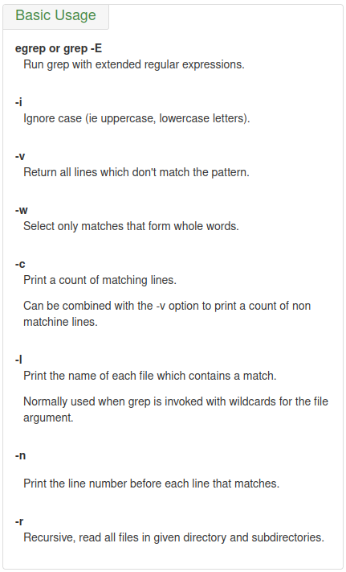

# regexp

regular expressions

## character classes and bracket expressions

`[0123456789]` matches any single digit, where as `[^()]` matches any single character that is not an opening or closing parenthesis

range expressions: '[a-d]' = '[abcd]'

### class list

**named POSIX classes**

'[:alnum:]' = '[:alpha:]' + '[:digit:]'

'[:alpha:]' = '[:lower:]' + '[:upper:]' = '[A-Za-z]'

'[:blank:]' = blank characters: space and tab

'[:cntrl:]' = control characters, in ASCII, octal codes 000 through 037, and 177 (DEL)

'[:digit:]' = digits: 0 1 2 3 4 5 6 7 8 9

'[:graph:]' = graphical characters: '[:alnum:]' and '[:punct:]'

'[:print:]' = printable characters: '[:graph:]' and space, in the range of ASCII 32-126

'[:punct:]' = punctuation characters: ! " # $ % & ' ( ) * + , - . / : ; < = > ? @ [ \ ] ^ _ ` { | } ~ 

'[:space:]' = space characters: tab, newline, vertical tab, form feed, carriage return, and space

'[:xdigit:]' = hexadecimal digits: 0 1 2 3 4 5 6 7 8 9 A B C D E F a b c d e f

ref: https://www.regular-expressions.info/posixbrackets.html


### character class tips

Special characters lose their special meaning **inside bracket expressions**!!!

']' ends the bracket expression if it's not the first list item. So if you want to make the ']' character a list item, you must put it first.

-  '[.' represents the open collating symbol.
-  '.]' represents the close collating symbol.
-  '[=' represents the open equivalence class.
-  '=]' represents the close equivalence class.

- '[:' represents the open character class symbol, and should followed by a valid character class name.
- ':]' represents the close character class symbol.

'-' represents the range if it's not first or last in a list or the ending point of a range.
'^' represents the characters not in the list. If you want to make the '^' character a list item, place it anywhere but first.

## basics

ref: https://ryanstutorials.net/linuxtutorial/grep.php

**.** (dot) - a single character.

**?** - the preceding character matches 0 or 1 times only.

***** - the preceding character matches 0 or more times.

**+** - the preceding character matches 1 or more times.

**{n}** - the preceding character matches exactly n times.

**{n,m}** - the preceding character matches at least n times and not more than m times.

**[agd]** - the character is one of those included within the square brackets.

**[^agd]** - the character is not one of those included within the square brackets.

**[c-f]** - the dash within the square brackets operates as a range. In this case it means either the letters c, d, e or f.

**()** - allows us to group several characters to behave as one.

**|** (pipe symbol) - the logical OR operation.

**^** - matches the beginning of the line.

**$** - matches the end of the line. 

**<word>** - matches a word.


`*` - the preceding character matches 0 or more times

The asterisk matches any numbers of repeats of the character string or RE preceding it, include zero instances.

example: "1133*" matches 11 + one or more 3's: 113, 1133, 113333, and so forth.

`.` (dot) - a single character

The dot matches any one character, except a newline.

example: "13." matches 13 + at least one of any character (including a space): 1133, 1134, but not 13 (additional character missing).

`?` - the preceding character matches 0 or 1 times only

The question mark matches zero or one of the previous RE or characters. It is generally used for matching single characters.

example: 'a\?b' matches 'b' or 'ab'

`+` - the preceding character matches 1 or more times

The plus matches one or more of the previous RE. It serves a role similar to the *, but does not match zero occurrences.

example: 'a\+b' matches 'ab', 'aab', 'aaab'...

`{n}` - the preceding character matches exactly n times.

`{n,m}` - the preceding character matches at least n times and not more than m times

Escaped "curly brackets" or "braces" indicate the number of occurrences of a preceding RE to match. "[0-9]\{5\}" matches exactly five digits (characters in the range of 0 to 9). "[0-9]\{i,j\} matches between i and j, inclusive sequences. "[0-9]\{i,\} matches more than or equal to i sequences.

`^`

The caret `^` matches the beginning of a line, but sometimes, depending on context, negates the meaning of a set of characters in an RE.

`\`

The backslash escapes a special character, which means that character gets interpreted literally (and therefore no longer special).

`<>`

Escaped "angle brackets" --\<...\>-- mark word boundaries.

example: "\<the\>" matches the word "the", but not words "them", "there", "other", etc.

The only way to be certain that a particular RE works is to test it.

`()`

Parentheses enclose a group of REs. They are useful with the following "`|`" operator and in substring extraction using expr. \(regexp\) groups the inner regexp as a whole. this is used to:
1. Apply postfix operators, like `\(abcd\)*`: search for zero or more sequences of 'abcd', while `abcd*` search for 'abc' followed by zero or more occurrences of 'd'.
2. Use back references, `regexp1\|regexp2`: matches either *regexp1* or *regexp2*.

`|`

The `|` "or" RE operator matches any of a set of alternate characters.

example: `grep 're(a|e)d' misc.txt ## will match "read" and "reed"`


# grep
https://www.gnu.org/software/grep/manual/grep.html


## Basic Usage




`-I` or `--binary-files=without-match` suppresses "**binary file matches**" messages in your `grep` output.


## Regular Expressions


## RE Multipliers


## RE Anchors


`\b` Matches word boundaries, while `\B` is the Negation, i.e. matches positions that are not word boundaries.


## Some Examples


ref: https://ryanstutorials.net/linuxtutorial/cheatsheetgrep.php


### Match multi-pattern

`xargs -I {} sh -c 'grep "Failed$" {}; grep "Passed$" {}`


# sed

sed, a stream editor

https://www.gnu.org/software/sed/manual/sed.html#Common-Commands

### options

`sed [OPTION]... 'operations' [input-file]...`

`OPTION` is one of: (`-n` and `-i` are used more often)

```shell
  -n, --quiet, --silent
                 suppress automatic printing of pattern space
      --debug
                 annotate program execution
  -e script, --expression=script
                 add the script to the commands to be executed
  -f script-file, --file=script-file
                 add the contents of script-file to the commands to be executed
  --follow-symlinks
                 follow symlinks when processing in place
  -i[SUFFIX], --in-place[=SUFFIX]
                 edit files in place (makes backup if SUFFIX supplied)
  -l N, --line-length=N
                 specify the desired line-wrap length for the `l' command
  --posix
                 disable all GNU extensions.
  -E, -r, --regexp-extended
                 use extended regular expressions in the script
                 (for portability use POSIX -E).
  -s, --separate
                 consider files as separate rather than as a single,
                 continuous long stream.
      --sandbox
                 operate in sandbox mode (disable e/r/w commands).
  -u, --unbuffered
                 load minimal amounts of data from the input files and flush
                 the output buffers more often
  -z, --null-data
                 separate lines by NUL characters
      --help     display this help and exit
      --version  output version information and exit

```


### operations

`operations` could be in form of `[n1[,n2]]command`, while `command` is mostly one of `[acdips]`.

```shell

a\
text

    Append text after a line.
a text

    Append text after a line (alternative syntax).
b label

    Branch unconditionally to label. The label may be omitted, in which case the next cycle is started.
c\
text

    Replace (change) lines with text.
c text

    Replace (change) lines with text (alternative syntax).
d

    Delete the pattern space; immediately start next cycle.
D

    If pattern space contains newlines, delete text in the pattern space up to the first newline, and restart cycle with the resultant pattern space, without reading a new line of input.

    If pattern space contains no newline, start a normal new cycle as if the d command was issued.
e

    Executes the command that is found in pattern space and replaces the pattern space with the output; a trailing newline is suppressed.
e command

    Executes command and sends its output to the output stream. The command can run across multiple lines, all but the last ending with a back-slash.
F

    (filename) Print the file name of the current input file (with a trailing newline).
g

    Replace the contents of the pattern space with the contents of the hold space.
G

    Append a newline to the contents of the pattern space, and then append the contents of the hold space to that of the pattern space.
h

    (hold) Replace the contents of the hold space with the contents of the pattern space.
H

    Append a newline to the contents of the hold space, and then append the contents of the pattern space to that of the hold space.
i\
text

    insert text before a line.
i text

    insert text before a line (alternative syntax).
l

    Print the pattern space in an unambiguous form.
n

    (next) If auto-print is not disabled, print the pattern space, then, regardless, replace the pattern space with the next line of input. If there is no more input then sed exits without processing any more commands.
N

    Add a newline to the pattern space, then append the next line of input to the pattern space. If there is no more input then sed exits without processing any more commands.
p

    Print the pattern space.
P

    Print the pattern space, up to the first <newline>.
q[exit-code]

    (quit) Exit sed without processing any more commands or input.
Q[exit-code]

    (quit) This command is the same as q, but will not print the contents of pattern space. Like q, it provides the ability to return an exit code to the caller.
r filename

    Reads file filename.
R filename

    Queue a line of filename to be read and inserted into the output stream at the end of the current cycle, or when the next input line is read.
s/regexp/replacement/[flags]

    (substitute) Match the regular-expression against the content of the pattern space. If found, replace matched string with replacement.
t label

    (test) Branch to label only if there has been a successful substitution since the last input line was read or conditional branch was taken. The label may be omitted, in which case the next cycle is started.
T label

    (test) Branch to label only if there have been no successful substitutions since the last input line was read or conditional branch was taken. The label may be omitted, in which case the next cycle is started.
v [version]

    (version) This command does nothing, but makes sed fail if GNU sed extensions are not supported, or if the requested version is not available.
w filename

    Write the pattern space to filename.
W filename

    Write to the given filename the portion of the pattern space up to the first newline
x

    Exchange the contents of the hold and pattern spaces.
y/src/dst/

    Transliterate any characters in the pattern space which match any of the source-chars with the corresponding character in dest-chars.
z

    (zap) This command empties the content of pattern space.
#

    A comment, until the next newline.
{ cmd ; cmd ... }

    Group several commands together.
=

    Print the current input line number (with a trailing newline).
: label

    Specify the location of label for branch commands (b, t, T).

```


## sed [-nefr] [operation]

The `n1-n2` line match **operation** would be like: `'[n1[,n2]]function'`. There are also other forms of selecting line, e.g. the regular expression match.

### **function**/command:

The `function` is also called `command` in a `operation`.

- a: add
- c: change
- d: delete
- i: insert
- p: print
- s: substitute

### selecting lines

Addresses determine on which line(s) the `sed` command will be executed. The following command replaces the word ‘hello’ with ‘world’ only on line 144:

```bash
sed '144s/hello/world/' input.txt > output.txt
```

If no addresses are given, the command is performed on all lines. The following command replaces the word ‘hello’ with ‘world’ on all lines in the input file:

```bash
sed 's/hello/world/' input.txt > output.txt
```


#### `/regexp/`

Addresses can contain **regular expressions to match** lines based on content instead of line numbers. The following command replaces the word ‘hello’ with ‘world’ only in lines containing the word ‘apple’:

```bash
sed '/apple/s/hello/world/' input.txt > output.txt
```


#### `n1,n2`

An **address range** is specified with two addresses separated by a comma (`,`). Addresses can be numeric, regular expressions, or a mix of both. The following command replaces the word ‘hello’ with ‘world’ only in lines 4 to 17 (inclusive):

```bash
sed '4,17s/hello/world/' input.txt > output.txt
```


### reverse selecting lines

Appending the `!` character to the end of an address specification (before the command letter) negates the sense of the match.  That is, if the `!` character follows an address or an address range, then only lines which do *not* match the addresses will be selected. The following command replaces the word ‘hello’ with ‘world’ only in lines *not* containing the word ‘apple’:

```bash
sed '/apple/!s/hello/world/' input.txt > output.txt
```


The following command replaces the word ‘hello’ with ‘world’ only in lines 1 to 3 and 18 till the last line of the input file (i.e. excluding lines 4 to 17):

```bash
sed '4,17!s/hello/world/' input.txt > output.txt
```


### delimiter

The most common delimiter is a forward slash (`/`). Other characters can also be used as delimiters. This is particularly useful if the regexp itself contains a lot of slashes, since it avoids the tedious escaping of every `/`. If regexp itself includes any delimiter characters, each must be escaped by a backslash (`\`).

**Alternate Delimiters**:

- `@`: Often used when dealing with file paths or URLs that contain slashes.
- `#`: Commonly used for similar reasons as `@`.
- `|`: Useful for separating complex patterns.

```bash
sed 's@/usr/local/bin@/opt/bin@' file.txt
sed 's#/usr/bin#/bin#' file.txt
sed 's|/etc|/config|' file.txt
# The above are examples of most commonly used delimiters
# While any character can be used as a delimiter
```


**In selecting lines**:

If `%` is used as a delimiter, the matching regular expression will be like:`\%regexp%` (The `%` may be replaced by any other single character)

The beginning backslash (`\`) is used to make the following character have a escaped meaning.


## The 's' Command

`s/regexp/replacement/flags` ## supporting (`sed '/pattern/{ action }'`)

Its basic concept is simple: the 's' command attempts to match the 'pattern space' against the supplied regular expression 'regexp'; if the match is successful, then that portion of the 'pattern space' which was matched is replaced with 'replacement'.

### Replacement contain match portions:
The 'replacement' can contain '\n' ('n' being a number of 1 to 9, inclusive) references, which will refer to the portion of the match which is contained between the nth \( and its matching \). Also, the 'replacement' can contain unescaped & characters which reference the whole matched portion of the pattern space.

## Delete empty line:
```sed '/^$/d' <input-file> ```## `^`: start, `$`: end, 'd': delete, `^$`: match an empty line

example: ```sed '/^$/d' /tmp/data.txt > /tmp/output.txt```

## Delete blank line with only space:
```sed '/^[[:space:]]*$/d' <input-file>``` ## `[[:space:]]*`: {0-n} spaces

example: ```sed -i '/^[[:space:]]*$/d' input.file``` ## `-i`: update the file

## Replace newline(\n):
```sed ':a;N;$!ba;s/\n/ /g' file``` ## 'N': newline + next line (appends a newline and the next input line to the 'pattern space')

### explanation
This will read the whole file in a loop (':a;N;$!ba'), then replaces the newline(s) with a space (`s/\n/ /g`).
0 sed starts by reading the first line excluding the newline into pattern space.
1 create a label via ':a'.
2 append a newline and next line to the pattern space via 'N'.
3 If we are before the last line, branch to the created label '$!ba' ('$!' means not to do it on the last line. This is necessary to avoid executing 'N' again, which which would terminate the script if there is no more input!).
4 Finally the substitution replaces every newline with a space on the pattern space (which is the whole file).

`sed -e ':a' -e 'N' -e '$!ba' -e 's/\n/ /g' file` # cross-platform compatible syntax

## conditional branch
t label
Branch to label only if there has been a successful substitution since the last input line was read or conditional branch was taken. The label may be omitted, in which case the next cycle is start.

example: sed ':x;N;/middle/tx;s/\n/,/g'


## how sed works
sed maintains 2 data buffers: the active '`pattern space`', and auxiliary '`hold space`'. Both are initially empty.

sed operates by performing the following cycle on each line of input: first, sed reads one line form the input stream, removes any trailing newline, and places it in the '`pattern space`'. Then commands are executed; each command can have an address associated to it:addresses are a kind of condition code, and a command is only executed if the condition is verified before the command is to be executed.

When the end of the script is reached, unless the '-n' option is in use, the contents of '`pattern space`' are printed out ot the output stream, adding back the trailing newline if it was removed. Then the next cycle starts for the next input line.

Unless special commands (like 'D') are used, the '`pattern space`' is detected between two cycles. The '`hold space`', on the other hand, keeps its data between cycles.

### pattern space

sed works like this: sed reads one line at a time, chops off the terminating newline, puts what is left into the '`pattern space`' where the sed script can address or change it, and when the '`pattern space`' is printed, appends a new line to stdout (or to a file). If the '`pattern space`' is entirely or partially detected with 'd' or 'D', the newline is not added in such cases. Thus scripts like 
`sed 's/\n//' file`       # to delete newlines from each line             
`sed 's/\n/foo\n/' file`  # to add a word to the end of each line 
will NEVER work, because the trailing newline is removed before the line is put into the '`pattern space`'. 

# awk
https://www.gnu.org/software/gawk/manual/gawk.html

```bash
awk program input-file1 input-file2 ...
awk -f program-file input-file1 input-file2 ...
awk [-F field-separator] program filename```
```
## program = pattern { action }
```bash
# Programs in awk consist of pattern–action pairs.
awk 'pattern{ action }'
awk 'BEGIN{ action };/regexp/{ action };END{ action }'
```
`$0`: all field
`$1`: the first field after separated by 'field-separator'
`$2`: the second field
`$n`: the nth field

`$NF`: the last field

`$(NF-1`): the second last field

```bash
awk -F "," 'BEGIN{OFS="\n"}; \
{print $1,$5,$2,$4,$3,"Phase noise",$8,$6,$7,$10,$9,$11,$14,$12,$15}'
```
```shell
# To add as Make targets for all the .c files in current directory
ls *.c | awk 'BEGIN{OFS="\n\r"}{print}' | awk '{OFS=" "}{print "build_objs +=",$1}' | sed 's/.c$/.o/g' > objects.mk
```


**omission**:

In an `awk` rule, either the pattern or the action can be **omitted**, but not both. 

- If the pattern is omitted, then the action is performed for *every input line*. 
- If the action is omitted, the default action is to **print all lines** that match the pattern, i.e. `{ print $0 }`.

**Interpreter**:

The line beginning with `#!` lists the full file name of an **interpreter** to run and a single optional initial command-line **argument** to pass to that interpreter. 

**single quotes**:

There are **single quotes** around the `awk` program so that the shell won’t interpret any of it as special shell characters.


## pattern elements

Patterns in `awk` control the execution of rules -- a rule is executed when its pattern matches the current input record.

ref: https://www.gnu.org/software/gawk/manual/gawk.html#Expressions-as-Patterns

### /regular expression/

The pattern matches when the input record matches the `regexp`.

```awk
/foo|bar|baz/  { buzzwords++ }
```

A regular expression enclosed in slashes (`/`) is an `awk` pattern that matches every input record whose text belongs to that set. 

regular expression comparisons ( **match or not** ):

The two operators `~` and `!~` perform **regular expression comparisons**.


### expression

The pattern matches if the **expression**'s value is nonzero (if a number) or non-null (if a string).

The expression is reevaluated each time the rule is tested against a new input record.

```
awk '$1 == "li" { print $2 }' mail-list
```


### begpat, endpat

A pair of patterns separated by a comma, specifying a *range* of records. The range includes both the initial record that matches begpat and the final record that matches endpat. 

### special patterns

BEGIN

END

BEGINFILE

ENDFILE


### empty

An empty (i.e., nonexistent) pattern is considered to match *every* input record. 

```
awk '{ print $1 }' mail-list
```


## escape sequences
beginning with a backslash (`\`), only list uncommon once:

`\a`: The “alert” character, Ctrl-g, ASCII code 7 (BEL). (This often makes some sort of audible noise.)

`\b`: Backspace, Ctrl-h, ASCII code 8 (BS).

`\f`: Formfeed, Ctrl-l, ASCII code 12 (FF).

`\n`: Newline, Ctrl-j, ASCII code 10 (LF).

`\r`: Carriage return, Ctrl-m, ASCII code 13 (CR).

`\t`: Horizontal TAB, Ctrl-i, ASCII code 9 (HT).

`\v`: Vertical TAB, Ctrl-k, ASCII code 11 (VT).

`\nnn`: The octal value nnn, where nnn stands for 1 to 3 digits between ‘0’ and ‘7’. For example, the code for the ASCII ESC (escape) character is ‘\033’.

`\xhh…`: The hexadecimal value hh, where hh stands for a sequence of hexadecimal digits (‘0’–‘9’, and either ‘A’–‘F’ or ‘a’–‘f’). A maximum of two digits are allowed after the ‘\x’. Any further hexadecimal digits are treated as simple letters or numbers. (c.e.) (The ‘\x’ escape sequence is not allowed in POSIX awk.)

> [!CAUTION]
>
> In ISO C, the escape sequence continues until the first non-hexadecimal digit is seen. For many years, `gawk` would continue incorporating hexadecimal digits into the value until a non-hexadecimal digit or the end of the string was encountered. However, using more than two hexadecimal digits produced undefined results. As of version 4.2, only two digits are processed.

`\/`: A literal slash (should be used for regexp constants only). This sequence is used when you want to write a regexp constant that contains a slash (such as `/.*:\/home\/[[:alnum:]]+:.*/`; the `[[:alnum:]]` notation is discussed in Using Bracket Expressions). Because the regexp is delimited by slashes, you need to escape any slash that is part of the pattern, in order to tell awk to keep processing the rest of the regexp.

`\"`: A literal double quote (should be used for string constants only). This sequence is used when you want to write a string constant that contains a double quote (such as "He said \"hi!\" to her."). Because the string is delimited by double quotes, you need to escape any quote that is part of the string, in order to tell awk to keep processing the rest of the string.

### meta-characters
`\`: suppresses the special meaning of a character when matching. ## example: `\$` matches character`$`

`^`: anchor matching to the beginning

`$`: anchor matching to the end

`.`(period): match single character


## variables and if statements

```bash
xxd -c 1 -ps test.bin | awk 'BEGIN{ i = 0; line = ""}; {i++; line = ($1 line); if(i>=16){print line; line = ""; i = 0;} }; END{if(i>0)print line}' | head
# Firstly,produce hex file by `xxd` in 1 byte a line format, 
# then accumulate them by `awk` in 16 bytes a line foramt in little endian mode
# Another way of using `awk`
xxd -g 16 test.bin | cut -d " " -f 2 | sed 's/ //g' | sed 's/\(..\)/\1 /g' |awk '{for(i=NF;i>0;i--) printf "%s", $i; print ""}' > test.uvhex
```


# Debug strategies

1. Check typo's first
2. Re reading references
3. Break pattern down into individual components and test each individually
4. Examine the output


