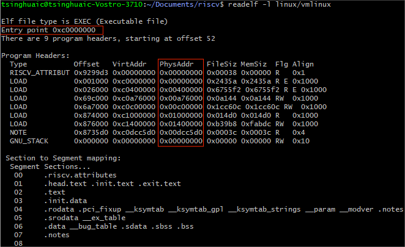
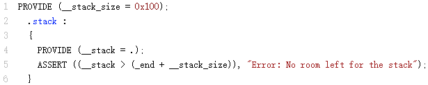
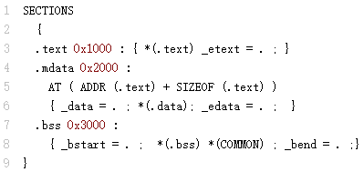
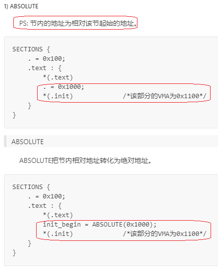

2023年7月11日星期二


# ld linker script file notes

Ref: [链接脚本](https://www.cnblogs.com/jianhua1992/p/16852784.html)[(Linker Scripts)语法和规则解析(自官方手册) - BSP-路人甲 - 博客园 (cnblogs.com)](https://www.cnblogs.com/jianhua1992/p/16852784.html)

[GNU ld linker script 链接脚本详解 - Dalink - 博客园 (cnblogs.com)](https://www.cnblogs.com/idalink/articles/11800860.html)

[Top (LD) (sourceware.org)](https://sourceware.org/binutils/docs/ld/)

## 关键字ADDR

`ADDR()`可以用来获取段（section）的链接地址（linker address）；

`LOADADDR()`可以用来获取段的加载地址（load address）。


## 关键字AT


`AT`用来指定段或者符号（section or symbol）的加载地址，即加载程序时，实际的memory address。


对于Linux内核而言，当vma开启之前加载地址和链接地址是不一样的，这时候代码就依赖于加载地址来正常工作。当vma开启后，加载地址和链接地址在虚拟地址空间就是一样了，代码就可以依赖链接地址来正常工作。


下图中的`PhysAddr`是加载地址的物理地址。但实际上会被bootloader根据情况加载到比如说0x8000,0000这样的地址。所以这里的地址更像是一个相对地址。




另外，由于Linux kernel是一个裸机程序，它会被加载到物理地址空间，从bootloader跳转到相应的物理地址入口点，然后自己开启vma。这里的`Entry point`是一个虚拟地址，所以它并不会像elf文件被加载进OS一样的方式工作。

## KEEP

The KEEP statement within a linker script will instruct the linker to keep the specified section, even if no symbols inside it are referenced. This statement is used within the SECTIONS section of the linker script. This becomes relevant when garbage collection is performed at link time, enabled by passing the --gc-sections switch to the linker. The KEEP statement instructs the linker to use the specified section as a root node when creating a dependency graph, looking for unused sections. Essentially forcing the section to be marked as used.

This statement is commonly seen in linker scripts targeting the ARM architecture for placing the interrupt vector table at offset 0x00000000. Without this directive the table, which might not be referenced explicitly in code, would be pruned out.

SECTIONS
{
	.text :
	{
		KEEP(*(.text.ivt))
		*(.text.boot)
		*(.text*)
	} > ROM

	/** ... **/

}

## 基本概念


链接器的目标文件都有一个段（section）列表。每个段都有名称和大小。大多数段还具有关联的数据块，称为段内容。

- ​	一个段可以标记为可加载（loadable），这竟味着在运行输出文件时，段内容需要加载到内存中。
- ​	一个没有内容的段是可分配的，这意味着应该在内存中预留一个区域，但这里不需要加载任何东西（某些情况下，该内存必须清零）。
- ​	既不可装载也不可分配的部分通常包含某种调试信息。


每个可加载或可分配的输出段都有两个地址。每一个是VMA（虚拟内存地址），是运行输出文件时该段将具有的地址。第二个是LMA（加载内存地址），是段将会被加载的地址。一个示例是将数据段加载到ROM中，然后程序启动时将其复制到RAM中（初始化全局变量）。这种情况下，ROM地址是LMA，而RAM地址是VMA。


### `ENTRY`

Entry Point: 设置入口点


也可以通`-e` 输入命令选项（第一优先级）

也可能是目标专用标号值，例如`start`符号。或者是`.text`段的第一个字节地址。如果以上都没有，则为地址0。


### `OUTPUT_FORMAT`


使用`OUTPUT_FORMAT(bfdname)` 与命令行上使用`-oformat bfdname`完全相同。命令行优先。


### `REGION_ALIAS`


为内存区域创建别名


### `ASSERT`


断言会在最终链接阶段之前进行检查。`ASSERT(exp, message)`将确保`exp`不为零。如果为零，则退出链接并显示错误代码，并打印一些相关信息。




### `EXTERN()`

强制将符号作为示定义符号输入到输出文件中。

### `OUTPUT_ARCH(bdfarch)`

指定一个特定的输出机器架构。

### Simple Assignments

使用任何C赋值操作符来赋值符号


### `HIDDEN`

为elf目标的端口定义一个符号，符号将被隐藏并且不会被导出。


### `PROVIDE`

在某些情况下，仅当一个符号被引用了却没有定义在任何链接目标中，才需要为链接脚本定义一个符号。例如，传统链接器定义了符号‘etext’。然而，ANSI C要求用户能够使用’ etext '作为函数名而不会引发错误。PROVIDE关键字可以用来定义一个符号，比如‘etext’ ，只有当它被引用但没有被定义时才使用。语法是 PROVIDE(symbol = expression)。


在本例中，如果程序定义了’ _etext ‘(带有前导下划线)，链接器将给出重复定义错误。另一方面，如果程序定义了’ etext ‘(没有前导下划线)，链接器会默认使用程序中的定义。如果程序引用了’ etext '但没有定义它，链接器将使用链接器脚本中的定义。


### Source Code Reference

从源代码获取链接器脚本定义的变量并不直观。特别是链接脚本中的符号与高级语言定义的变量声明不同的时候，将使用一个没有值的变量替代它。能做的就是访问链接器脚本定义符号的地址。因此，应该始终获取符号的地址，并且永远不要尝试使用它的值。

如果要把内存的`.ROM`拷贝到`.FLASH`中，链接器脚本包含了这些声明：


实际使用中，发现必须要用数据变量的方式，而不能用指针：


如果直接定义为指针，则st = (ne10_fft_cfg_float32_t) _end;被编译为将_end作为变量，从中取出值附给st。


若使用数组，则将符号地址直接给st。


若声明符号为一个char类型，则通过它的地址去访问更大的空间时会有编译器报警。


但是编译出来的结果是正确的。


所以，最终**结论**为：

建议将链接器中的符号声明为数组，然后数组名作为指针来使用。

### `SECTIONS`

SECTIONS 命令告诉链接器如何将输入段映射到输出段，以及如何将输出段放在内存中。


section 区段：输入段

segment 节： 输出段


### `输出段`

Output section: 输出段的名字是`section`, 必须是该格式所支持的名称之一，（例如a.out，只允许` .text`, ` .data`, ` .bss`）。Address是输出段VMA（虚拟内存地址）。


### 输入段

输入段说明由一个文件名和一个括号中的段名列表（可选）组成。文件名和段名可以是通配符，最见的输入段描述是在输出段中包括所有具有特定名称的输入段。例如，把所有输入段放入` .text`段，可以这么写：（这里`*`是一个通配符，它可以用来匹配任何文件名）


包含多个段：


指定文件名来包含特定的段：


通配符：


### `-gc_sections`


使用了链接时垃圾收集的功能时，把段标记为不应被消除非常常用。此功能通过一个输入段的通配符入口使用KEEP()实现，类似于`KEEP((.INIT))或者`KEEP(SORT_BY_NAME().(ctors))。


### 输出段数据


BYTE, SHORT, LONG, QUAD命令分别存储1，2，4，8字节。在存储字节后，位置计数器会按照存储的字节数增加。例如，下面将会存储一个单字节数据1，然后存储一个符号为 ’addr’ 四字节数据的值：（这些命令仅在段描述内部工作）


段结束位置填充4字节：


### LMA

AT关键字把一个表达式当作自己的参数，这将指定段的实际加载地址。



这说明，有初始化值的全局变量的初始化数据在.text的结尾处。因此，需要把初始化数据从ROM镜像复制到运行时地址（VMA）。此链接器脚本的运行时初始化代码应该类似于下面的形式：


### `MEMORY`

设置内置区域，描述目标中的内存块的位置和大小。


可以使用 ’>region’ 把一个段指定到此前设置的内存区域内。


### Operators

链接器识别标准的C算术运算符集，具有标准绑定和优先级级别：


### Builtin Functions


- ​	ABSOLUTE(exp)
- ​	ADDR(section)
- ​	ALIGN(align)
- ​	ALIGN(exp,align)
- ​	ALIGNOF(section)
- ​	BLOCK(exp)
- ​	DATA_SEGMENT_ALIGN(maxpagesize, commonpagesize)
- ​	DATA_SEGMENT_END(exp)
- ​	DATA_SEGMENT_RELRO_END(offset, exp)
- ​	DEFINED(symbol)
- ​	LENGTH(memory)
- ​	LOADADDR(section)
- ​	LOG2CEIL(exp)
- ​	MAX(exp1, exp2)
- ​	MIN(exp1, exp2)
- ​	NEXT(exp)
- ​	ORIGIN(memory)
- ​	SEGMENT_START(segment, default)
- ​	SIZEOF(section)
- ​	SIZEOF_HEADERS
- ​	sizeof_headers


#### **ABSOLUTE**

ABSOLUTE将节内相对地址转化为绝对地址。



#### ALIGN


ALIGN(align)当前位置对齐到align的字节点数。比如，按align为8时，就按8个字节对齐。


## segment

`text`: code segment, used to store code and read-only constants.
`data`: data segment, used to store initialized global variables and static variables.
`bss`: bss segment, used to store uninitialized global variables, set to 0 when programs startup.

.bss(**block started by symbol**) It defined a label (i.e. symbol) and reserved a block of uninitialized space for a given number of words.
.bss(**better save space**) Peter van der Linden, a C programmer and author, says, "Some people like to remember it as 'Better Save Space.' Since the BSS segment only holds variables that don't have any value yet, it doesn't actually need to store the image of these variables. The size that BSS will require at runtime is recorded in the object file, but BSS (unlike the data segment) doesn't take up any actual space in the object file."

About how to calculate the memory usage of the target file:

the used flash size = the size of text
the used RAM size = the size of data + the size of bss


# tools


## ldd

Show infos for shared library.

```
Usage: ldd [OPTION]... FILE...
      --help              print this help and exit
      --version           print version information and exit
  -d, --data-relocs       process data relocations
  -r, --function-relocs   process data and function relocations
  -u, --unused            print unused direct dependencies
  -v, --verbose           print all information
```


## nm

List symbols in files (a.out by default).

```
Usage: nm [option(s)] [file(s)]
 List symbols in [file(s)] (a.out by default).
 The options are:
  -a, --debug-syms       Display debugger-only symbols
  -A, --print-file-name  Print name of the input file before every symbol
  -B                     Same as --format=bsd
  -C, --demangle[=STYLE] Decode mangled/processed symbol names
                           STYLE can be "none", "auto", "gnu-v3", "java",
                           "gnat", "dlang", "rust"
      --no-demangle      Do not demangle low-level symbol names
      --recurse-limit    Enable a demangling recursion limit.  (default)
      --no-recurse-limit Disable a demangling recursion limit.
  -D, --dynamic          Display dynamic symbols instead of normal symbols
      --defined-only     Display only defined symbols
  -e                     (ignored)
  -f, --format=FORMAT    Use the output format FORMAT.  FORMAT can be `bsd',
                           `sysv', `posix' or 'just-symbols'.
                           The default is `bsd'
  -g, --extern-only      Display only external symbols
    --ifunc-chars=CHARS  Characters to use when displaying ifunc symbols
  -j, --just-symbols     Same as --format=just-symbols
  -l, --line-numbers     Use debugging information to find a filename and
                           line number for each symbol
  -n, --numeric-sort     Sort symbols numerically by address
  -o                     Same as -A
  -p, --no-sort          Do not sort the symbols
  -P, --portability      Same as --format=posix
  -r, --reverse-sort     Reverse the sense of the sort
      --plugin NAME      Load the specified plugin
  -S, --print-size       Print size of defined symbols
  -s, --print-armap      Include index for symbols from archive members
      --quiet            Suppress "no symbols" diagnostic
      --size-sort        Sort symbols by size
      --special-syms     Include special symbols in the output
      --synthetic        Display synthetic symbols as well
  -t, --radix=RADIX      Use RADIX for printing symbol values
      --target=BFDNAME   Specify the target object format as BFDNAME
  -u, --undefined-only   Display only undefined symbols
  -U {d|s|i|x|e|h}       Specify how to treat UTF-8 encoded unicode characters
      --unicode={default|show|invalid|hex|escape|highlight}
      --with-symbol-versions  Display version strings after symbol names
  -X 32_64               (ignored)
  @FILE                  Read options from FILE
  -h, --help             Display this information
  -V, --version          Display this program's version number
nm: supported targets: elf64-x86-64 elf32-i386 elf32-iamcu elf32-x86-64 pei-i386 pe-x86-64 pei-x86-64 elf64-l1om elf64-k1om elf64-little elf64-big elf32-little elf32-big pe-bigobj-x86-64 pe-i386 srec symbolsrec verilog tekhex binary ihex plugin
```

