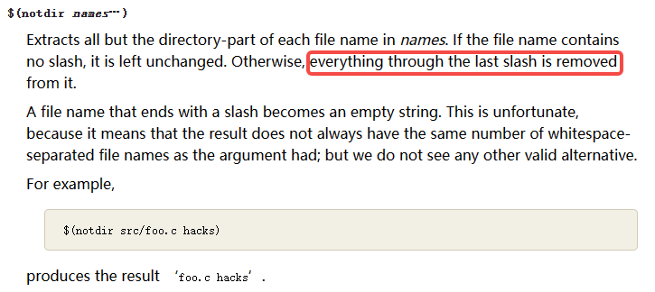

2023年8月2日星期三


# Makefile notes

To record makefile syntax and compilation options.


## Makefile rules

target ... : prerequisites ...

command

...

...


target就是目标文件，可以是Object File，也可以是执行文件。还可以是一个标签（label）

prerequisites就是要生成那个target所依赖的文件或者是目标。

command是make需要执行的命令。（可以是任意的shell命令）

```makefile
targets : prerequisites ; recipe
        recipe
        …
```


target和prerequisites构成一个文件依赖关系。prerequisites中，如果有文件比target更新，command所定义的命令就会被执行。这就是makefile的规则，也是makefile中最核心的内容。

> [!NOTE]
>
> If the command is **not preceded by a tab**, you get an error message "makefile:4: \*** missing separator. Stop."
> If there is **no makefile** in the current directory, you get an error message "make: \*** No targets specified and no makefile found. Stop."
> The makefile can be named "**makefile**", "**Makefile**" or "**GNUMakefile**", without file extension.


### dependency


对于**normal** prerequisite，rule要求：prerequisites的recipes要先于target的recipe。


对于 **order-only** prerequiste，只确保prerequistes 存在于target之前，不要求target随prerequistes更新。

### empty recipes


explicit rule可以没有相应的`recipe`，这样就**只规定了他们之间的依赖关系**。


Makefile里主要包含了五个东西：**显示规则**，**隐晦规则**，**变量定义**，**文件指示**和**注释**。


### makefile functions

去除路径，只留文件名




### makefile variables

?= 只有当变量没有设置过，才附相应的值给它

:= (immediate) 只做简单展开，即将右侧的变量按照当前值展开，然后附给左边

= (deferred) 递归展开，当用到左的变量时，才将右侧的变量展开

#### Automatic Variables

Automatic variables are set by make after a rule is matched. There include:

    $@: the target filename.
    $*: the target filename without the file extension.
    $<: the first prerequisite filename.
    $^: the filenames of all the prerequisites, separated by spaces, discard duplicates.
    $+: similar to $^, but includes duplicates.
    $?: the names of all prerequisites that are newer than the target, separated by spaces.


## Expansion

GNU make does its work in two distinct phases: a `read-in` phase and a `target-update` phase.

1. Parsing and **Immediate** Expansion for **Target names and Prerequisites** (dependencies)

   - reads all the **makefiles**, included **makefiles**, etc

   - internalizes all the **variables** and their **values** and implicit and explicit **rules**.

2. **Deferred** Expansion of **Recipes**

   - uses this internalized data to determine which **targets** need to be updated

   - run the **recipes** necessary to update them

```makefile
immediate : immediate ; deferred
        deferred
```

This is true for **explicit** rules, **pattern** rules, **suffix** rules, **static pattern** rules, and **simple prerequisite definitions**.

### **deferred expansion**

We say that expansion is *immediate* if it happens during the first phase: `make` will expand that part of the construct as the makefile is parsed. 

We say that expansion is *deferred* if it is not immediate. Expansion of a deferred construct part is delayed until the expansion is used: either when it is referenced in an immediate context, or when it is needed during the second phase.

```makefile
immediate = deferred
immediate ?= deferred
immediate := immediate
immediate ::= immediate
immediate :::= immediate-with-escape
immediate += deferred or immediate
immediate != immediate

define immediate
  deferred
endef

define immediate =
  deferred
endef

define immediate ?=
  deferred
endef

define immediate :=
  immediate
endef

define immediate ::=
  immediate
endef

define immediate :::=
  immediate-with-escape
endef

define immediate +=
  deferred or immediate
endef

define immediate !=
  immediate
endef
```

Conditional directives are parsed immediately.

GNU Make also has the ability to enable a *second expansion* of the prerequisites (only) for some or all targets defined in the makefile. In order for this second expansion to occur, the special target `.SECONDEXPANSION` must be defined before the first prerequisite list that makes use of this feature.

###  shell variables

For variables used in `shell`, it should be **escaped** to avoid expansion in Makefile.

|            | shell variables              | makefile variables              |
| ---------- | ---------------------------- | ------------------------------- |
| Assignment | `VAR=value`                  | `VAR = value` or `VAR := value` |
| Reference  | `$VAR`, `"$VAR"` or `${VAR}` | `$(VAR)` or `${VAR}`            |

Shell variable names can be **delimited** from adjacent text by form of `"$VAR"` or `${VAR}`, while `$(command)` is used for **quoting commands**.


### escape

`$$`: escaped single dollar sign

A dollar sign followed by **a charactoer** other than a dollar sign, open-parenthesis (**`$(foo)`**) or open-brace(**`${foo}`**) treats that single character or characters inside the structure (i.e. `foo`) as the variable name.

So, the way to **escape** a variable is to replace the `$` with `$$`. The `$` sign for quoting commands in shell can also be escape this way.


`:::=`: *immediate-with-escape*, the value one the right-hand side is immediatly expanded but then escaped.


### `eval` function

The `eval` function is very special: it allows you to define new makefile constructs that are not constant; which are the result of evaluating other variables and functions. The argument to the `eval` function is **expanded**, then the results of that expansion are **parsed** as makefile syntax. The expanded results can **define** new `make` variables, targets, implicit or explicit rules, etc.

The result of the `eval` function is always the empty string; thus, it can be placed virtually anywhere in a makefile without causing syntax errors.

It’s important to realize that the `eval` argument is **expanded** **twice**:

1. first **expanded** by the **eval function**, 
2. then the results of that expansion are expanded again when they are **parsed** as **makefile syntax**. 

This means you may need to provide **extra levels of escaping** for “$” characters when using `eval`.

`make` does not re-split lines after it has expanded them for macros. In order to properly expand a multi-line macro you must use the `eval` function: this causes the `make` parser to be **run on the results of the expanded macro**.


## include

```makefile
# Include the (*.d, dependency file) makefiles. The - at the front suppresses the errors of missing
# Makefiles. Initially, all the .d files will be missing, and we don't want those
# errors to show up.
-include $(DEPS)
```


dependency files
------------------------------------------------------------------------------------------------

Generating Prerequisites Automatically
In the makefile for a program, many of the rules you need to write often say only that some object file depends on some header file. For example, if main.c uses defs.h via an #include, you would write:

`main.o: defs.h`
You need this rule so that make knows that it must remake main.o whenever defs.h changes. You can see that for a large program you would have to write dozens of such rules in your makefile. And, you must always be very careful to update the makefile every time you add or remove an #include.

To avoid this hassle, most modern C compilers can write these rules for you, by looking at the #include lines in the source files. Usually this is done with the `-M` option to the compiler. For example, the command:

`cc -M main.c`
generates the output: `main.o : main.c defs.h`
Thus you no longer have to write all those rules yourself. The compiler will do it for you.

Dependency file (`*.d`) is used for header file dependency ( header files included )

### practical way of doing dependency

`-MM` tells gcc to output header dependencies for the compile file(s), but only those that are in single quotes (it will exclude system headers).

`-MG` tells gcc that it's okay if it runs into headers that it can't find. This is going to be all of the headers, honestly, because we also (purposefully) haven't told gcc anything about our include paths. We're looking for very shallow dependency tracking: just the files that are included in the test file.

`-MF` tells gcc we want the header dependencies to be written to a file. The next argument should be the name of the file to write to, which is why we have placed the dependency file first in our rule above.

## default goal: all

Compile the entire program. This should be the default target. 

The overall rule is often name "all", which is the default target for make.

The **default goal** is the target of the **first rule** in the first makefile. If the first rule has multiple targets, only the **first target** is taken as the default. There are two exceptions: a target starting with a `period` is not a default unless it contains one or more slashes, `/`, as well`;` and, a target that defines a **pattern rule**(`%.o: %.c`) has no effect on the default goal.

GNU Make also allows you to specify the default make target using a special variable called `.DEFAULT_GOAL`. You can even unset this variable in the middle of the Makefile, causing the next target in the file to become the default target.

By default, make starts with the first target (not targets whose names start with `.`). This is called the **default goal**. (Goals are the targets that make strives ultimately to update. You can override this behavior using the command line (see Arguments to Specify the Goals) or with the `.DEFAULT_GOAL` special variable (see Other Special Variables).

### Phony Targets (or Artificial Targets)

A target that does not represent a file is called a phony target. For example, the "clean" in the above example, which is just a label for a command. If the target is a file, it will be checked against its pre-requisite for out-of-date-ness. Phony target is always out-of-date and its command will be run. The standard phony targets are: `all`, `clean`, `install`.


### FORCE

If a rule has no prerequisites or recipe, and the target of the rule is a nonexistent file, then `make` imagines this target to have been updated whenever its rule is run. This implies that all targets **depending on** this one will **always** have their recipe run.

An example will illustrate this:

```
clean: FORCE
        rm $(objects)
FORCE:
```

Here the target ‘`FORCE`’ satisfies the special conditions, so the target clean that depends on it is forced to run its recipe. There is nothing special about the name ‘FORCE’, but that is one name commonly used this way.

As you can see, using ‘`FORCE`’ this way has the same results as using ‘`.PHONY: clean`’.

Using ‘`.PHONY`’ is more explicit and more efficient. However, other versions of `make` do not support ‘`.PHONY`’; thus ‘`FORCE`’ appears in many makefiles.


Virtual Path
------------------------------------------------------------------------------------------------

For large systems, it is often desirable to put sources in a separate directory from the binaries. The directory search features of make facilitate this by **searching several directories automatically** to find a prerequisite.

### VPATH

You can use `VPATH` (uppercase) to specify the directory to search for dependencies and target files. For example,

```makefile
# Search for dependencies and targets from "src" and "include" directories
# The directories are separated by space
VPATH = src include
```

### vpath

You can also use `vpath` (lowercase) to be more precise about the file type and its search directory. For example,

```makefile
# Search for .c files in "src" directory; .h files in "include" directory
# The pattern matching character '%' matches filename without the extension
vpath %.c src
vpath %.h include
```


### Implicit Rules

The search through the directories specified in `VPATH` or with `vpath` also happens during consideration of implicit rules.

For example, when a file foo.o has no explicit rule, `make` considers implicit rules, such as the built-in rule to compile foo.c if that file exists. If such a file is lacking in the current directory, the appropriate directories are searched for it. If foo.c exists (or is mentioned in the makefile) in any of the directories, the implicit rule for C compilation is applied.

The recipes of implicit rules normally use automatic variables as a matter of necessity; consequently they will use the file names found by directory search with no extra effort.


# GCC options

`-Wall`: Print out all warning messages
`-g`: generates additional symbolic debugging information for use with gdb debugger
`-c`: Compile into object file "Hello.o". By default, the object file has the same name as the source file with extension of ".o" (there is no need to specify -o option). No linking with other object files or libraries.


## Machine_Dependent Options

Each target machine supported by GCC can have its own options for example, to allow you to compile for a particular processor variant or ABI, or to control optimizations specific to that machine. By convention, the names of machine-specific options start with `-m`.

Riscv ref: [RISC-V Options (Using the GNU Compiler Collection (GCC))](https://gcc.gnu.org/onlinedocs/gcc-12.2.0/gcc/RISC-V-Options.html#RISC-V-Options)


## -mcmodel medany

This is a special cmodel used for riscv compilation.


Ref: [Option Summary (Using the GNU Compiler Collection (GCC))](https://gcc.gnu.org/onlinedocs/gcc-12.2.0/gcc/Option-Summary.html#Option-Summary)


## 库文件链接顺序


多个库文件链接时，链接命令中给出所依赖的库时，依赖库的库一定要放到被依赖库的前面，这样才能真正避免undefined reference的错误，完成编译链接。即，库文件应该放到.o文件的后边，被库文件依赖的库，依次放在后边。

