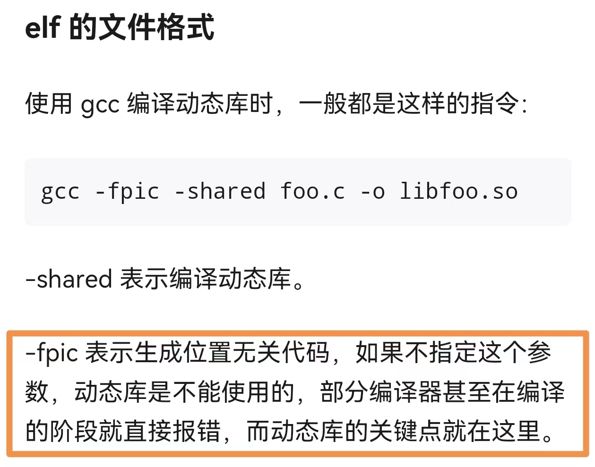
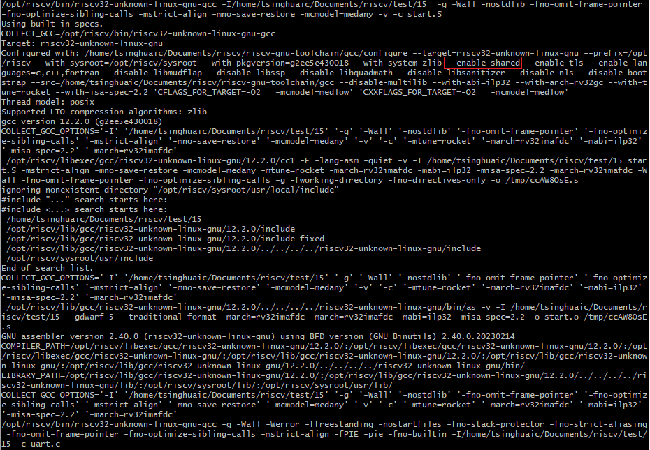

Global Offset Table

链接过程中，是如何处理**GOT**的？

## 动态链接

`.got.plt` section： 存放global functions的地址

`.got` section: 存放global variables 的地址

在动态**链接或加载**的时候，这些section的地址会被更新。

.got.plt是GOT的一部分，是GOT为PLT专门准备的节。PLT表作为库函数的动态链接跳转，可以实现延绑定。库函数做延迟绑定时，第一次调用相应的函数时，.got.plt中相应的表项指向了resolve函数，它会实现重定位解析，然后把解析到的库函数的真正地址写到.got.plt中，并跳转到库函数入口。第二次调用这个函数时，就会直接从.got.plt中相应的表项中读到库函数的地址。

`.plt.got`: 如果库函数有全局/静态变量，它们的重定位地址做到这个section?

全局变量和函数地址都是符号。

重定位：对符号进行绑定。

静态重定位：静态链接时重定位

动态重定位：动态链接，加载时重定位。

### .dynamic段

.dynamic 是整个动态链接中最核心的部分，该 section 中保存了动态链接器所需要的符号基本信息。通过-d参数查看.dynamic段。

readelf -d *.elf

### 动态链接器自举

## interperter

The interperter in the context of dynamic linking, is typically the **dynamic linker** itself.

**ELF Header**: Executable and Linkable Format (ELF) files, which are common on Unix-like systems, can specify an interpreter in the `PT_INTERP` segment of their program header. This segment points to the dynamic linker.

**Loading the interpreter**: When the operating system loads an ELF executable, it checks for the `PT_INTERP` segment. If present, it loads the specified interpreter into memory. For example, on many Linux systems, this interpreter is `/lib/ld-linux.so.2`.

**Execution**: The operating system transfers control to the interpreter, which then loads the necessary shared libraries and resolves relocations before handing control back to the executable.

How Dynamic linking works:

1. **Shared Libraries**: These are collections of code, such as functions or classes, that multiple programs can use. They typically have the extension `.so` (shared object) on Unix-like systems or `.dll` (dynamic-link library) on Windows.
2. **Relocation**: When an executable is dynamically linked, it leaves behind placeholders called relocations. These are references to addresses that need to be resolved at runtime, such as the address of a function in a shared library.
3. **Dynamic Linker**: At runtime, the dynamic linker (or dynamic loader) is responsible for loading the required shared libraries into memory and resolving the relocations. This involves fixing up the addresses so that the executable can correctly call the functions in the shared libraries.

## 静态链接 .got

链接选项-static/-shared

-shared表示编译动态库，加载时重定位

-static表示编译静态库，编译时重定位

-fPIC表示生成位置无关代码，即通过GOT表存放符号地址（.got放变量，.got.plt放函数，由.plt表实现重定位延迟绑定）。必须有GOT表在数据段中，才能在加载时重定位。

--enable-shared/--disable-shared代表什么?

当使用**glibc库**时，会即使是静态链接程序，也会有.got section。似乎是因为即使是静态库，其中也包含.rela.text section，以便在需要的时候将它们转变成动态库，然后进行动态链接。

**libgc**c.a: /opt/riscv/lib/gcc/riscv32-unknown-linux-gnu/12.2.0/**libgcc.a**

静态库不应该生成.got表和.got.plt表。

虽然生成了**.got表**，但其中的**地址在静态链接时，已经定位好**。和全局变量一样，这些区域也会生成到bin文件中，因此不会受到影响。

全局变量是在什么时候初始化的？或者说，是什么时侯从.text区域搬移到.data区域的？

答：如果代码不是在MCU类似的硬件上，即上电后全局变量的初值存在flash上，.data区域要分配在sram上才能正常工作，那就不需要额外做全局变量初始化，也就没有从.text到.data区域的搬移操作。