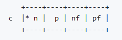

2024年1月29日星期一

## malloc的实现

malloc函数是C语言标准库中的函数，用于动态分配内存。它并不是系统调用，而是在用户模式下运行的。malloc函数的实现依赖于内存分配器，而内存分配器的实现则依赖于操作系统提供的内存管理机制。在Linux系统中，malloc函数的实现通常使用glibc库中的ptmalloc内存分配器。ptmalloc内存分配器会在应用层实现一个内存分配器，预先向操作系统申请一些内存，然后自己构造一个内存池。当我们申请内存的时候，直接由分配器从预先申请好的内存池里申请。当我们释放内存的时候，分配器会将这些内存管理起来，并通过一些策略来判断是否将其回收给操作系统. 因此，malloc函数的实现并不依赖于系统调用，而是依赖于内存分配器的实现。

在裸机上，要使用malloc函数，就需要实现一个内存分配器。

ref: [rhempel/umm_malloc: Memory Manager For Small(ish) Microprocessors (github.com)](https://github.com/rhempel/umm_malloc)

doubly linked lists for both free and used blocks.

最开头的block是特殊的，它总是free block list的头。第一次分配时，在末尾分配出lf作为第一个分配出去的块。

last free block always exists at the end to mark the end of head region?

最开始的块和最后一个块是特殊的？

## Bare Metal C lib

在裸机环境下，C 语言标准库函数不是直接可用的。这是因为 C 语言标准库函数通常依赖于操作系统提供的一些功能，例如文件 I/O 和内存管理。在裸机环境下，这些功能不可用，因此 C 语言标准库函数也无法使用。

如果您想在裸机环境下使用 C 语言标准库函数，您需要自己实现这些函数或者使用第三方库。例如，您可以使用开源的 Bare Metal C 库，该库提供了许多常用的 C 语言标准库函数的实现，可以在裸机环境下使用。此外，您还可以使用其他第三方库，例如 Newlib 和 uClibc。

-ffreestanding / -fno-hosted

freestanding implementation vs hosted implementation

freestanding environment vs hosted environment

freestanding意味着-fno-builtin。

[Other Builtins (Using the GNU Compiler Collection (GCC))](https://gcc.gnu.org/onlinedocs/gcc-12.2.0/gcc/Other-Builtins.html#Other-Builtins)

riscv有3种编译方式：

- ​	bare-metal mode: glue code or nosys lib?
- ​	newlib proxy kernel: based on newlib(libc), using sys-calls to proxy kernel?
- ​	riscv linux: standard C lib?

ways to do bare-metal compilation:

### newlib/newlib-nano

newlib中主要有以下三个部分：

ref: https://sourceware.org/newlib/docs.html

ref: https://github.com/32bitmicro/newlib-nano-1.0

裸机环境下，需要自己实现一些系统调用stubs。

要在裸机（bare-metal）上使用newlib，需要实现基本的类似_write, _read等这样的stubs。这个文件一般被称为glue.c。Newlib使用内部的堆分配器（head allocator）来实现动态内存管理（malloc, free），所以还可能需要实现_sbrk这个stub。

从riscv32-newlib编译的实践来看，如果不实现这些stubs，无论使用newlib, newlib-nano，都会最终产生系统调用（即dump文件中能看ecall指令）。只要实现了newlib/newlib-nano库所依赖的stubs，那么就可以编译出不依赖与系统调用的程序了。

推测在newlib/newlib-nano库中，_write, _read, _sbrk等stubs都是一个weak属性的函数，因此，可以在glue.c中重新将它们实现为不带系统调用。优先链接了glue.c文件中的stub函数，就可以编译出没有ecall的程序。

另一种方法是链接nosys库，在这个库里以不真正进行系统调用的方式实现newlib/newlib-nano所依赖了stubs函数。

ref: [Embed with GNU (sourceware.org)](https://sourceware.org/newlib/libgloss.html)

链接里介绍了newlib库中，glosslayer的详细信息。

newlib-nano: 移除了non-MCU freatures，对代码大小进行了优化。它和标准newlib的最大的区别是更小，更精简。

#### -lnosys

means no syscalls’ implementation。不管是newlib还是newlib-nano，都可以依赖nosys库编译出没有系统调用的目标文件。（但在链接的时候会报warning提示相应的syscall没有实现）

使用newlib/newlib-nano库时，会有一些stub函数需要实现，如果不实现，就会报以下错误。

nosys库里边就包涵了这些系统调用函数的stubs。当链接了nosys库后，就不会因此而报错，但会报warning提示这些系统调用会失败。不过最终编译是成功的。

#### -nostdlib/-nodefaultlibs

-nostartfiles, -nodefaultlibs, -nolibc -nostdlib

Do not use the standard system startup files or libraries when linking. No startup files and only the libraries you specify are passed to the linker, and options specifying linkage of the system libraries, such as -static-libgcc or -shared-libgcc, are ignored.

The compiler may generate calls to memcmp, memset, memcpy and memmove. These entries are usually resolved by entries in libc. These entry points should be supplied through some other mechanism when this option is specified.

One of the standard libraries bypassed by -nostdlib and -nodefaultlibs is libgcc.a, a library of internal subroutines which GCC uses to overcome shortcomings of particular machines, or special needs for some languages. (See [Interfacing to GCC Output](http://gcc.gnu.org/onlinedocs/gccint/Interface.html#Interface) in GNU Compiler Collection (GCC) Internals, for more discussion of libgcc.a.) In most cases, you need libgcc.a even when you want to avoid other standard libraries. In other words, when you specify -nostdlib or -nodefaultlibs you should usually specify -lgcc as well. This ensures that you have no unresolved references to internal GCC library subroutines. (An example of such an internal subroutine is __main, used to ensure C++ constructors are called; see [collect2](http://gcc.gnu.org/onlinedocs/gccint/Collect2.html#Collect2) in GNU Compiler Collection (GCC) Internals.)

-nostdlib和-nodefaultlibs的作用是一样的。告诉链接器不要使用系统的startup文件，C库和gcc库。

not use any standard system libraries when linking, exclude startup crt0, libgcc and c library in default gcc or clang.

-nostartupfiles: 没有启动文件（startup files）

-nolibc: 没有c库或者系统库，但有启动文件（startup files），gcc库或者toolchain提供的language support libraries，如libgnat, libgfortran, libstdc++。

#### libgloss

libgloss作为newlib的关键部分，包括了以下功能：

它们分析代表startup files，read/write功能，和其它open, close, lseek, fork, kill, sbrk等syscalls。

## specs

GCC是一个driver程序，它通过调用一系列其它程序来完成compiling, assembling和linking的工作。GCC应该如何去解析命令行参数，应该去调用哪些程序，并把哪些option传递给这些程序的行为，由spec strings来控制。-specs= 选项就是用来指定一个spec file，去设置新的spec strings来override GCC内置的spec strings。spec file是一个纯文本文件，它由一系统的directive指令组成。

--specs=libncrt_small.specs: specify a spec file

GCC已有的builtin spec strings:

ref: [Spec Files (Using the GNU Compiler Collection (GCC))](https://gcc.gnu.org/onlinedocs/gcc-12.2.0/gcc/Spec-Files.html#Spec-Files)

## Optimization

跟优化相关选项：

[Optimize Options (Using the GNU Compiler Collection (GCC))](https://gcc.gnu.org/onlinedocs/gcc-12.2.0/gcc/Optimize-Options.html#Optimize-Options)

# Newlib

**C standard library** implementation for embedded systems

Designed for use in embedded systems, particularly where there is no operating system present. Orignial Authors are Cygnus Support, now maintained by Red Hat developers.

Newlib mainly consists of `-lc`, `-lm`, `-lgloss`, `-lc_nano`, .

## nosys

`-lnosys` option tells the linker to **exclude** the default Newlib system call stubs from being linked. Then there will be **no implementations of the system calls** like `_write`, `_read`, `_open`, `_close`, etc.
