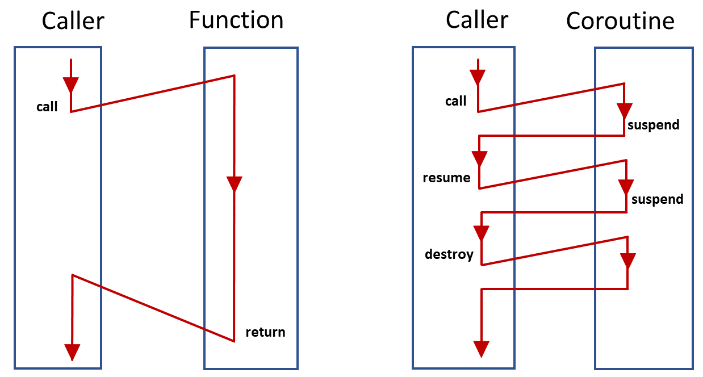

What is Coroutine in C++?




`Process`, `Thread`, `Coroutine` are different levels of parallelism tools.

The core part of `Coroutine` is promise type, awaiter and the coroutine handle.

A breif definition of `coroutine` in C++ is that, if a function contains `co_await`, `co_return`, or `co_yield` keywords, it's a `coroutine`. But, the things behind is not that simple.

## promise type
Here is a minimal example of a coroutine:

```c++
#include <coroutine>

class BasicCoroutine {
public:
	struct promise_type {
		BasicCoroutine get_return_object() { return BasicCoroutine {}; }
		std::suspend_never initial_suspend() noexcept { return {}; }
		std::suspend_never final_suspend() noexcept { return {}; }
		void unhandled_exception() noexcept {}
		void return_void() noexcept {}
		// void return_value() {}
		// std::suspend_always yield_value(unsigned value) {
			// value_ = value;
			// return {};
			// }
	};
};

BasicCoroutine coro()
{
	co_return;
}

int main()
{
	coro();
}
```
The coroutine `coro()` will be rewritten by compilers as:

```c++
BasicCoroutine coro(Parameters parameter)
{
	auto* frame = new coroutineFrame(std::forward<Parameters>(parameters));
	auto returnObject = frame->promise.get_return_object();
	co_await frame->promise.initial_suspend();
	try
	{
		// <body-statements>
		co_return;
	}
	catch (...)
	{
		frame->promise.unhandled_exception();
	}
	/* `co_return` or simply coroutine function fall-off will get here */
	co_await frame->promise.final_suspend();
	delete frame;
	return returnObject;
	
```

In this example, we can see that the `promise_type` is created by programmers, but used by compilers to process the coroutine. Compilers will first new a coroutine frame (`coroutineFrame`), which is used to preserve the state of the coroutine between its suspensions and resumptions. The frame also has an instance of the `promise_type` inside. Then the methods are used to frame infrastructure for the coroutine to enable it beable to be suspended and resumed later.

## awaiter

The new `co_await` operator is used to suspend a coroutine at certain points, normally in the form of the expression `co_await a`. `a` is an `awaiter`, sometimes also referred to as `awaitable`. It must support certain methods: `await_ready`, `await_suspend`, `await_resume`. Here is an example of an **awaiter**:

```c++
struct Awaiter {
	std::coroutine_handle<> *hp_;
	constexpr bool await_ready() const noexcept { return false; }
	void await_suspend(std::coroutine_handle<> h) { *hp_ = h; }
	constexpr void await_resume() const noexcept {}
};
```

Obviously, this struct is also used by compilers when evaluated in the expression. Generally, the `co_await expr` works like:
- The compiler gets an awaitable object, either from the `expr`, or itself is the `awaiter`.
- Then, calls `awaiter.await_ready()` method, suspends when it returns false
- If to suspend, calls `awaiter.await_suspend(coroutine handle)`, and returns to the resume point.
  - Before calling`await_suspend`, compilers also bundle up all state into the coroutine frame object in heap, referenced by the coroutine handle to be passed in.
- Some time later, when the coroutine is resumed by invoking the coroutine handle, calls `awaiter_resume()`.
  - The **return value** of `await_resume` is the return value of the whole `co_await expr` expression.

Here is an pseudo code of `co_await expr`:

```c++
auto&& value = expr;
auto&& awaitable = (promise.await_transform) ? promise.await_transform(value) : value;
auto&& awaiter = (awaitable.operator co_await) ? awaitable.operator co_await() : awaitable;

if (!awaiter.await_ready() {
	if constexpr (await_suspend returns void) {
		awaiter.await_suspend(coroutine_handle);
		return to caller/resumer;
	} else if (await_suspend returns bool && awaiter.await_suspend(coroutine_handle))
		return to caller/resumer;
}

return awaiter.await_resume();
```

There are also some predfined **awaiters**:
- `std::suspend_always`: `::await_ready` always return false, other methods empty and do nothing
- `std::suspend_never`: `::await_ready` always return true, other methods empty and do nothing
```c++
struct suspend_always {
	bool await_ready() const noexcept { return false; }
    void await_suspend(coroutine_handle<>) const noexcept {}
    void await_resume() const noexcept {}
};
struct suspend_never {
    bool await_ready() const noexcept { return true; }
    void await_suspend(coroutine_handle<>) const noexcept {}
    void await_resume() const noexcept {}
};
```

## coroutine handle

A `coroutine_handle` is a **low-level object** that represents and manages the **state of a coroutine**. It acts as a non-owning pointer to the coroutine's internal **frame**, allowing direct control over its execution and lifetime.

A `coroutine_handle` is like a **C pointer**, not like an object. The resources it points to is allocated in heap by compiler. Somebody needs to reclaim the space by calling `h.destory()`, otherwise it creates a memory leak.

There are 2 ways to get the coroutine state handle:
- `std::coroutine_handle<promise_type>::from_promise(*this)` inside the promise type
- `awaiter::await_suspend(std::coroutine_handle<> h)` passed in when evaluating `co_await expr`

Key Features of `coroutine_handle`:
- resume(): Resumes coroutine execution
- destroy(): Destroys coroutine state and frees resources
- done(): Checks if coroutine is finished
- promise(): Accesses the coroutine's promise object

AI generated example:
```c++
#include <coroutine>
#include <iostream>

struct Generator {
    struct promise_type {
        int current_value;
        auto get_return_object() { return Generator{this}; }
        auto initial_suspend() noexcept { return std::suspend_always{}; }
        auto yield_value(int value) {
            current_value = value;
            return std::suspend_always{};
        }
        auto final_suspend() noexcept { return std::suspend_always{}; }
        void unhandled_exception() { std::terminate(); }
    };

    using Handle = std::coroutine_handle<promise_type>;
    Handle coro_handle;

    explicit Generator(promise_type* p) : coro_handle(Handle::from_promise(*p)) {}

    int next() {
        coro_handle.resume();
        return coro_handle.promise().current_value;
    }

    ~Generator() {
        if (coro_handle) coro_handle.destroy();
    }
};
```

## Other coroutine keywords

`co_yield`:
`co_yield e` = `co_await p.yield_value(e)`, while `p` is the promise object of current coroutine.

`co_return`:
3 ways a coroutine signals its completion:
1. `co_return e;` to return a final value `e` through calling `p.return_value(e)` on promise object `p`
2. `co_return;` to end the coroutine without a final value, through calling `p.return_void()` on promise object `p`
3. Just fall off the end of the coroutine function

The coroutine completion process will started by `co_await frame->promise.final_suspend();`. See more details in the coroutine pseudo code rewritten by compilers.
