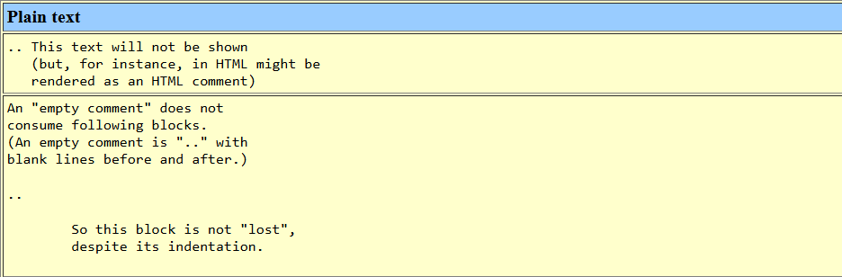
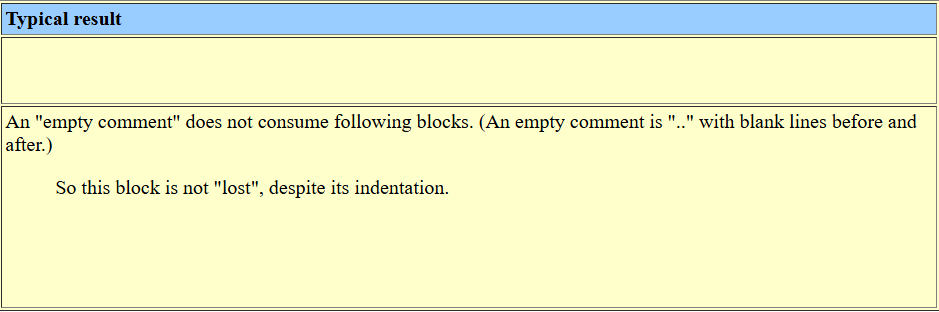

ReStructuredText

The primary goal of **reStructuredText** is to define and implement a **markup syntax** for use in Python docstrings and other documentation domains, that is readable and simple, yet powerful enough for non-trivial use. The intended purpose of the markup is the conversion of `reStructuredText` documents into useful structured data formats.

ref: https://docutils.sourceforge.io/rst.html


# How to convert rst to HTML

`sphinx-build`


# Pandoc

**pandoc** is a powerful command-line tool for converting documents between different formats (Markdown, reStructuredText, HTML, PDF, DOCX, LaTex, etc.).


- Table of Contents (TOC)
  - If you want a TOC in your DOCX, add `--toc` to your Pandoc command (`pandoc input.md -o output.docx --toc`)
  - Pandoc will insert a TOC at the top, based on the heading hierarchy.


# Lists

Lists of items come in three main flavours: **enumerated**, **bulleted** and **definitions**. In all list cases, you may have as many paragraphs, sublists, etc. as you want, as long as the left-hand side of the paragraph or whatever aligns with the first line of text in the list item.

Lists must always start a new paragraph -- that is, they must appear after a blank line.


## Definition lists

Unlike the other two, the definition lists consist of a term, and the definition of that term. The format of a definition list is:

```rst
what
  Definition lists associate a term with a definition.

*how*
  The term is a one-line phrase, and the definition is one or more
  paragraphs or body elements, indented relative to the term.
  Blank lines are not allowed between term and definition.
```

Results in:

- what

  Definition lists associate a term with a definition.

- *how*

  The term is a one-line phrase, and the definition is one or more paragraphs or body elements, indented relative to the term. Blank lines are not allowed between term and definition.


# Sections

**Section headers** can be used to split text into sections.

Recommended section title adornment characters: ``= - ` : ' " ~ ^ _ * + # < >``


emacs shortcut to adjust section level (Adding section header markup):

```
C-c C-a C-a
```


# Escaping Mechanism

ref: https://docutils.sourceforge.io/docs/ref/rst/restructuredtext.html#escaping-mechanism

Using a backslash to escape a blank line (especially inside a list) :

```rst
\

```


# Pre-formatting

ref: https://docutils.sourceforge.io/docs/user/rst/quickstart.html#lists

To just include a chunk of preformatted, never-to-be-fiddled-with text, finish the prior paragraph with "`::`". The preformatted block is finished when the text **falls back to the same indentation level** as a paragraph prior to the preformatted block. For example:

```rst
An example::

    Whitespace, newlines, blank lines, and all kinds of markup
      (like *this* or \this) is preserved by literal blocks.
  Lookie here, I've dropped an indentation level
  (but not far enough)

no more example
```

Results in:

> An example:
>
> ```
>   Whitespace, newlines, blank lines, and all kinds of markup
>     (like *this* or \this) is preserved by literal blocks.
> Lookie here, I've dropped an indentation level
> (but not far enough)
> ```
>
> no more example


Note that if a paragraph consists only of "::", then it's removed from the output:

```
::

    This is preformatted text, and the
    last "::" paragraph is removed
```

Results in:

```
This is preformatted text, and the
last "::" paragraph is removed
```


## Code

The "code" directive constructs a **literal block**. If the code language is specified, the content is parsed by the [Pygments](https://pygments.org/) syntax highlighter and tokens are stored in nested [inline elements](https://docutils.sourceforge.io/docs/ref/doctree.html#inline-elements) with class arguments according to their syntactic category.

```rst
.. code:: C
    :number-lines:
    
    def my_function():
    	"just a test"
    	print(8/2)
```


## Literal block

A paragraph consisting of two colons (`::`) signifies that the following text block(s) comprise a `literal block`. The literal block must either be **indented or quoted** (see below). No markup processing is done within a literal block. It is left as-is, and is typically rendered in a monospaced typeface:

```
This is a typical paragraph.  An indented literal block follows.

::

    for a in [5,4,3,2,1]:   # this is program code, shown as-is
        print a
    print "it's..."
    # a literal block continues until the indentation ends

This text has returned to the indentation of the first paragraph,
is outside of the literal block, and is therefore treated as an
ordinary paragraph.
```

Literal blocks end when text returns to the preceding paragraph's indentation.

The paragraph containing only :: will be completely removed from the output; no empty paragraph will remain.

As a convenience, the :: is also recognized at the end of any paragraph. If immediately preceded by whitespace, both colons will be removed from the output (this is the "partially minimized" form). When text immediately precedes the ::, *one* colon will be removed from the output, leaving only one colon visible (i.e., :: will be replaced by :; this is the "fully minimized" form).

In other words, these are all equivalent (please pay attention to the colons after "Paragraph"):

1. Expanded form:

   ```
   Paragraph:
   
   ::
   
       Literal block
   ```

2. Partially minimized form:

   ```
   Paragraph: ::
   
       Literal block
   ```

3. Fully minimized form:

   ```
   Paragraph::
   
       Literal block
   ```

All whitespace (including line breaks, but excluding **minimum indentation** for indented literal blocks) is preserved. Blank lines are required before and after a literal block, but these blank lines are not included as part of the literal block.

### Indented Literal Blocks

Indented literal blocks are indicated by indentation relative to the surrounding text (leading whitespace on each line). The minimum indentation will be removed from each line of an indented literal block. The literal block need not be contiguous; blank lines are allowed between sections of indented text. The literal block ends with the end of the indentation.

Syntax diagram:

```
+------------------------------+
| paragraph                    |
| (ends with "::")             |
+------------------------------+
   +---------------------------+
   | indented literal block    |
   +---------------------------+
```

### Quoted Literal Blocks

Quoted literal blocks are unindented contiguous blocks of text where each line begins with the same non-alphanumeric printable 7-bit ASCII character [[16\]](https://docutils.sourceforge.io/docs/ref/rst/restructuredtext.html#footnote-10). A blank line ends a quoted literal block. The quoting characters are preserved in the processed document.

[[16](https://docutils.sourceforge.io/docs/ref/rst/restructuredtext.html#footnote-reference-20)] 

The following are all valid quoting characters:

```
! " # $ % & ' ( ) * + , - . / : ; < = > ? @ [ \ ] ^ _ ` { | } ~
```

Note that these are the same characters as are valid for title adornment of [sections](https://docutils.sourceforge.io/docs/ref/rst/restructuredtext.html#sections).

Possible uses include literate programming in Haskell and email quoting:

```
John Doe wrote::

>> Great idea!
>
> Why didn't I think of that?

You just did!  ;-)
```

Syntax diagram:

```rst
+------------------------------+
| paragraph                    |
| (ends with "::")             |
+------------------------------+
+------------------------------+
| ">" per-line-quoted          |
| ">" contiguous literal block |
+------------------------------+
```


# Explicit Markup

ref: https://docutils.sourceforge.io/docs/user/rst/quickref.html#comments

Explicit markup blocks are used for constructs which float (footnotes), have no direct paper-document representation (hyperlink targets, comments), or require specialized processing (directives). They all begin with **two periods and whitespace**, the "explicit markup start".


## Comments

ref: https://docutils.sourceforge.io/docs/user/rst/quickref.html#comments

Any text which begins with an explicit `markup start` but doesn't use the syntax of any of the constructs above, is a comment.

```rst
.. This text will not be shown
   (but, for instance, in HTML might be
   rendered as an HTML comment)
```






Use [empty comments](https://docutils.sourceforge.io/docs/user/rst/quickref.html#comments) to separate indentation contexts, such as block quotes and directive contents.
